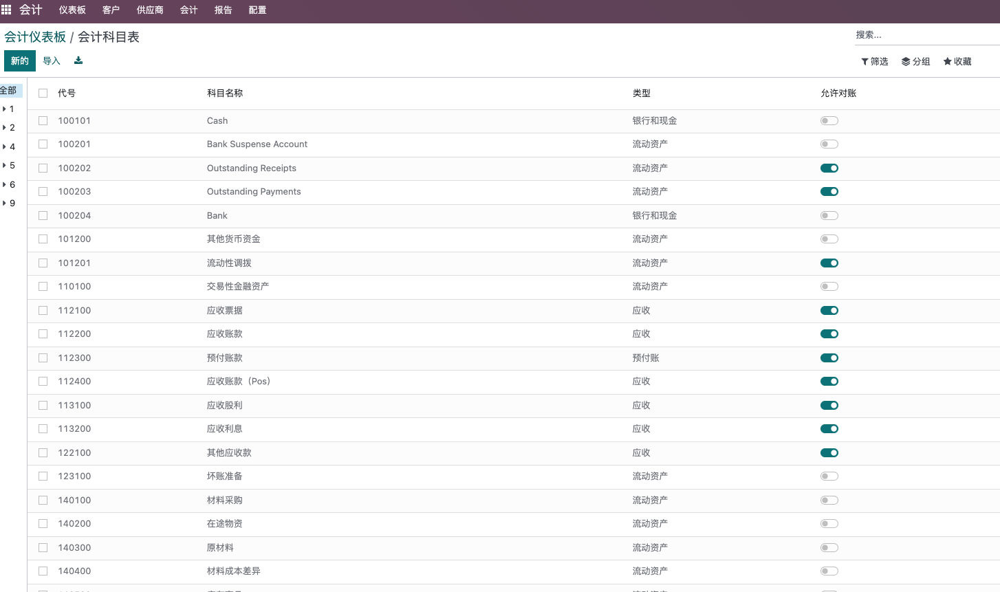
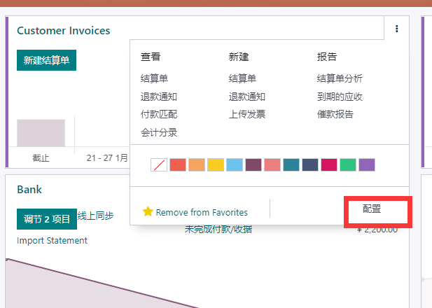
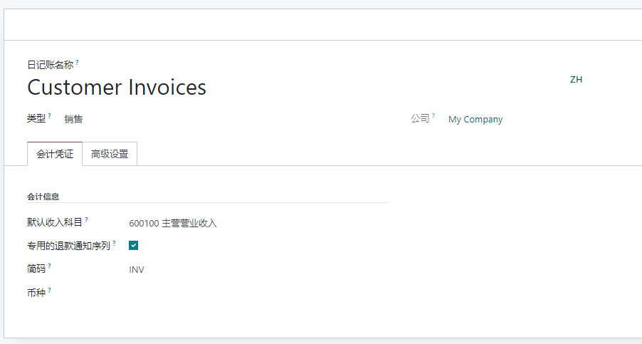
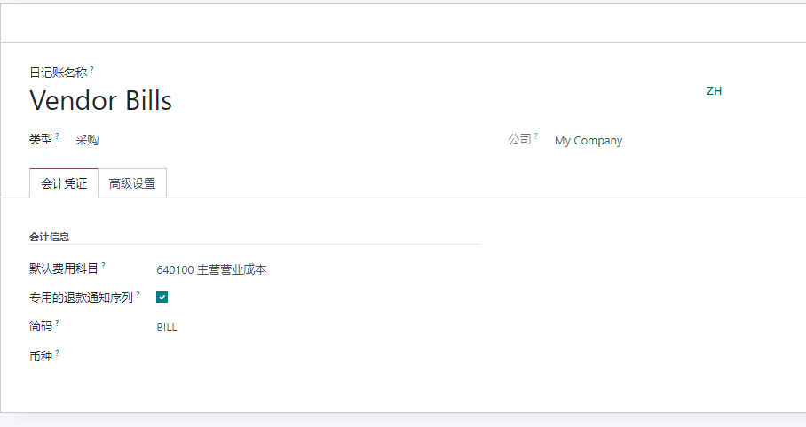
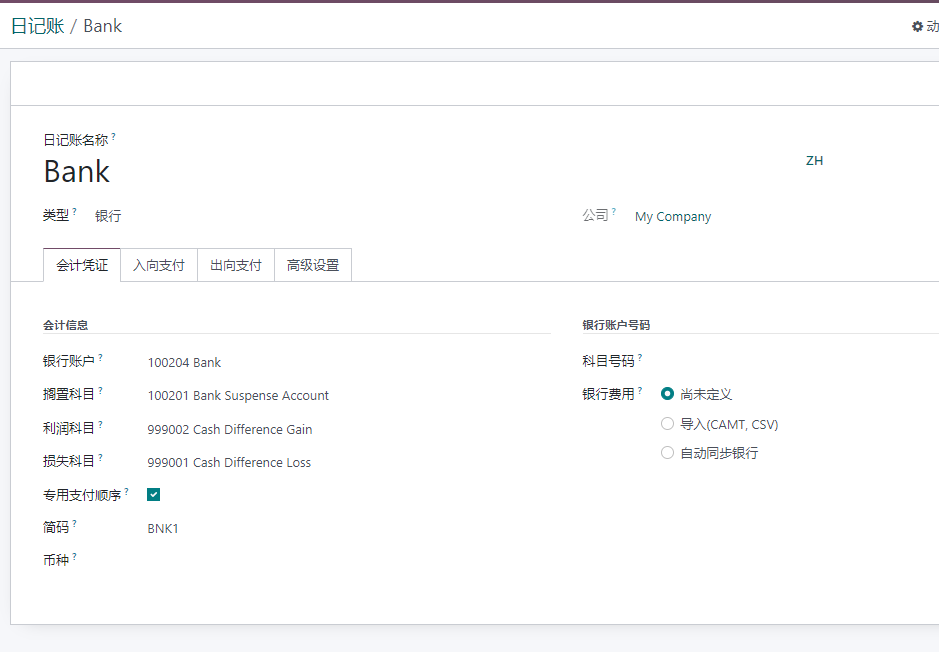

# 第一章 基础概念

本章我们将介绍Odoo财务体系的基础概念。在Odoo的财务体系中有三大基石，它们是
**科目表(Chart of Accounts)**、**日记账(Journals)**和**税率(Taxes)**。如果想要在Odoo中进行开票，那么这三样东西是必须要事先配置好的。

## 会计仪表盘

我们在进入Odoo的财务模块时，首先看到的就是**会计仪表盘(Accounting Dashboard)**，下面我们来看一下可以从会计仪表盘中看到哪些有用的信息。
下面是一个典型的会计仪表盘。


在会计仪表盘中会列出我们当前系统中拥有的日记帐。关于日记帐，我们会在后面详细介绍，这里我们可以看到与日记帐相关的一些数据。

## 财务本地化

我们在刚开始创建系统时，Odoo会让我们选择一个国家，会计模块在安装时会根据我们选择的国家安装与其对应的会计模块包。我们可以在会计-设置-财务本地化菜单中看到我们当前安装的是哪一个会计包。


> 此设置将在你创建了第一个(包含草稿状态在内的)凭证之后消失。


## 财务角色

公司内部的通常的财务角色有如下几种：

* **财务助理**(Account Assistant)： 负责客户/供应商发票整理，银行流水处理和支付校验跟踪。
* **财务经理**(Account Manager)：职责是验证客户/供应商账单，处理支付和生成总账报表。
* **财务总监**(CFO): 负责公司内部的科目余额表、利润表、分析会计和预算的制定。

对于外部的财务角色来说，通常有以下几种:

* **注册会计师**(Chatered Account): 负责审计公司的财务报表、作出调整和装订已经关闭的会计凭证。
* **审计**(Auditor): 负责审计流水的真假或是否合理。
* **官方**(Authority): 政府的监管部门，审计公司财务是否存在偷税漏税或财务造假的可能。

公司财务角色与监管的关系可以用下图展示:


## 科目和科目表

如果想要查看当前公司内的所有科目表，可以在会计仪表盘中点击会计科目-审查进行查看，也可以在设置-会计-日记帐中进行查看。


我们将看到科目的列表。



我们可以根据需要对现有的科目进行调整配置。

### 科目类型

* **权益**(Equity): 公司的资产权益，包括股东的出资等。
* **固定资产**(Fixed Assets)： 公司拥有的长期资产，例如房子、车等等。
* **负债**(Liability): 公司要在将来支付的债权，例如供应商账单等。
* **流动资产**(Current Assests): 代表公司短期权益，例如短期内客户将要支付的账单。
* **银行和现金**(Bank and Cash)：代表公司银行和现金资产。
* **收入**(Income)：公司经营活动产生的利润。
* **费用**(Expense)：公司经营活动产生的费用成本。

### 科目核销

在科目设置上有一个是否允许核销的开关


**核销**的操作意思是允许使用银行流水或支付流水对凭证进行核销。

> 允许核销的科目应该只是**应收**或者**应付**的科目。

### 更新科目

如果我们要更新科目设置，通常使用导入更新的方式，具体步骤如下：

> 不要轻易改动科目的类型，容易发生错误。例如，把应收(Receivable)类型的科目擅自改为应付(Payable), 将会导致销售订单在开票时报错：
    ```
    应收账款上的任何日记账项目都必须有到期日，反之亦然。
    (Any journal item on a receivable account must have a due date and vice versa.)
    ```

## 日记账

**日记账**在财务中用来体现交易的结果，通常包含借方、贷方和余额三栏。根据不同的日记帐类型，在odoo中，我们可以把日记账分为如下几类:

* 销售(Sales): 客户销售日记帐
* 采购(Purchase): 供应商采购日记账
* 银行和现金(Bank and Cash): 用于记录支付的日记账
* 杂项(Miscellaneous): 其他类型的日记账

所有的日记账都会在**总账报表(General Ledger)**中进行体现。

我们在前面提到的，进入会计模块的仪表板就是显示的当前可用的日记账。

### 配置日记帐

我们可以在仪表盘中点击更多(...)来配置日记帐。



我们来看一下日记帐的具体设置。



对于销售类型的日记帐，我们可以看到它有如下几个设置：

* 默认的收入科目： 指定的默认收入科目
* 专用退款序列: 退款和收入使用不同的序列
* 简码：日记帐的短码


在高级设置中还有一个锁定设置，如果勾选了，那么用户将不能将已经提交的凭证重置为草稿。



采购日记帐跟销售日记帐类似，不同点在于，默认的科目是费用类型。


杂项比较简单只有一个简码设置。



最后是银行和现金类型的日记帐，与其他日记帐不同的是多了如下设置：

* 银行账户：银行和现金类型的科目
* 搁置科目： 银行和现金交易的暂记科目，直到交易被核销为止
* 利润科目： 当系统计算与实际关帐时的有差异的利润科目
* 损失科目： 当系统计算与实际关帐时的有差异的损失科目
* 专用的支付序列： 日记帐与银行交易是否共享统一序列

最后是另外的两个独有设置：

* 账户号码：银行的账号
* 银行流水来源： 有三种方式 1. 手动(未定义) 2.导入 3.自动同步

### 更改日记帐的顺序

如果我们想要更改日记帐在仪表盘中显示的顺序，那么我们可以在日记帐列表中，拖拽日记帐行，完成顺序调整。


### 创建原则

虽然odoo允许我们创建尽可能多的日记帐，但是对于销售和采购类型的日记帐来说，我们要尽量保持最少的数量，因为对于销售和采购业务来说，odoo只会使用诸多销售和采购类型日记帐中的第一个。

> 当然我们也可以使用其他策略，例如跟销售团队进行绑定来确定唯一的日记账，但这是另外一个话题了。

## 导入期初余额

我们可以使用Excel模板来导入期初余额。如何导入，请参考这里的[视频](https://www.bilibili.com/video/BV1Sw411u7be/?spm_id_from=333.1007.0.0)。
