# 第四章 联系人与合作伙伴

* [客户和供应商](#供应商和客户菜单)
* [供应商和客户菜单](#供应商和客户菜单)
* [客户编号与别名](#客户编号与别名)
* [作伙伴的隶属关系](#合作伙伴的隶属关系)
* [合作伙伴的类型](#合作伙伴的类型)
* [用户、合作伙伴和员工](#用户合作伙伴和员工)
* [国家和城市](#国家和城市)
  * [联系人地址格式](#联系人地址格式)
  * [开启城市选择](#开启城市选择)
  * [中国三级省市区联动](#中国三级省市区联动)
* [地图模式](#地图模式)
* [联系人的显示名称](#联系人的显示名称)
* [VAT校验](#VAT校验)


在odoo中，合作伙伴(res.partner)是一个非常广泛的概念，它可以指客户、供应商，也可以是某个具体的人、公司，甚至收货地址、发票地址也属于合作伙伴的范畴。这里不讨论系统为何要这样设计，但是这也设计的的确会把上面这些概念的界限变得模糊。因此，我们这里单独列出了一章，详细讲解如何区分上面的这些概念。

## 客户和供应商

首先，我们先来看最重要的两个概念，客户和供应商。前面我们说过，从技术角度上讲，客户和供应商都是同一个对象: res.partner，在数据库中都是同一张表。那么我们应该如何区分它们呢？

对于13.0之前的版本，odoo专门设计了两个字段用来标识客户和供应商。

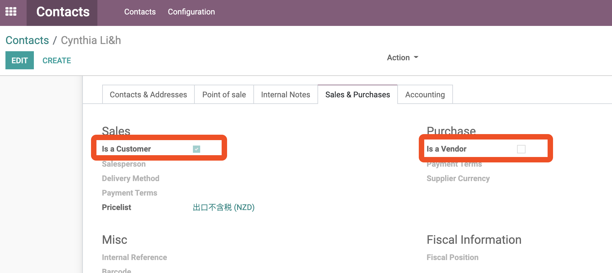

但是从13.0开始，官方重新设计了这个特性，取消了这两个字段，取而代之的是客户比重、供应商比重。

> 客户比重、供应商比重的字段定义位于会计模块中，因此，需要安装会计模块后才可以使用这两个字段。


如此设计的含义是暗示**此合作伙伴的客户属性和供应商属性的比重**，因为存在一种可能，此合作伙伴即是客户又是供应商。**当客户比重大于1时，此合作伙伴即是客户**。**当供应商比重大于1时，即为供应商**。对于内部用户的关联业务伙伴、地址等其他类型的合作伙伴，其客户比重和供应商比重均为0。

## 供应商和客户菜单

为了使用方便，我们在**欧姆网络解决方案**中新增了联系人菜单中新增了客户和联系人的菜单分类，以方便用户在联系人模块快速区分客户和供应商。

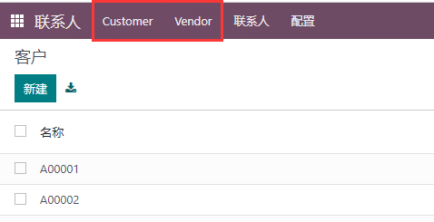

## 客户编号与别名

有时候我们希望通过编码来统一管理客户，因此我们可是用ref这个字段。并给他设置一个自动生成的序列号：


此序列号在不同公司下保持唯一。另外，我们也可以给公司设置一个别称（简称）用于快速识别。编码和别名都会在客户需要的地方展示出来：


## 合作伙伴的隶属关系

有些时候，我们的客户可能是一个公司，同时又有该公司下的联系人，odoo原生支持这种上下级的关系。

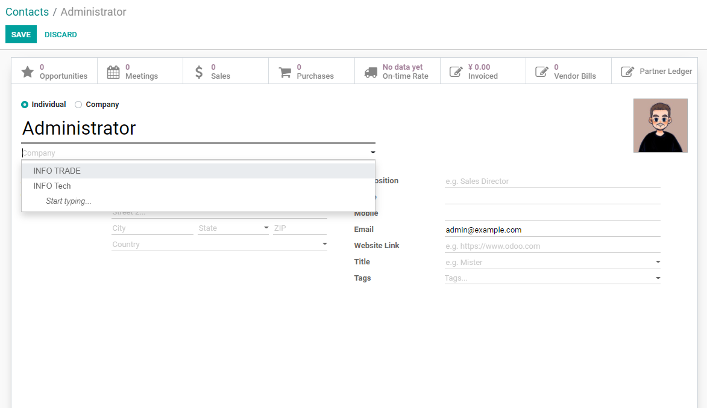

可以看到，我们在创建一个合作伙伴的时候可以选择该合作伙伴是个人还是一个公司，如果是个人，那么我们可以在下面选择他所属的公司。一旦我们给个人选择了公司，那么我们在创建销售单的时候，如果选择个人作为客户，那么我们看到他隶属的公司：


合作伙伴可以按照类型分为**个人**与**公司**, 从技术角度上讲, 取决于它的company_type字段取值. 而company_tyep事实上只是一个计算字段, 其背后的字段应该是is_company

```python
company_type = fields.Selection(string='Company Type',
        selection=[('person', 'Individual'), ('company', 'Company')],
        compute='_compute_company_type', inverse='_write_company_type')


@api.depends('is_company')
def _compute_company_type(self):
    for partner in self:
        partner.company_type = 'company' if partner.is_company else 'person'
```

因此, 我们在对合作伙伴进行功能拓展的时候要注意使用is_company而非company_type.

## 合作伙伴的类型

前面讲过，合作伙伴的概念不仅仅局限于客户、供应商，甚至可以用于收货地址等更为广泛的概念。合作伙伴可以分为一下几种类型：

* 联系人：客户、供应商等联系人信息
* 发票地址： 收取发票的地址
* 送货地址： 发送货物的收货地址
* 其他地址： 客户的备用地址
* 私有地址： 只有被授权才可以访问的私有地址

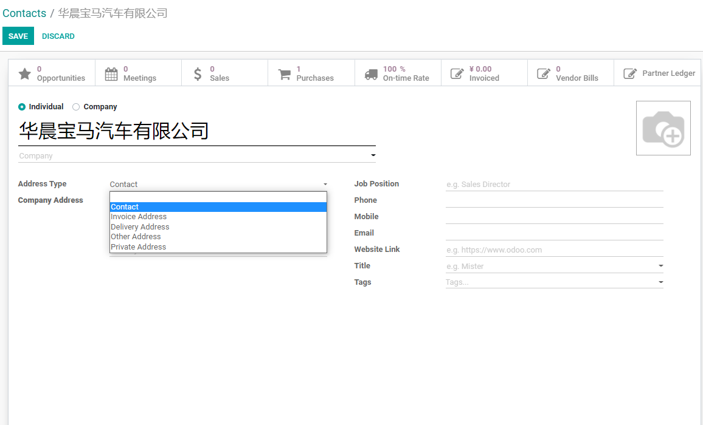

## 用户、合作伙伴和员工

初次接触odoo的同学可能会被这三个概念搞糊涂，通常一个odoo的系统用户对应一个合作伙伴，从技术的角度上讲，用户指的是res.users对象，是一个可以使用账号密码登录的账号，合作伙伴是res.partner对象，是一种记录信息的载体，并不能用来登录。

那员工又是什么呢？如果用户安装了人力资源模块，系统中会有一个员工对象hr.employee，它代表的是公司的雇员信息。

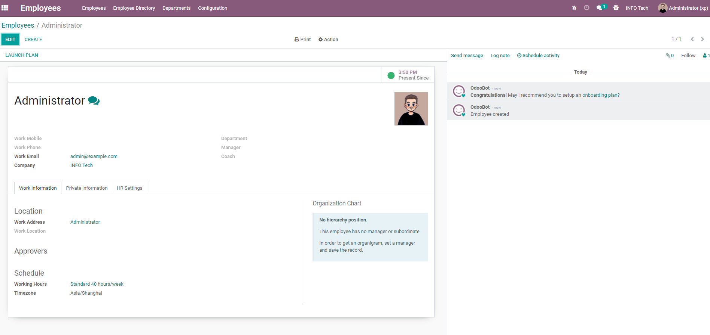

员工与用户是有关联关系的，在HR设置Tab页中，有一个字段关联的用户，用于关联用户和员工。

有很多人觉得odoo不方便的一个地方就是把员工信息和用户关系割裂开了，不能像他们之前使用的软件一样根据部门进行权限的划分。这确实是odoo本地化的难点之一，但是我们也不能用传统企业信息化的思维来要求odoo，解决方案就是利用好odoo提供的用户组和规则等权限工具，实现我们想要的目的。

## 国家和城市

联系地址也是合作伙伴的一种，对于客户和供应商，通常我们会记录它们的联系电话和地址。一个常规的联系人界面如下图:

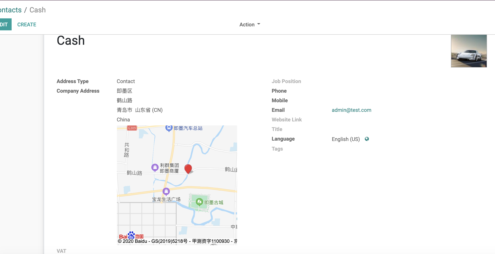

### 联系人地址格式

不同国家的地址格式不同，odoo原生支持地址格式的自定义。下面我们来看一下不同国家如何采用不同的地址格式。

在国家设置中有两个字段:

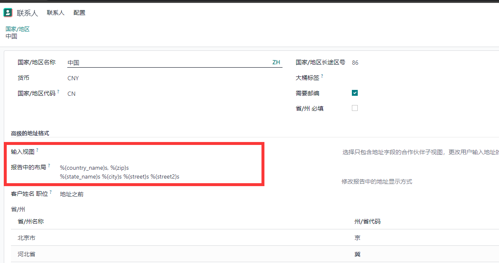

* 输入的视图： 自定义地址格式的视图
* 地址格式布局： 地址格式的布局方式。

> 虽然这里的描述中说用于PDF报告文件，但实际上在地址显示中也是用到了该字段。

我们知道默认情况下，地址的格式顺序是:

```sh
street/stree2/zip/city/state_id/country_id
```

如果想要改变默认的排序方式，我们就可以在地址布局字段中重新排序：

```sh
%(country_name)s, %(zip)s
%(state_name)s %(city)s %(street)s %(street2)s
```

上面的例子是中国常用的地址格式顺序。

可用的变量：

* country_name: 国家
* zip: 邮编
* state_name/state_code： 省/州
* city: 城市
* street: 地址第一栏
* street2: 地址第二栏

> 虽然我们可以通过指定地址格式顺序的方式对地址重新排序，但有些情况下系统的行为并非我们预期的那样，例如使用西班牙国家时， 你会发现它的行为逻辑不是代码中的顺序。这是因为，在没有指定地址视图的情况下，系统会对含有城市一栏的地址代码进行重新排序。

### 开启城市选择

我们可以在此表单上选择国家、省份，然后填写城市和详细地址。一般来说，当我们确定了国家时，省份信息会自动加载，有一种联动的效果。默认情况下，城市是一个文本框，需要手动填写城市名称。从12.0开始，城市也支持了联动效果，但是默认情况下是关闭状态。

要开启城市选择效果，首先需要安装base_address_city模块，然后到菜单联系人-设置-本地化-国家，找到你要更改设置的国家，然后激活城市：


激活以后，我们的城市将变为下面的状态:

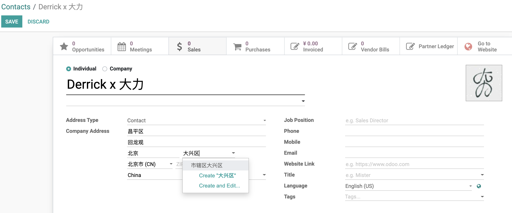

另外，如果需要将地址详细到门牌号，那么可以安装base_address_extend模块，安装此模块以后，地址列表中将出现楼号和门牌号字段：


### 中国三级省市区联动

虽然官方加入了城市的多选效果，但是，对于中国大陆用户而言，官方选择的合作伙伴提交的地址模块并不是那么好用。实际的使用过程中，我们经常需要输入县区这一级的行政区域，而官方并没有单独将县区化作单独的字段，而是合并到了城市当中，这当然对我们的使用造成了不便：

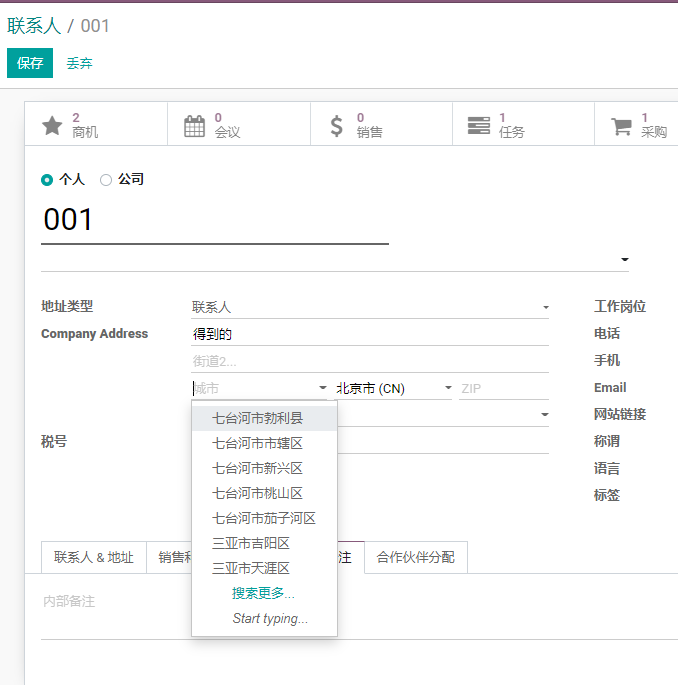

因此，我们在自己的解决方案中专门为此开发了一个新的模块——[中国地理位置区划](https://odoohub.com.cn/shop/30#attr=)解决此问题，根据2020年中国最新的行政区域规划进行了设计(已支持4级乡镇联动)。使用效果如下：


需要的同学可以我们的[官方模块商城](https://odoohub.com.cn/shop)进行选购。

## 地图模式

与社区版不同的一点是，企业版内置了一种地图视图，可以很方便地在地图上查看客户的位置信息。

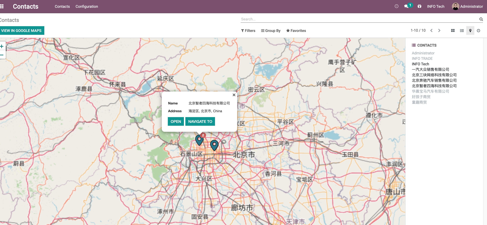

比较遗憾的是，由于某些原因，国内访问的时候不是很稳定，时常出现加载不出来的问题，显得不是那么很接地气。因此，我们也为此开发了一个百度地图的模块，用来替代这个模块。

关于百度地图模块的详细内容，可以参考[附录](../chapter10/README.md)。

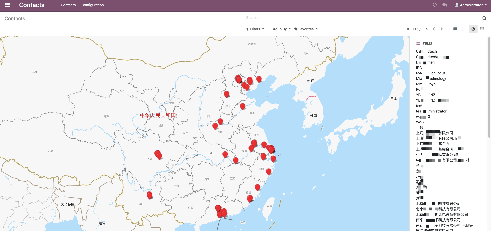

## 联系人的显示名称

通常display_name作为计算字段是不存储的，但是在联系人模型(res.partner)中，odoo对它进行了存储。

它的计算方法如下：

```python
@api.depends('is_company', 'name', 'parent_id.display_name', 'type', 'company_name', 'commercial_company_name')
def _compute_display_name(self):
# retrieve name_get() without any fancy feature
names = dict(self.with_context({}).name_get())
for partner in self:
        partner.display_name = names.get(partner.id)
```

这就导致，如果我们想要使用name_get方法对res.partner的显示名称进行修改，如果不在依赖中声明我们所需要的字段，那么我们希望的事情就不会发生。

## VAT校验

Odoo原生支持对不同的国家VAT进行校验，开启方法即安装相应的本地化模块。例如，我们这里以西班牙为例，如果我们想要创建联系人时对联系人的税号进行校验，那么就要安装西班牙本地化模块l10n_es，安装之后，就开启了VAT校验。

当我们创建或修改的联系人国家选择的是西班牙时，系统会要求VAT税号满足ESAXXXXX格式，当我们输入的税号不符合这个格式时，系统会提示：

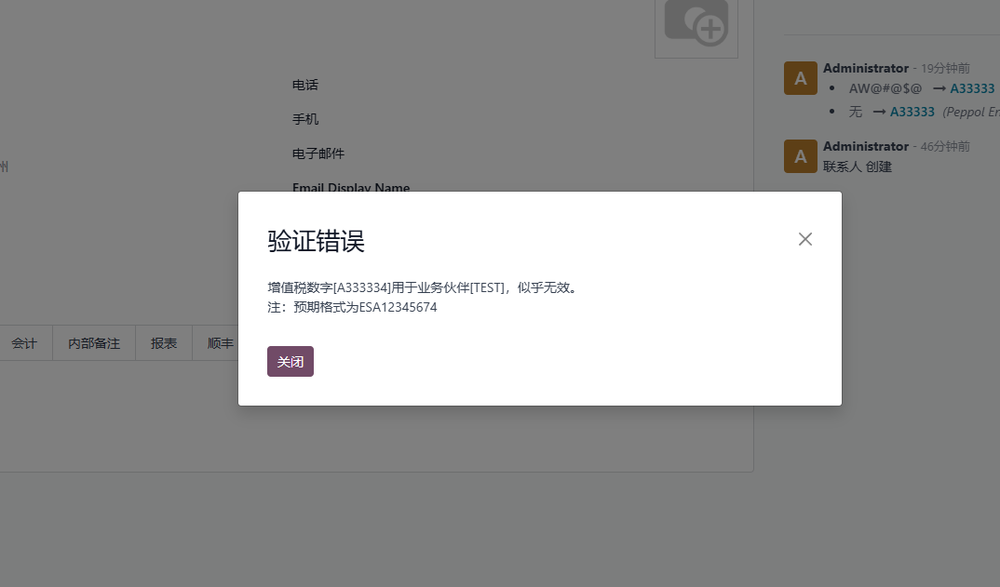

如果想要去掉这个限制就需要卸载本地化模块。由于卸载模块是个不安全的操作，因此，我们在[联系人解决方案](https://odoohub.com.cn)中对此进行了优化，我们在设置中新增了VAT校验控制选项：

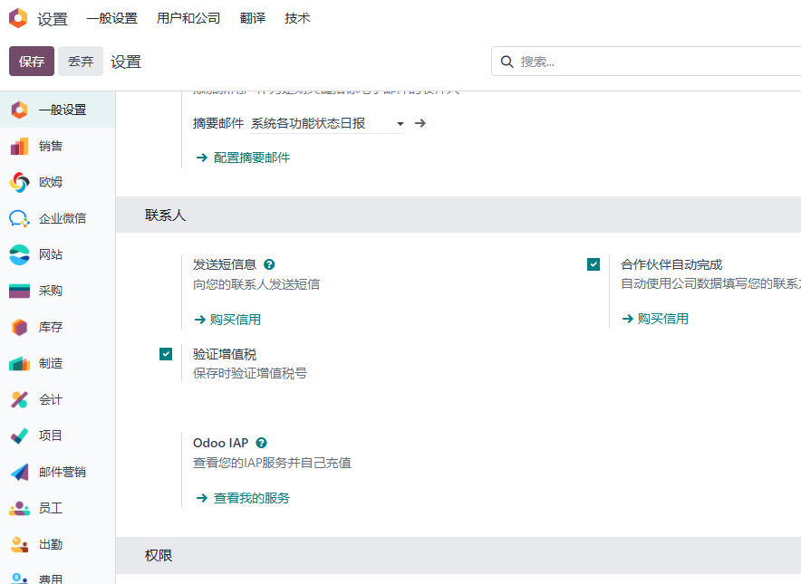

当我们取消掉VAT校验选项时，系统就不会再对VAT税号进行格式校验了。