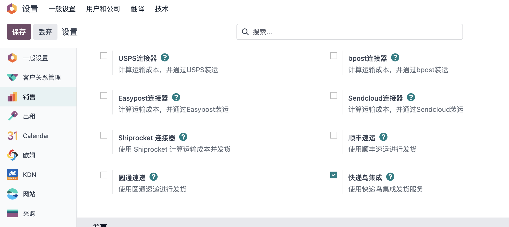
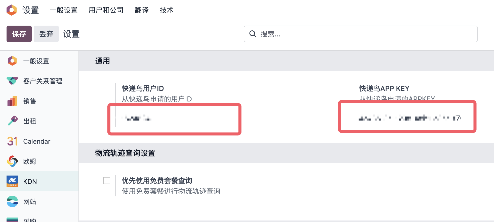
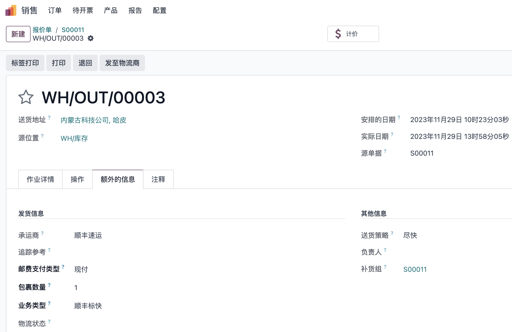
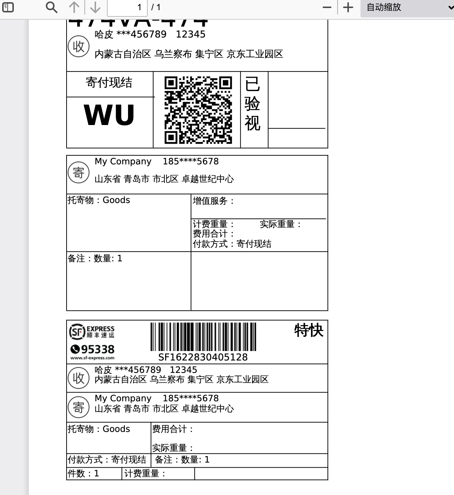

# 快递鸟模块

[快递鸟](http://www.kdniao.com/reg?from=TX-Kevin)是国内使用较为广泛的快递集成查询平台之一，提供了600+的物流公司对接接口，是比较不错的物流查询服务选择。随着odoo17.0的发布，我们最近也将快递鸟模块升级到了17.0。下面我们来详细看一下如何使用。

## 注册快递鸟账号

要使用快递鸟的查询服务，我们首先需要在[快递鸟](http://www.kdniao.com/reg?from=TX-Kevin)平台注册一个账号。

注册完成后，可以在个人中心获取到用户ID和APPKEY：

## 安装并设置快递鸟模块

拿到用户ID和APPKEY以后，我们就可以设置我们的快递鸟模块了。首先，在系统中设置中勾选快递鸟集成模块:

安装完成后，我们在快递鸟设置菜单中把用户ID和APPKEY填到设置中。

然后我们就可以开始使用快递鸟进行发货了。

## 激活要使用的承运商

对于大多数人来说，经常使用的快递服务商可能就那么几个，因此快递鸟提供的600+物流商过于冗余，因此我们默认将所有的承运商都进行了归档处理。如果想要使用其中的某几个，只需要在归档的列表中进行激活处理即可。

## 使用快递鸟发货

正如前面所说，我们这里以顺丰速递为例，进行发货操作。我们在销售单中做一单销售，然后在生成的发货单中选择顺丰速递作为承运商。

与之前版本不同的是，我们在17.0版本中修正了电子面单的打印方式，采取了跟其他物流方式一样的处理逻辑。当用户完成调拨时，自动将生成的电子面单附加在讨论区中。

## 打印电子面单

点击附件的PDF文件，我们就可以打印电子面单了。

## 物流查询

快递的物流信息会自动显示在快递单号下方，用户可以点击更新物流信息进行手动更新。

## 快递鸟的优势与缺点

优点自然是快递鸟集成的快递商很多，不用单独进行对接。缺点是，快递鸟的查询服务需要付费且不支持运费查询。假如你只是想要使用某个承运方(例如顺丰)，更推荐单独对接。

## 技术支持

<iframe src="//player.bilibili.com/player.html?isOutside=true&aid=579125651&bvid=BV1a64y1L7Zn&cid=1351600414&p=1" scrolling="no" border="0" frameborder="no" framespacing="0" allowfullscreen="true"></iframe>

想要了解更多关于快递鸟模块的信息，欢迎关注公众号OdooHub获取更多内容。
