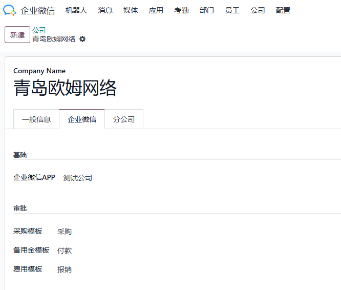
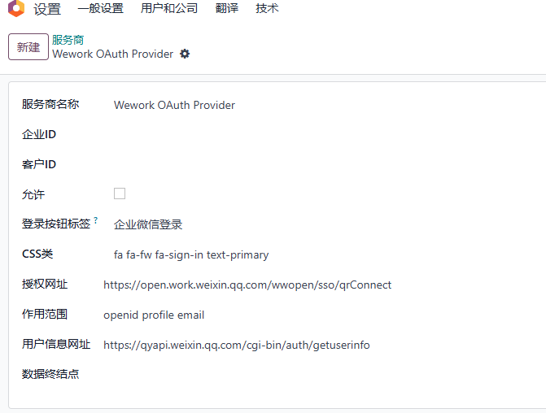
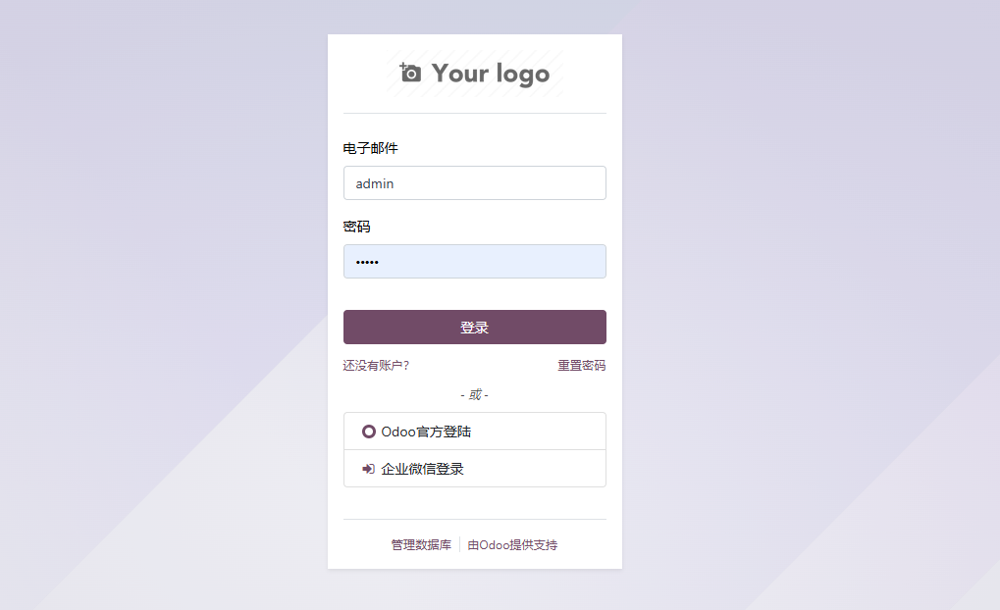
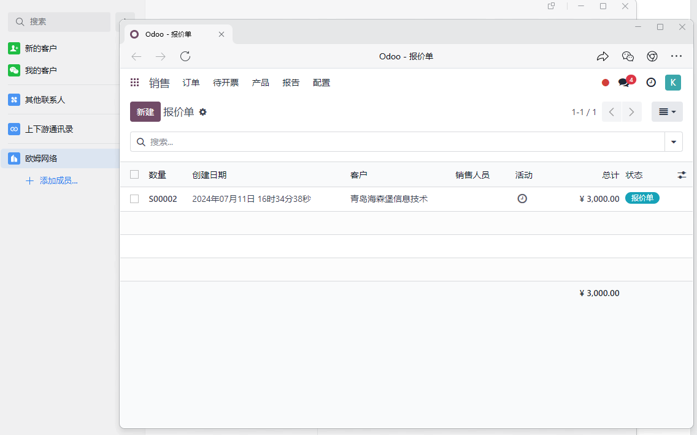
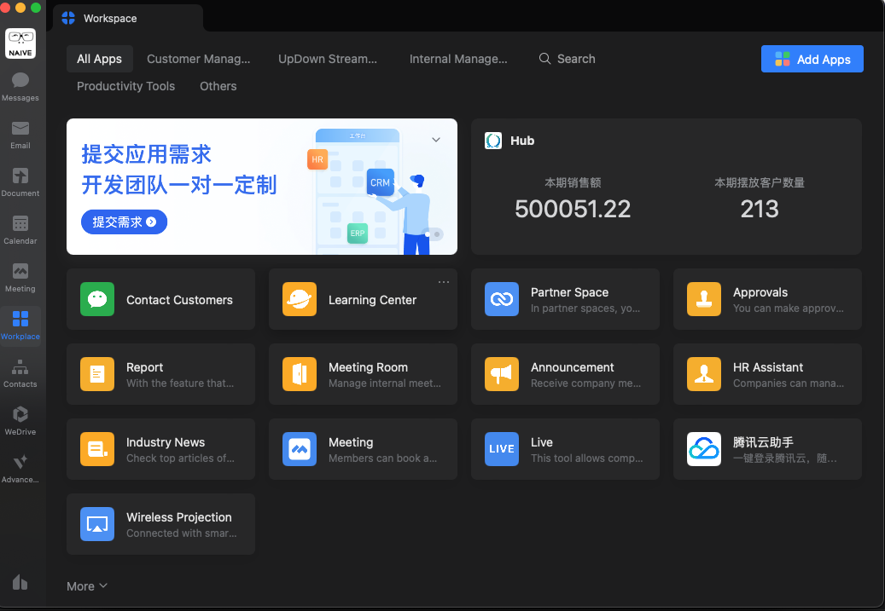
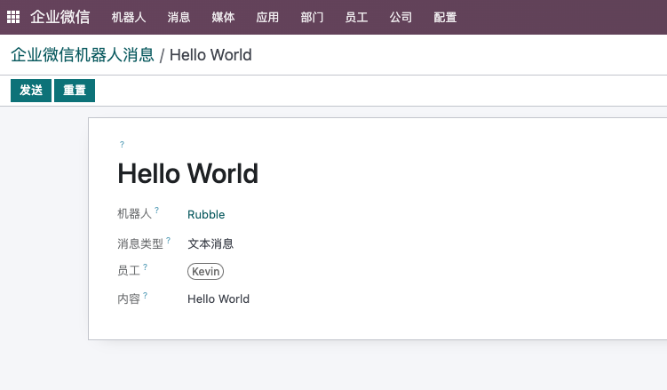
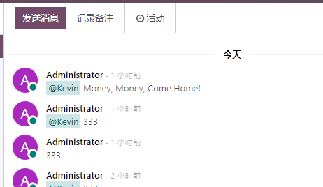
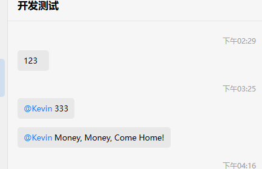
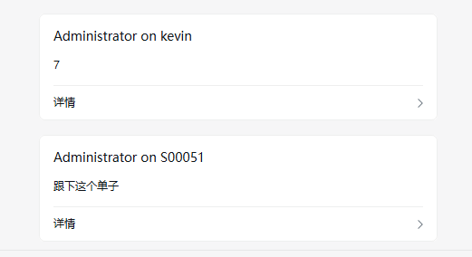

# 企业微信解决方案

> 本文基于企业微信模块(17.0.1.12) \
> 兼容版本：13.0 15.0 16.0 \
> 版本间有些许差异，详询客服

* [需求背景](#需求背景)
* [后台配置](#企业微信管理后台配置)
* [Odoo端配置](#odoo端配置)
* [基础版功能](#功能介绍)
  * [扫码登录](#扫码登录)
  * [菜单管理](#菜单管理)
  * [工作台设置](#工作台设置)
  * [机器人消息](#机器人消息)
  * [讨论组消息](#讨论组消息)

## 需求背景

企业微信作为当前企业内部沟通的几大内部IM软件之一,其优势在于能够跟微信打通,方便与客户联系。很多客户都有需求，要在企业微信内部对工作进行及时通知和反馈，在企业微信中进行审批，乃至统计员工的考勤和费用等等。

本模块将展示，通过与odoo的关联，我们将如何利用企业微信提高我们的工作效率。

## 企业微信管理后台配置

首先，要使用[企业微信](https://work.weixin.qq.com/)，您必须要先注册一个企业微信账号。

注册完成之后，使用管理员账号登录[管理后台](https://work.weixin.qq.com/wework_admin/frame)

### 创建应用

要使用企业微信，我们需要创建一个应用。在企业微信后台-应用管理-创建应用，创建一个应用。这里我们起名Odoo：

### 获取基础参数

然后，我们需要获取以下三个参数：

* 企业ID: 在企业微信后台-我的企业获取，例： ww123456
* AgentID： 应用ID，例：1000001
* 密钥：应用密钥，例：abcdefghijklmn

然后我们需要设置**网页授权及JS-JDK的域名**用于OAuth授权：

最后，还要把服务器的IP加入到**企业可信IP**的白名单中。

## Odoo端配置

我们在企业微信后台配置完成之后，就可以在odoo中进行接入了。首先，在用户管理中，把用户加入到**企业微信经理**用户组中。

然后我们在主菜单中点击企业微信，进入企业微信模块内。在企业微信模块-设置-企业微信中，填入我们前面拿到的几个参数：

> 如果需要验证域名归属，将后台生成的验证文本文件名和内容分别填入到域名设置中即可完成校验。

### 消息解密

如果需要解析企业微信服务器发送来的消息，还需要配置EncodingAESKEY和Token, 这两个参数可以在企业微信后台消息API设置中获取到。

### 绑定公司

设置完企业微信应用之后，我们还要绑定使用的公司才能正常使用。在企业微信-公司-企业微信选项卡中，选中我们刚才创建的应用。

这样就完成了Odoo端的基础配置。下面我们来看一下企业微信模块拥有哪些功能。

## 功能介绍

### 基础数据同步

接入企业微信后的第一件事就是把企业微信中的部门和员工数据同步到Odoo中，我们在企业微信-设置-同步部门/同步员工，两个菜单可以分别完成两个同步动作。

### 员工同步

在进行员工同步时，用户可以根据自己的需要选择**自动绑定用户**或者**创建用户**

#### 自动绑定

同步员工数据时，默认根据员工姓名进行匹配，也可以在应用的设置中调整匹配策略。目前支持的匹配策略有：

* 根据姓名匹配
* 根据邮箱匹配
* 根据电话匹配
* 根据邮箱或电话匹配
* 以上任意一条满足匹配

#### 自动创建系统用户

如果勾选了自动创建客户，那么系统会自动查找当前同名用户是否存在，如果不存在则自动创建一个同步用户。

> 自动创建的用户，登陆名称为其企业微信ID

### 扫码登录

同步完基础数据，那么就可以开启扫码登录功能，简化员工登录步骤。在设置-用户-OAuth服务商中，打开Wework OAuth Provider一行:

勾选允许选项。然后将**企业ID**和**AgentID**分别填入企业ID和客户ID即可。

我们退出登录就可以看到登录界面多出了一个企业微信登录按钮，点击出现扫码登录界面，使用企业微信扫码即可完成登录。

### 菜单管理

我们的自定义应用会出现在企业微信的应用列表中，应用支持自定义菜单，我们可以在系统中设置我们想要的菜单，并分配合适的动作。

一个应用可以支持最多3个一级菜单和5个二级菜单。

我们可以在菜单设置中直接关联我们系统中的特定页面，从而一键直达想要的数据。

### 工作台设置*

与应用主页相比，工作台的位置更为显眼，而且可以定制数据展示方式。

在企业微信-应用-工作台中，创建一个工作台，并设置它的样式：

然后用户可以在企业微信客户端的工作台出看到我们定制的数据展示:

### 机器人消息

我们很多业务消息可以借助机器人来实现实时同步，本模块即支持定制化的机器人消息。下面，我们来看一下如何配置一个机器人实现业务消息实时发送。

首先，我们需要创建一个机器人。在机器人菜单下，我们创建一个机器人：

Webhook URL:写我们创建的机器人的URL地址。

发送机器人消息，我们在菜单机器人-机器人消息下，创建一条测试消息：

然后我们就可以在机器人所在的群接收到这个消息了。

### 讨论组消息

为了跟方便的与企业微信互通, 我们在设置中加入了即时通讯设置, 用户需要在设置中打开这个开关：

然后在任一单据的邮件讨论区@某员工,会自动发一条企业微信通知。

某员工会即时在企业微信中收到该消息。

员工也可也在此对话框中即时回复，回复的消息会根据最近一条记录，附加到原单据的对话区。

> 消息格式默认为文本，可以到企业微信设置中选择卡片式消息进行推送。

## 结语

利用企业微信，接合odoo我们可以做的事情有很多，例如流程审批和员工考勤等等。本文只是介绍了企业微信解决方案的基础部分和常见的使用场景。更多的功能，我们将在后面的高级应用部分举例。

关于Odoo企业微信更多的应用消息，请关注公众号OdooHub。