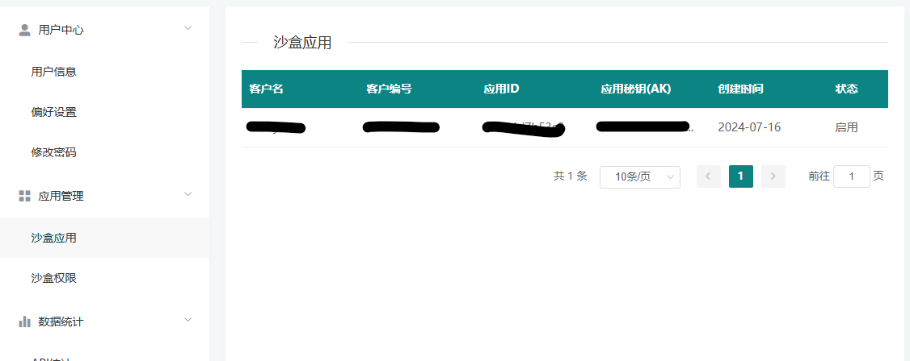
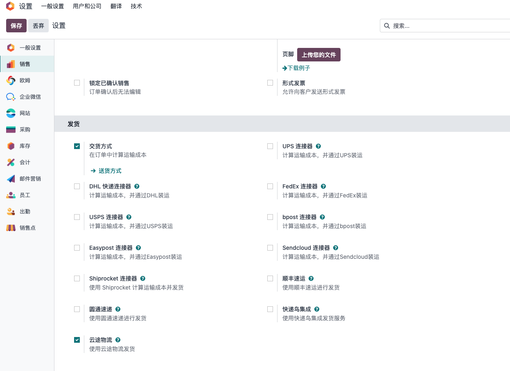
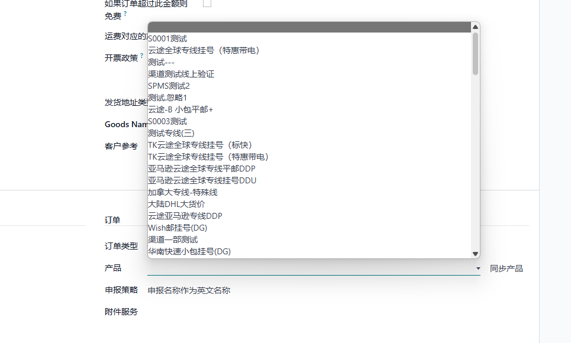
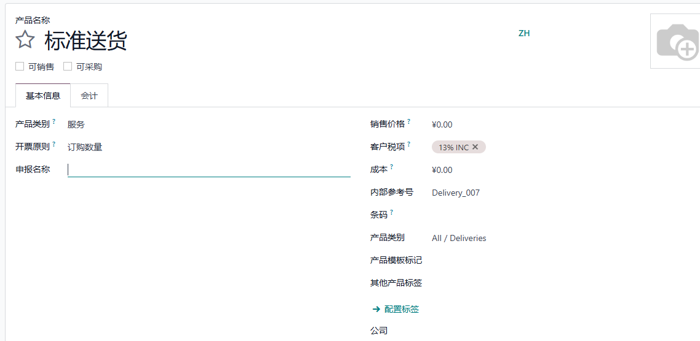
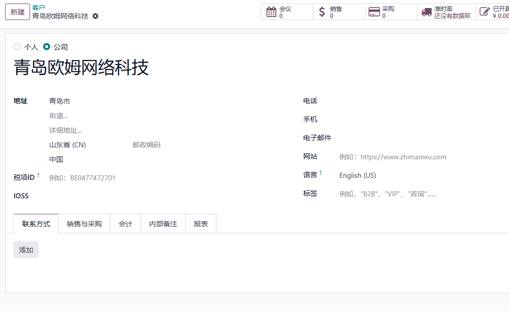

# 云途物流

> 支持版本:15.3+/17.0.1.2+

云途物流是国内一家主要服务于跨境电商小包裹的物流服务商，目前开通了多条国际线路，可以作为跨境电商行业小货的物流选项之一，本章将介绍如何使用Odoo17.0集成云途物流服务。

* [账号注册](#账号注册)
* [安装云途物流模块](#安装云途物流模块)
  * [订单类型](#订单类型)
  * [产品](#产品)
  * [申报策略](#申报策略)
  * [附件服务](#附件服务)
* [销售运费预估](#销售运费预估)
* [获取运单号](#获取运单号)
* [运单跟踪](#运单跟踪)
* [FAQ](#FAQ)

## 账号注册

首先我们需要到[云途物流开放平台](https://open.yunexpress.cn/)注册一个开发者账号，然后创建一个应用，拿到如下三个密钥

* APPID: 应用ID
* APPSCRET: 应用密钥
* SOUCEKEY: 确认来源的字符串

> SourceKey在设置用户信息中获取

## 安装云途物流模块

拿到上述三个参数，我们就可以安装我们的模块了，到系统-设置-销售中，勾选使用云途物流发货:

保存之后就可以到库存-设置-物流方法中选择云途物流进行配置了：

在基础配置中配置前面提到的三个参数，配置完成后我们就可以设置其他参数了。

### 订单类型

云途物流发货的方式可以分为两种**包裹**和**FBA**：

* 包裹：客户端向云途订单系统发起订单预报申请，用于单票寄件场景；
* FBA: 客户端向云途订单系统发起订单预报申请，用于FBA（Fulfillment by Amazon）寄件场景；

### 产品

云途物流支持的线路产品列表，点击同步按钮可以更新支持的产品列表。

### 申报策略

我们在运费产品中新增了一个申报名称字段，可以用来填写产品的申报的名称。

这里有两个选项：

* 使用申报名称作为英文名称
* 使用申报名称作为中文名称

用户可以根据自己的实际情况进行设置

### 附件服务

对于发往欧洲的快件，欧盟有可能会要求输入IOSS税号，因此我们在联系人的资料中添加了IOSS字段

当发货商有IOSS税号时使用IOSS税号，如果缺少IOSS税号，则可以在附加服务中添加V1服务是使用云途代收服务进行发货。

## 销售运费预估

我们可以在销售单中使用云途物流来预估运费:

需要注意的是这里使用的云途物流产品是设置中的物流产品。

## 获取运单号

我们在发货单中正常操作，交付产品，操作完成后，会自动生成运单号和电子面单:

## 运单跟踪

跟其他物流方式一样，点击物流跟踪按钮，跳转到官网进行查询。

## FAQ

### 1. receiver.address_lines 单个字串长度:1-200

地址栏长度超过200个字符、或地址栏中有空白字段
