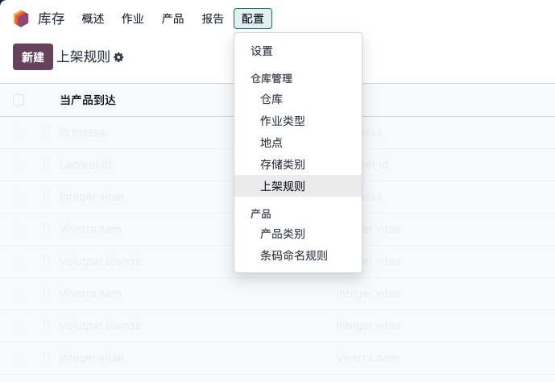

# 第九章 上架规则

* [上架规则与调拨单的优先级](#上架规则与调拨单的优先级)
* [子库位策略](#子库位策略)

与下架策略相对应的功能是上架规则，对于指定到达的产品，设置默认的入库库位。在仓库-设置-仓库管理-上架规则中进行管理：

> 上架规则的前提是要开启多库位管理

上架规则需要设置以下几项：

* 产品：上架规则应用于哪个产品
* 产品到达：产品抵达的指定库位，只能是父级库位
* 产品类型：上架规则作用于哪个产品类型
* 存储到：需要存储的目的库位
* 子库位*：存储到子库位的策略
* 存储类别：基于产品或数量的存储规则(参考存储类别一章)
* 公司：多公司条件下指定的公司

> 子库位为18.0新增字段

也就是说，假如我们这里有一个产品P，和两个库位 WH/L1和WH/L2，如果我们希望在采购单确认的时候把入库单上架到L2库位，那么我就这样设置：

产品：P, 产品到达：WH, 存储到: WH/L2。

## 上架规则与调拨单的优先级

读者在使用odoo的过程中可能会碰到比较迷惑的一种操作，假设我们这里有一张调拨单WH/INT/0002，我们设置的其源库位是BMW Location，目的库位是Audi Location，我们希望的操作是将一辆错误放到BMW库位的A4L调拨回Audi库位，但是实际操作过程中却出现了下面诡异的行为：

这显然与我们直观的逻辑不符，我们明明指明了目的库位是Audi Location，但是在检查库存的时候生成的目的库位居然依旧是BMW Location。那么这究竟是Odoo背后的逻辑错误，还是我们误操作了什么呢？

经过我们对源代码的研究，发现了其逻辑设计的思路，其背后的在作祟的就是上架规则。odoo的**上架规则优先级要高于调拨单的目的库位设置**，因为我们设置了A4L的在WH仓库的上架规则，因此，这里份简单上设置的目的库位就无效了。

## 子库位策略

子库位策略有以下三种：

* 无：不使用子库位策略。
* 上次使用：使用最近使用过库位作为目标库位。
* 最近位置：使用存储类别绑定的库位中距离最近的库位。

