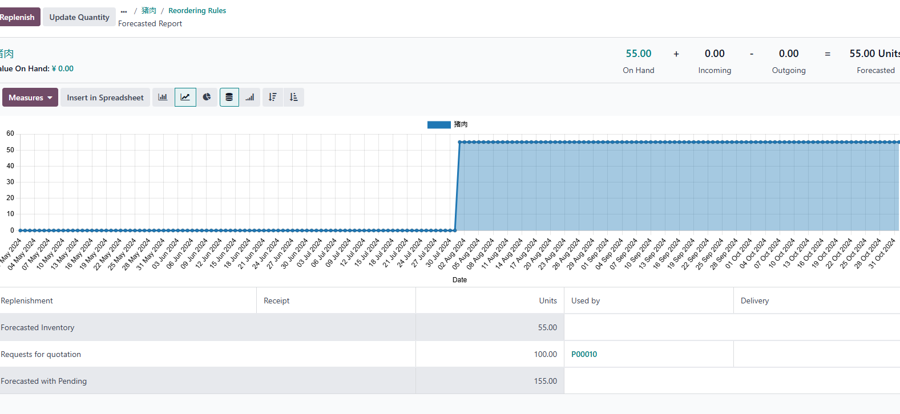
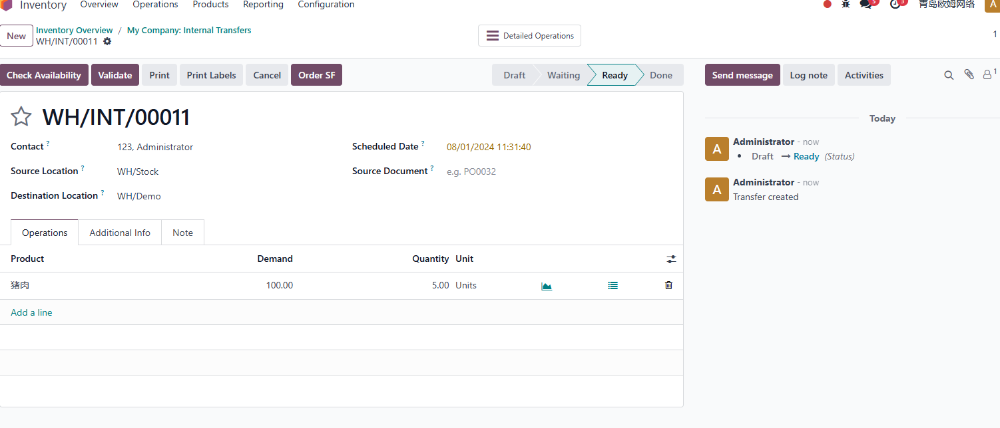
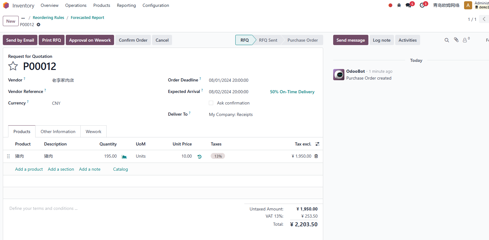

# 第六章 重订货规则

Odoo支持根据系统运行情况自动生成采购单进行补货，这里运行的机制是补货规则，我们可以根据不同的产品对于不同的库位和库存水平指定多样化的补货规则，以满足我们库存管理的需要。

* [基本概念](#基本概念)
* [补货逻辑](#补货逻辑)
* [在途数量](#在途数量)

## 基本概念

重订货规则(Reordering Rules)是Odoo提供给我们用来自动补货的逻辑规格则工具，它的基本属性有：

* 产品: 该订货规则适用的产品
* 库位：该订货规则生效的库位
* 在手数量：当前该产品的在手数量
* 预测数量：当前该产品的预测数量
* 路线： 使用该规则时首选的路线
* 最小数量： 订货下限数量
* 最大数量： 订货上限数量
* 待订购：当前等待订货数量
* 单位： 计量单位

## 补货逻辑

举个例子，假设我们这里有一个猪肉需要采购，我们在系统中做了如下的一个重订货规则：


我们设置猪肉的最低采购量是10kg，最高采购量是100kg，当前在手库存是0，那么当我们点击立即补货的按钮的时候，系统会自动帮我们建立一个100kg的采购单。


假如这个时候我们使用了50kg猪肉去生产肉包，那么当我们的猪肉库存消耗到100kg以内（例如55kg）的时候， 系统将自动帮我们新建一个新的采购单：



新建采购单的数量是100kg.

如果我们将猪肉消耗到了10kg以下，会是什么效果呢?


由此我们可以看出，系统补货总会以补货规则的上限来作为采购订单的采购数量。

## 在途数量

现在考虑另外一种情况，就是当我们进行补货的时候，猪肉的库存已经不足，且系统中有其他的业务正在等待猪肉的入库（销售/生产/调拨）。此时，系统补货会依据当前缺货数量和补货上限的总数作为补货数量。

例如，我们在内部做了一个调拨，从Stock库调拨100kg的猪肉去Demo库。因为我们当前只有5kg的猪肉可用，因此调拨不能完成。



此时我们发现系统给我们自动生成的采购数量是195kg



此补货的逻辑是：

```sh
采购数量 = 在途数量(缺货/在途入) + 订货规则上限数量 - 在手数量
```

也就是 100kg + 100kg - 5kg = 195kg。