# 第二章 开票

本章我们将了解如何给客户和供应商开具发票，处理支付条款等。

## 客户发票

首先，我们在做一个销售订单：

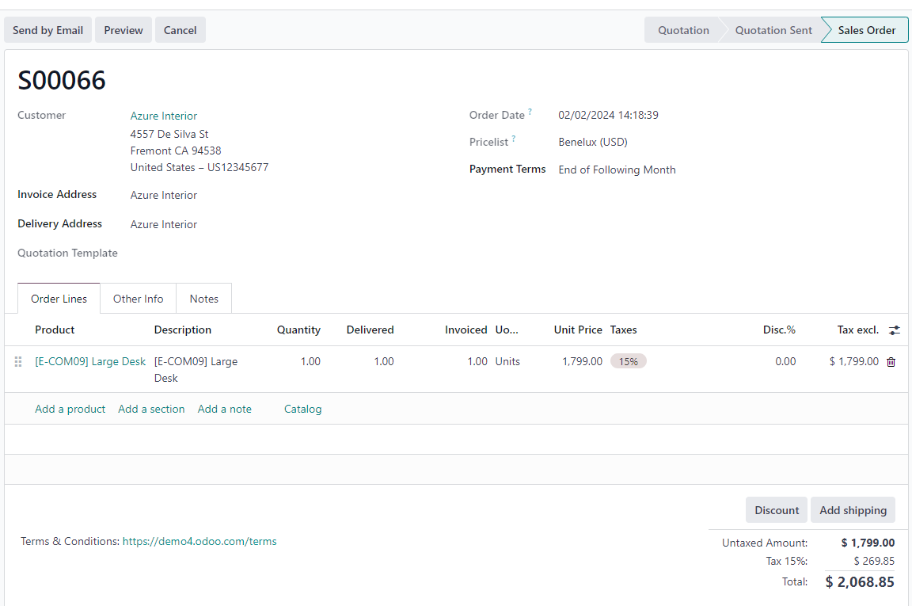

我们在确定订单后开票，发票中生成的会计科目是由产品的设置决定的。具体来说是由产品属性、产品分类属性和日记帐中的设置决定的。

在产品设置的会计属性中有两个设置，收入科目和费用科目。如果产品设置中的科目为空，那么系统将根据**产品分类**的属性中进行设置。如果产品分类中的科目设置也为空，那么系统将根据**日记账**的科目设置进行设置。

### 产品开票策略

我们在销售相关章节中也提到过，销售的开票策略由产品的开票策略决定。如果产品开票策略设置为**根据订单数量**， 那么系统允许不发货进行开票。如果开票策略设置为**根据发货数量**，那么系统将要求再发货完成后进行开票。

在销售明细中，如果订单行为绿色文字表明改行可以进行开票，反之则表明不能开票。

### 注释

我们可以在明细行中添加文字块和备注，文字块和备注将根据最近的一条产品明细一同带入到发票行中。

## 退票

如果我们在业务中需要给客户进行退款，那么首先我们就需要给客户创建一个**退款发票(Credit Note)**。步骤是找到已经开具的发票，然后单击退款按钮。

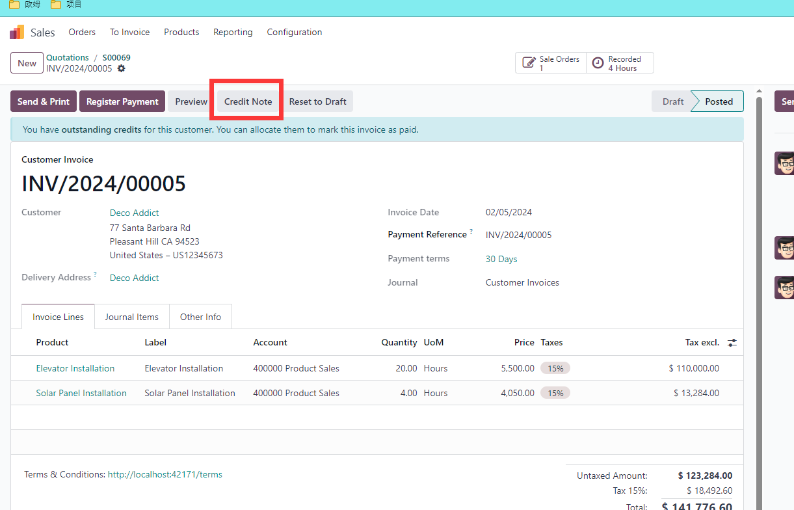

确认生成的退款发票：

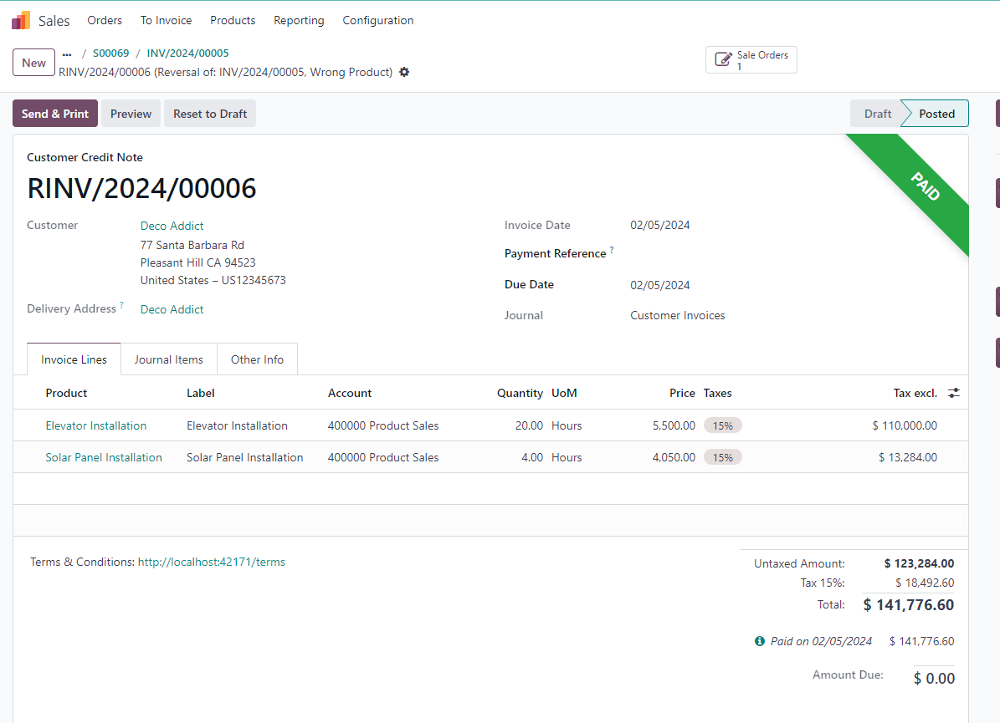

然后完成退款的支付即可。

### 使用与INV不同的序号

在日记帐中有一个设置可以让我们在创建退款发票时使用与客户发票不同的序列号：

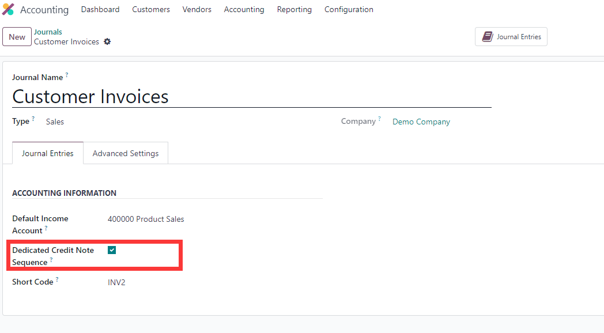

> 关于客户发票的序号机制，请参考CookBook客户发票一章。

### 部分退款

在odoo16.0及之前的版本中，退款支持部分退款。

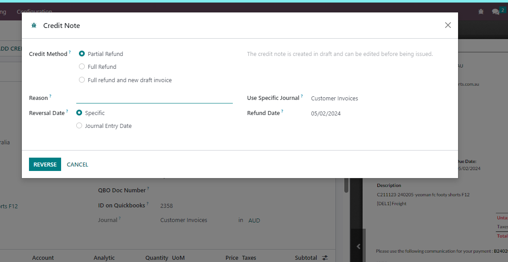

但17.0中已经移除部分退款，仅支持全部退款。

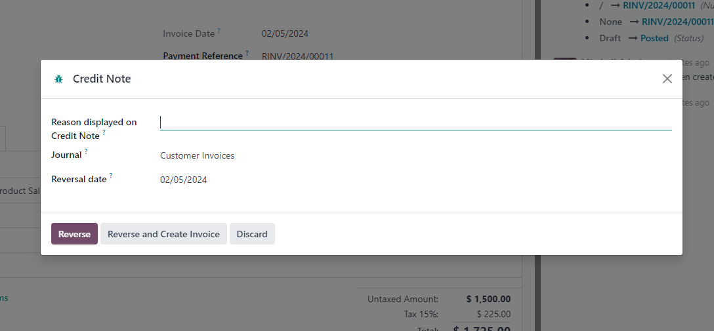

## 使用OCR识别发票

Odoo可以通过扫描将收到的发票上传到系统中，支持多个发票一同上传，并自动切割，还可以将不同的发票文件自动生成发票。

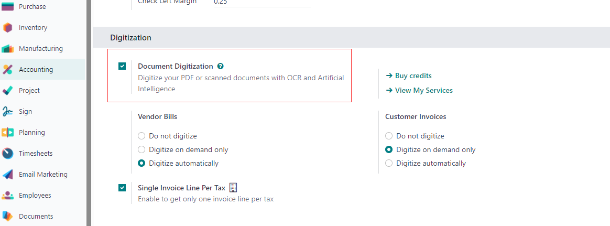

要使用OCR功能，我们首先需要在设置-会计-数字化设置中打开OCR功能。

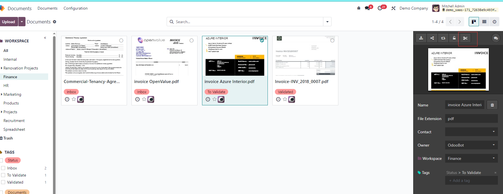

借助文档功能，我们可以将一个多个发票在一起的文件分割成多个独立的发票。

然后再点击生成采购账单按钮自动生成采购账单。

## 供应商发票

供应商发票和客户发票操作类似，只不过方向相反。我们可以通过OCR功能，上传一个供应商发的PDF，odoo会自动帮我们创建供应商发票。

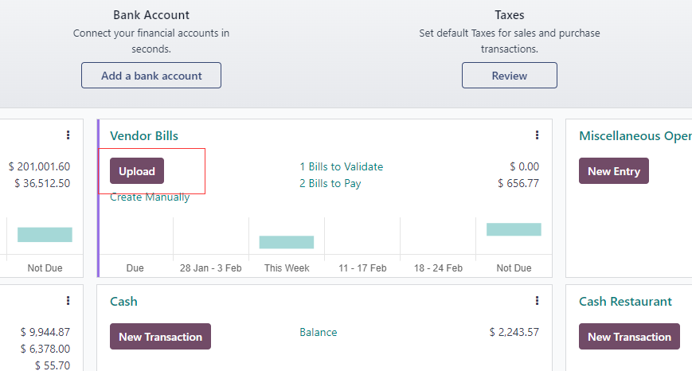

### 支付条款

支付条款用来设置客户的支付条款，创建新的支付条款位置在会计-设置-支付条款:

付款条款的默认公司为空，即所有公司都可以使用，如果设置了某个功能，那么只能由该公司使用。

这里我们举例来说，创建一个支付条款，立即支付40%，30天后支付60%，那么我们可以这么设置：

17.0与16.0不同的是，在16.0的明细类型中有一余额(Balance)类型，在17.0中被移除了。

接下来，我们使用这个付款条款创建一个客户发票:

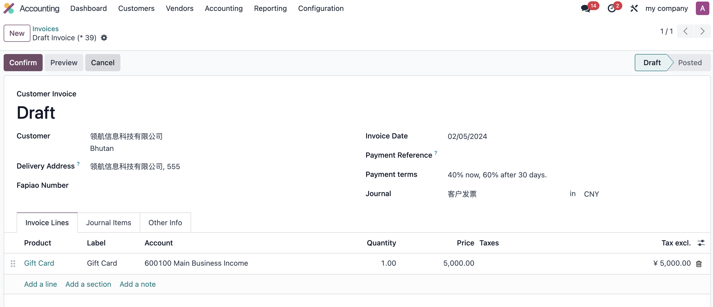

然后我们咋看它生成的会计凭证:

从会计凭证中我们可以看到在付款日和30天后分别生成了两个到期的凭证行。

#### 查看客户的到期应付

我们可以在报表-合作伙伴报表-到期的应收中看到客户的应付款:

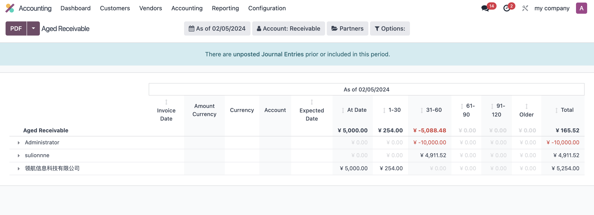

## 默认的条款和条件

我们可以在给客户的发票中显示我们的支付条款和条件, 支付条款有两种显示方式，一种是以文本形式的留在客户发票中的，另外一种方式是在线的条款链接。

设置位置在会计-设置-客户发票-默认的条款和条件:

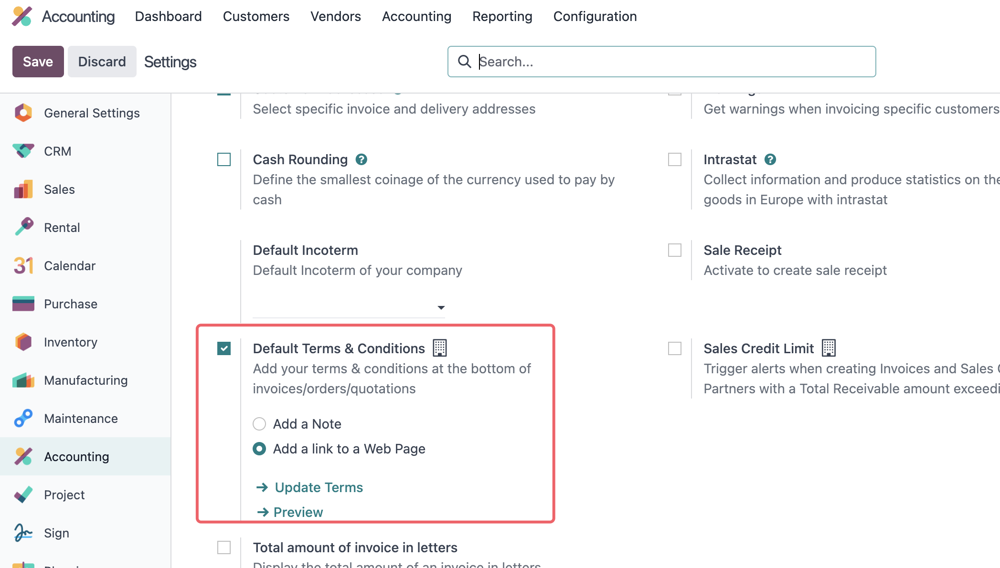