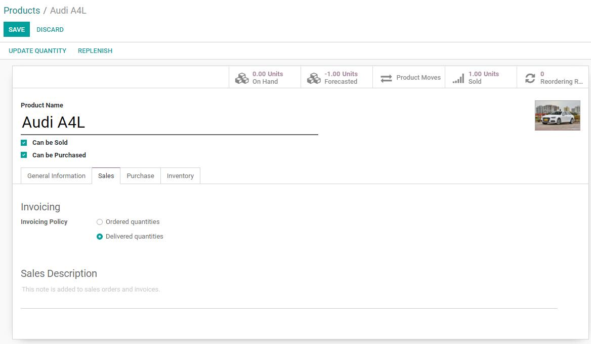
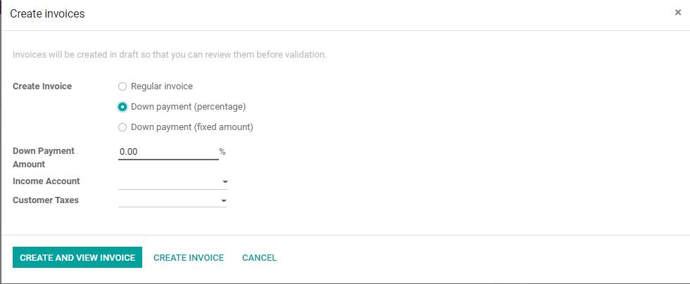
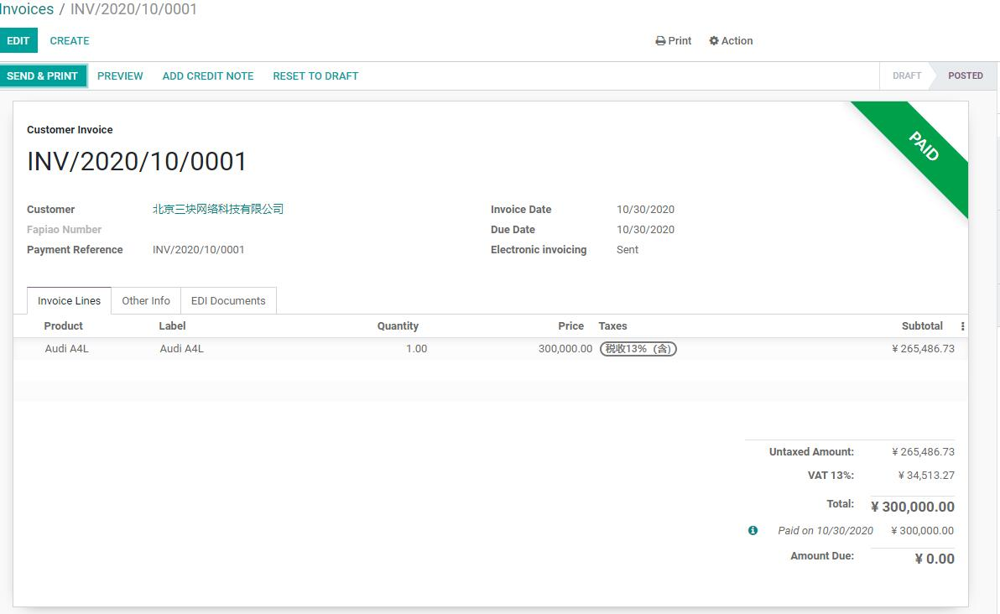
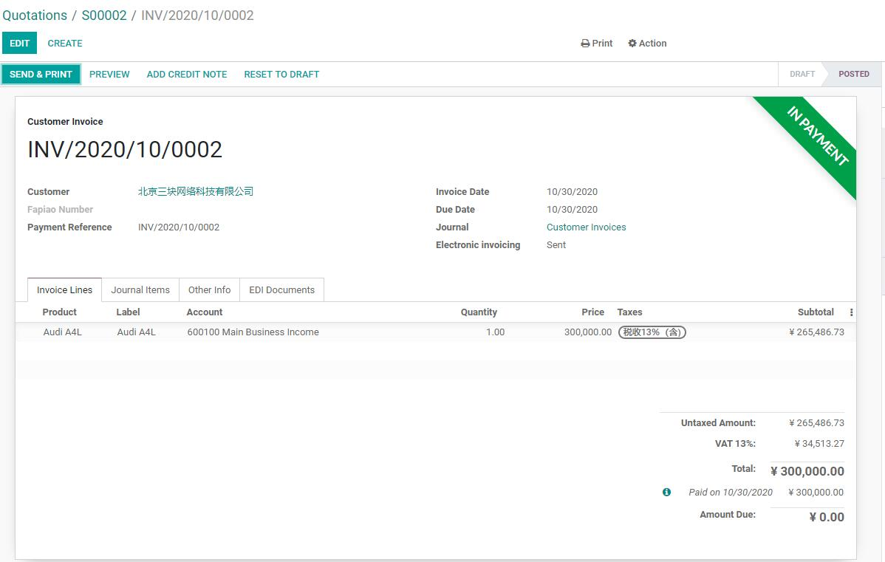
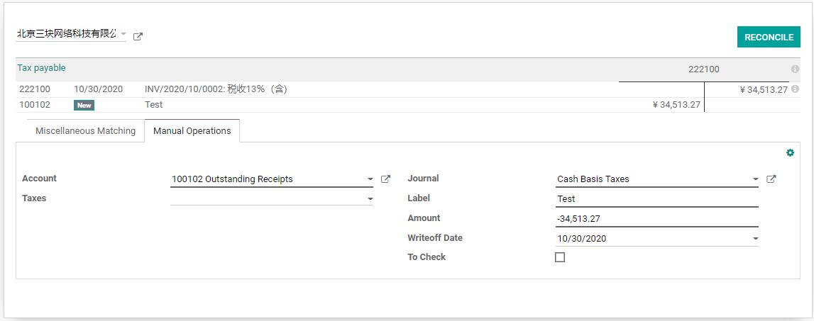
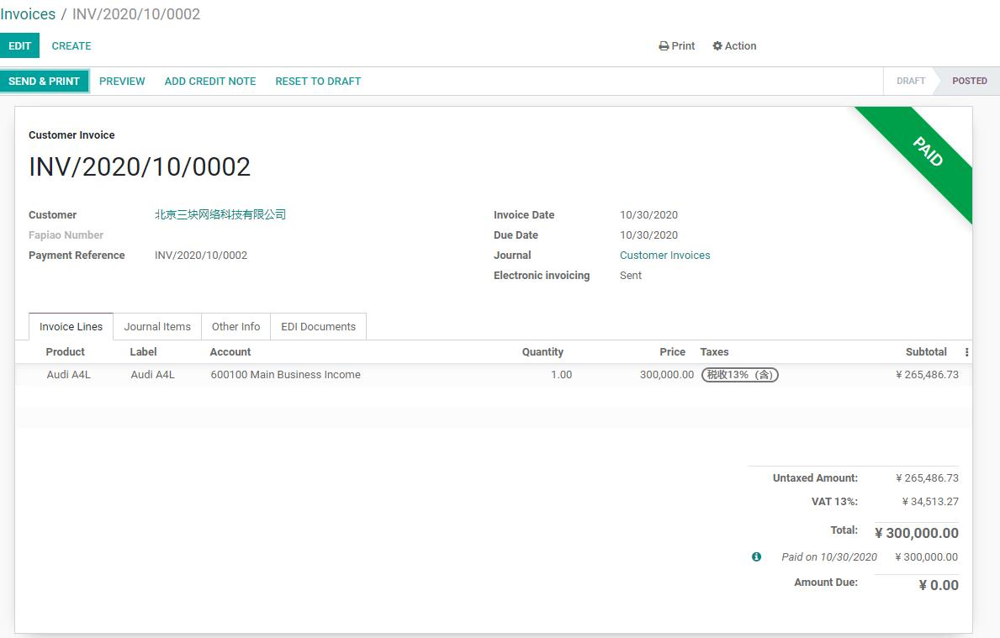
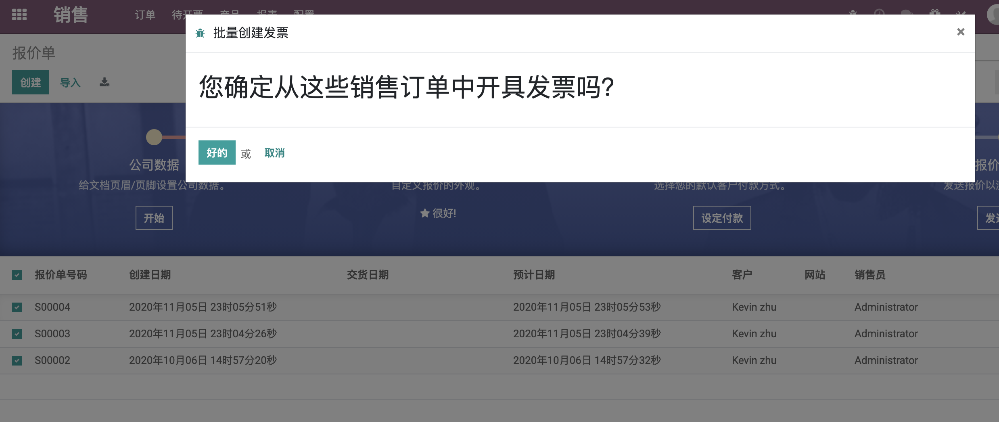
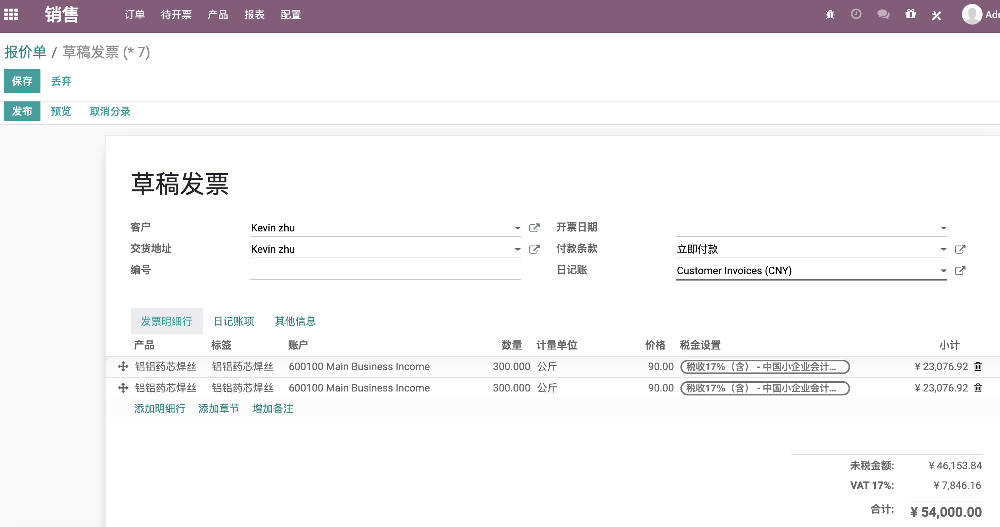

# 第一章 销售发票

本章主要介绍销售发票的创建和核销。

> 从13.0起，取消了之前的account.invoice对象，使用account.move取而代之。

## 销售发票的创建和核销

### 开票策略

我们在创建了销售订单之后，可以手动开发票，开票的数量依据是产品信息中的销售设置的开票策略：

开票策略有两种：

* 订单数量
* 发货数量

含义也狠简单，就是指开票数量是根据订单数量还是发货数量。一般对于库存商品，我们都选择按发货数量进行开票，对于服务类型的产品使用订购数量开票。

使用发货数量开票，我们就得先完成出库单，然后再开票。

### 发票的类型

我们在创建发票的时候，系统会弹窗进行问询，提供了三种类型的发票供选择：

* 常规发票： 按销售单的全单进行开票
* 预付款（百分比)： 按百分比进行首付款开票
* 预付款（固定金额）：按固定金额的首付款开票

对于预付款发票，系统会提供三个输入框，一个是首付款的百分比或者金额，一个是收入的会计科目和一个销售税种的选择。

创建发票之后，我们就可以安排付款了。

### 确认销售发票

我们可以通过销售单的关联按钮打开销售发票，也可以到会计-客户-客户发票菜单下打开销售发票，销售发票默认是草稿状态。

会计人员再确认发票金额准确无误后，点击确认将发票提交。之后，系统会显示两个重点颜色的按钮，一个是给客户发送邮件提醒，让客户安排付款。另一个是登记付款，意思就是当会计确认收到客户打款以后，手动登记付款（对于在线支付，这一步是自动的）。

点击登记付款，系统会提示一个登记付款的向导：

这里的Journal只能从现金或银行类型的日记账中选择（某些中文翻译成了付款方式，小白容易被搞迷糊）。同时需要注意的一点，如果你安装的是简单的财务模块（只有开票功能），这里提交之后，发票就会被标记为已付。如果你安装的是全功能的财务模块（企业版），那么这个地方将会被标记为登记付款(In Payment)，官方的翻译为"付款中"，实际也是不准确的，In Payment的含义是，客户已经付款，但是还需要进一步确认（核销）。

上图中，就是只安装了发票模块的效果图。如果我们安装了全功能的会计模块，那么显示的效果应该如下图：

那么，如何让这种类型的发票标记为已付呢？这就需要财务人员进行核销操作了。

### 发票的核销

打开会计-会计-动作-核销菜单，点击未核销的发票明细：

在明细里，我们可以看到所有未核销的发票明细：

选择要核销的条目，然后点击核销按钮，打开核销窗口：

然后人工填入核销的条件，点击右上角的核销，完成发票的核销操作。

### 多销售单开票

当同一个客户下了多单的时候，我们也许会希望能够将多个销售单据开具同一张销售发票，方便我们进行核销，而不用一个一个发票的进行核对。Odoo标准功能中没有此项（截止14.0），我们可以借助第三方模块来完成这个任务。

这里我们安装的模块叫invoice_batch，这是笔者自己开发的第三方模块，可以根据多张销售单或采购单开具同一张发票。需要的同学可以到笔者的[淘宝](opensoft.taobao.com)进行选购。

安装完上面的模块以后，我们在销售订单列表中，选中多个相同客户且尚未开具发票的销售订单：

点击好的，系统会自动帮我们创建一个包含所选中的订单明细的发票，如果你选择的销售订单不是已确认状态或者已经开具了发票，那么它会提示你相应的错误信息。

根据多个销售订单开具的发票的源单据中会显示多个销售单，以；分隔。