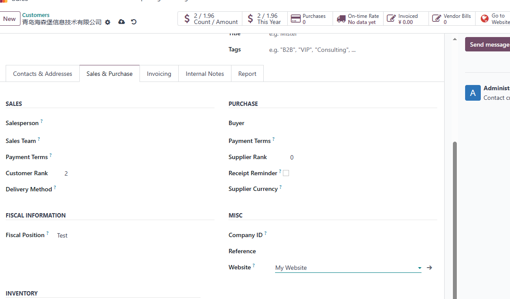
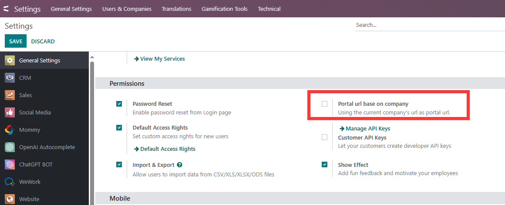

# 第一章 门户

* [门户销售](#门户销售)
* [多公司下的门户链接](#多公司条件下的门户链接)

## 门户销售

门户销售默认情况下仅支持排序,并不支持搜索和分组查询:

为了方便门户用户的使用,我们在欧姆网络解决方案的[门户销售解决方案]()中,增加了对销售订单的搜索,分组和查询支持。

筛选新增了如下支持:

分组新增了如下支持:

搜索新增了以下选项:

## 多公司条件下的门户链接

有时候我们会有多家公司，多家公司下又有多个网站，这个时候客户容易在多个网站间混乱。我们在系统中给客户发送邀请或重置密码等邮件时，需要根据客户所在的公司/网站进行不同的URL划分。

原生情况下，Odoo支持对门户用户发送的URL网址进行分类，分类的依据是下面的规则：

1. 客户资料中如果绑定了网站，那么使用该网站的URL作为邮件链接的URL。

2. 如果客户资料中没有，则根据客户的公司字段绑定的网站的URL作为邮件链接的URL。

3. 如果上述2个条件都不满足，则使用系统设置中的web.base.url的值作为邮件链接的URL。

但有时候我们希望生成的邀请/重置链接依据当前公司来进行生成，基于这种需求，在我们的[欧姆网络](https://www.odoohub.com.cn)解决方案中做了配置：

在设置-通用设置-权限中，选中基于公司的的门户链接选项即可。

这样配置完成以后，生成的链接就基于当前公司的网站域名生成相应的邀请链接了。