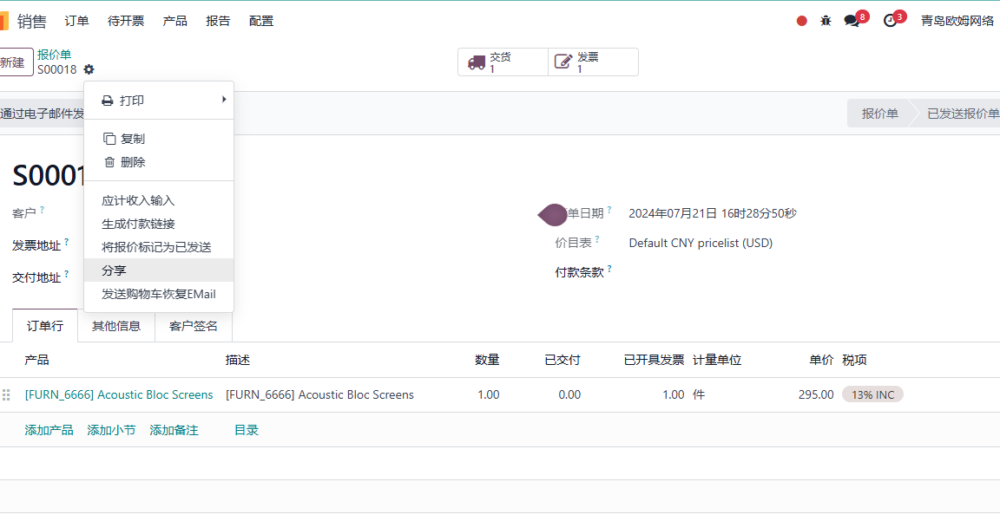
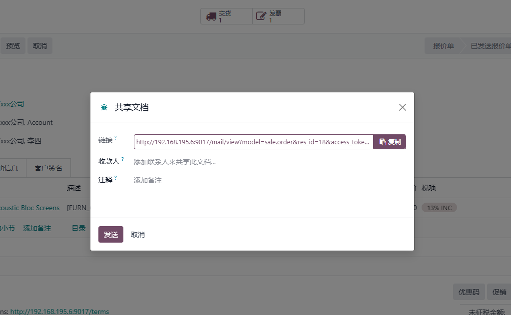
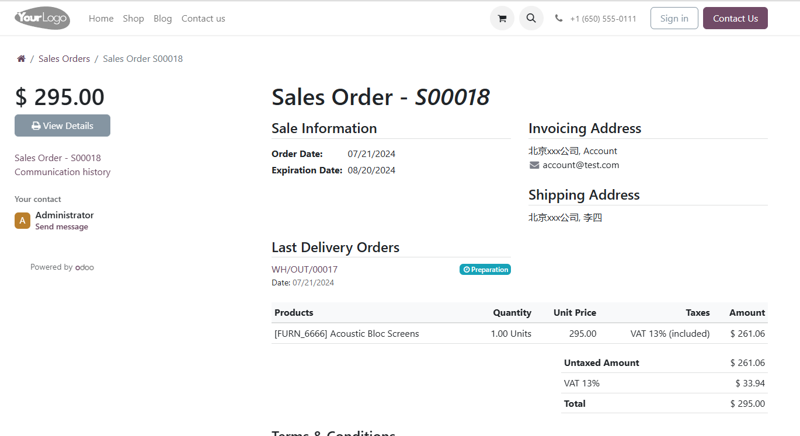
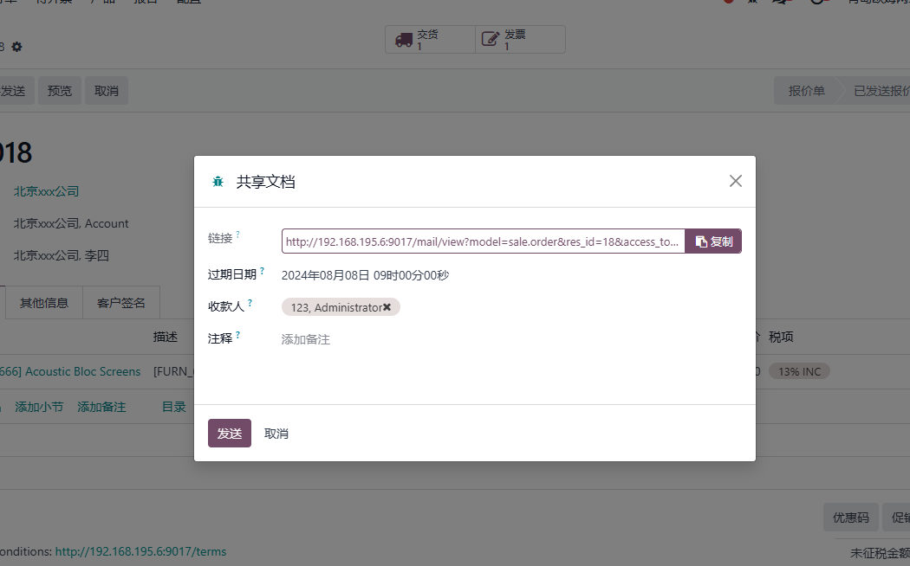
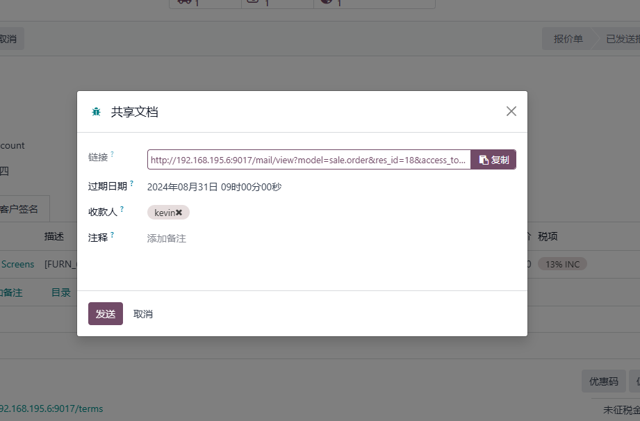

# 第三章 访问令牌

为了方便共享文档，odoo在每个文档模型中都加入了共享链接的快捷分享功能，用户可以方便的在想要分享的文档上将文档的链接分享给客户/供应商。我们以销售订单为例，来看一下分享功能的使用方法。

## 生成共享链接

我们在想要分享的文档上点击动作-分享，会弹出一个对话框：

在显示的对话框中有如下字段：

* 链接：分享链接，可以复制发送给客户的共享链接
* 接收人: 邮件的接收人
* 备注： 分享的备注

我们可以选择给客户发送邮件通知，也可以选择复制链接通过社交媒体的方式发送给客户。使用邮件通知的话，客户将受到一封共享邮件，点击邮件中的链接即可跳转到相应的销售单界面。

## 页面跳转逻辑

默认情况下，邮件的跳转链接会根据当前用户的权限选择显示不同的页面。如果当前用户拥有该文档的访问权限，那么页面将导向后台订单系统（要求登陆）。如果用户没有该文档的访问权限（例如，公共用户），那么系统将直接显示前台的订单页面。

> 因此我们在设置权限的时候需要注意，如果不希望客户登陆后台系统，就不要给客户拥有该文档的访问权限。

## 令牌

Odoo在实现上述逻辑的过程中使用了中间授权的访问令牌(Access Token)。访问令牌本质上一个uuid，当用户点击分享的时候赋值给了当前的文档。

当用户使用共享的链接进行访问时，如果用户不具备文档的访问权限，那么系统就会校验链接中携带的访问令牌是否有效。有效则进行前端展示，无效则跳转登陆页面。

每个文档只会生成一个令牌且令牌将一直有效，直到该文档的令牌被刷新。

## 多令牌和令牌管理

前面讲到过，因为每个文档只能有一个访问令牌。当我们想要将一个文档分享给不同的客户，且想要控制不同的客户的访问有效期的话，就满足不了我们的需求了。因此，我们在[门户解决方案](https://odoohub.com.cn)中增加了多令牌和令牌有效期管理的功能。

首先，我们要在设置-欧姆-门户中选中门户拓展：

如果需要销售订单共享令牌控制，则选中门户销售，点击保存即可。

### 多令牌控制

安装了门户拓展之后，我们可以到设置-技术-数据模型-门户Token中对多令牌进行管理

所有系统中生成的门户令牌都会在这里进行显示。我们可以在这里对令牌进行控制：

* 模型： 文档的模型
* res_id: 文档的关联ID
* 合作伙伴： Token所属的合作伙伴
* Access Token：访问令牌
* 过期日期：令牌的有效期，超过此时间令牌无效。

### 销售单令牌控制

安装了门户销售拓展之后，我们再去分享销售订单时，分享界面将变成下图所示：

我们可以在此界面选择分配给客户的Token有效期，以控制客户可以访问订单的时间范围。点击发送之后，我们可以在销售订单直接管理令牌：

如果我们希望分享给第二个人更长的时间，则再次点击分享按钮即可：

我们可以在令牌列表中对既有的Token进行管理：

