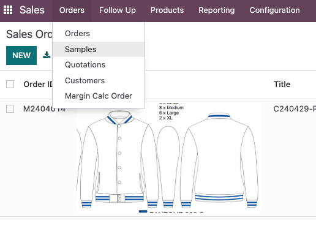
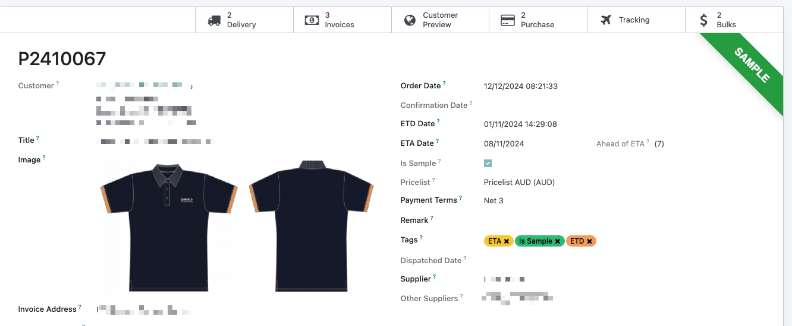
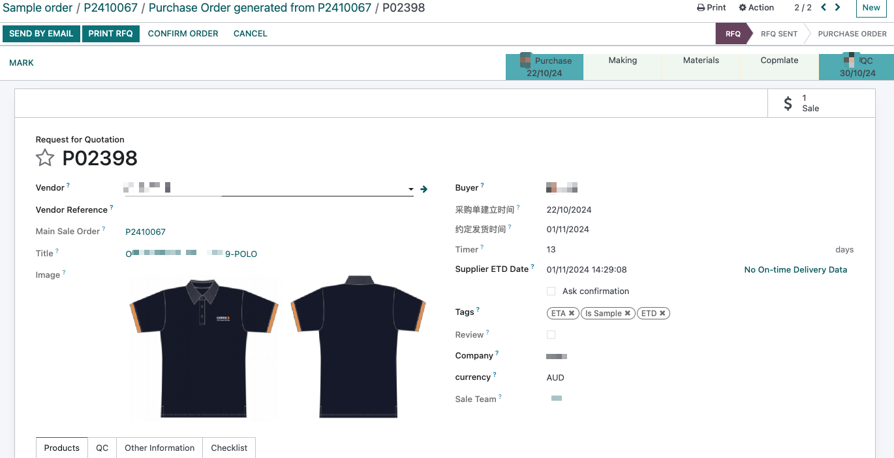
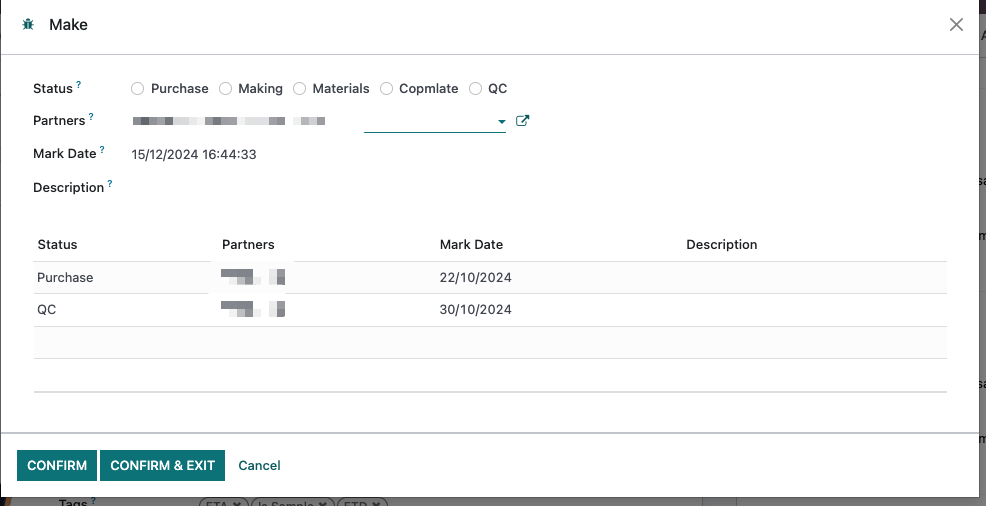
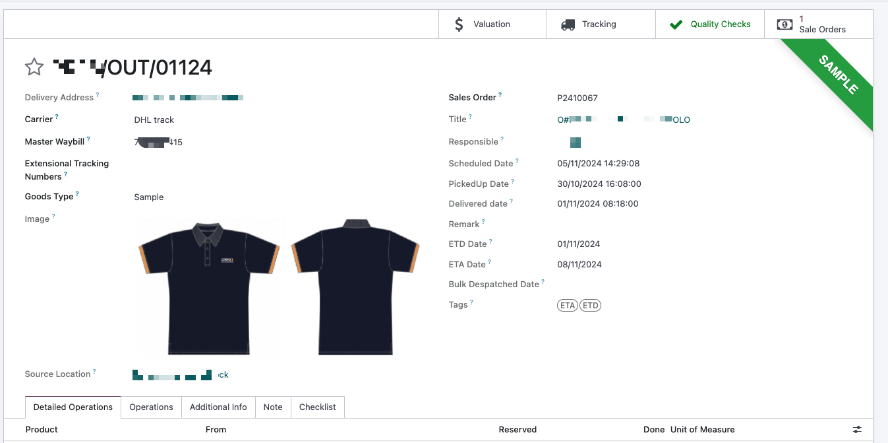
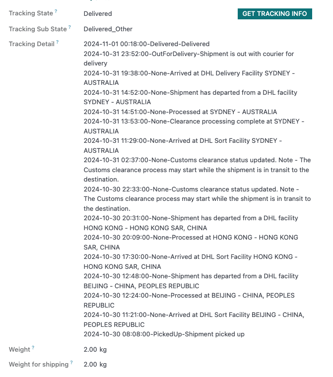
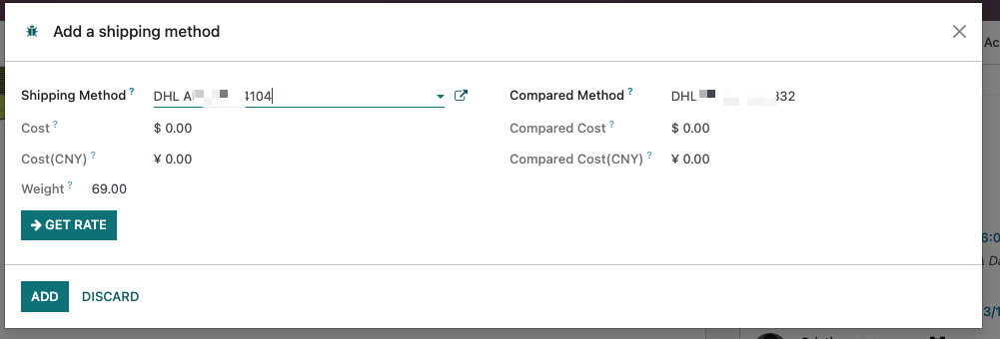
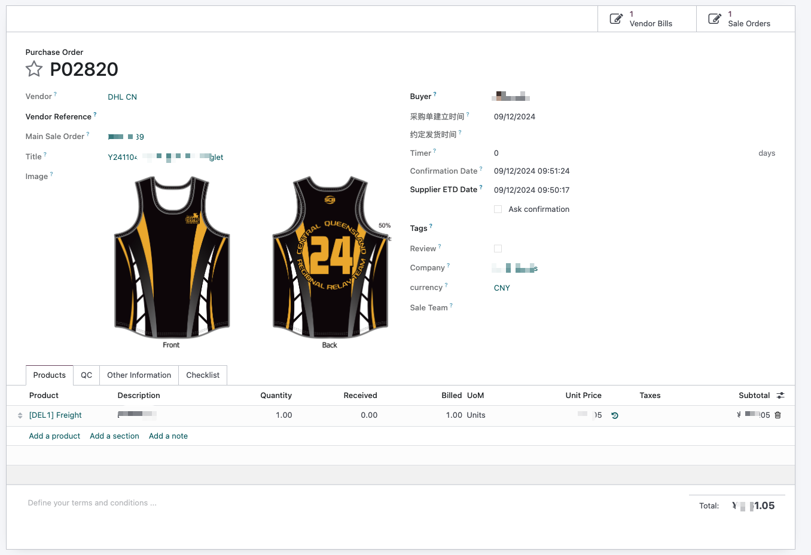
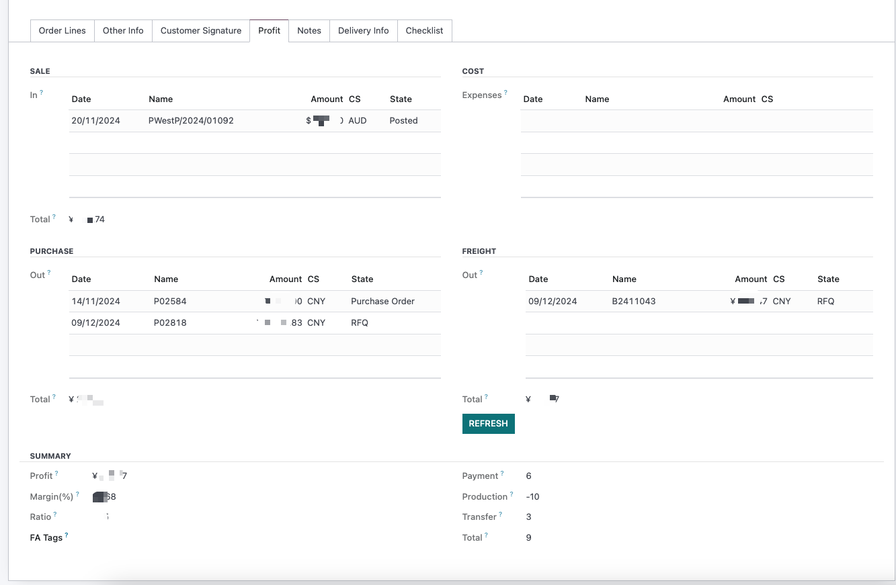

# 外贸定制类

## 业务背景

客户业务属于定制化外贸服装，通常由他的客户提出定制化产品需求，然后下单给工厂进行生产，工厂生产完成后发货交付。期间由跟单进行发货时间的安排，尾款的跟进和售后服务等等。本例由Odoo16.0协助完成。

## SKU设计

由于客户的业务特点更偏向于按需生产，实际业务中客户也不对库存进行管控（通常由工厂进行直接发货）， 但是需要对物流单号进行跟踪查询，因此这里我们把客户的所有的SKU都设计成了消耗品。

## 订单处理流程

### 销售订单

首先，由销售人员在销售模块中进行下单。销售订单分为**大货**和**样品单**两类。

销售人员可以从订单中很快看出此订单是样品单还是大货单。

确定好产品和数量之后，点击确定为销售订单。同时，将客户的**预计时间**（ETD）和**供应商的预计发货时间**（ETA）填到相应的信息栏中。

### 生成采购订单

由于客户基本全部采用外协工厂，不直接管控工厂的物料和生产情况。因此这里简单地将工厂用作了供应商。直接把需要生产的订单以采购订单的方式给到工厂。

为了方便客户操作，我们在销售订单中添加了创建采购单的按钮，由销售订单直接创建采购单，并自动关联。

### 供应商更新订单状态

这里我们给供应商开放了系统用户权限，供应商登录系统后可以看到自己的订单，并根据自己的情况更新订单的价格和状态。

为了方便客户和供应商之间的信息共享，我们开发了**标记**功能，由跟单人员或供应商对订单的状态进行更新，这样方便订单的相关人员共享信息。

订单的状态可以在设置中进行自定义。

### 发货

一旦工厂生产完成，跟单人员或供应商就可以将此订单标记为生产完成。然后订单进入QC并发货阶段。

QC使用odoo原生功能，完成QC之后，填写物流商和单号，点击验证完成发货。

### 物流状态更新

借助DHL、17Track等物流平台的API，我们可以在订单中方便地查询到货物的运输状态。

并且在货物送达后作出提醒或其他动作。

## 订单状态实时跟踪

为了一目了然地了解各个订单的当前状态，我们在订单列表中显示了订单的付款状态、物流状态等信息。

这样跟单可以迅速跟进订单状态进行下一步的动作处理。

## 运费计算

通过各物流商的API接口，我们可以在订单中添加运费。

也可以根据物流商提供的运费账单进行导入，生成物流商的运费采购订单。

生成物采购订单与销售订单关联，会在统计中进行统计。

## 费用统计

与订单有关产生的费用，我们也跟订单进行了关联。

## 利润统计

这样我们就可以根据各个环节以订单为维度对利润进行统计。

所有的外币都会自动转化为人民币进行统计。

## 售后服务

如果客户订单过程中产生了售后服务的需求，将由售后团队进行跟进和解决。

## 结语

借助Odoo提供的标准化流程，以适合现阶段客户的最佳方案，再结合我们强大地开发能力根据客户自己的定制化需求进行改造，成功使客户的原本由Excel驱动的业务流程成功Odoo化，整个公司内部的运作流程也变得清晰和简单，让客户能够把更多的精力放在业务拓展上，实现业绩增长。