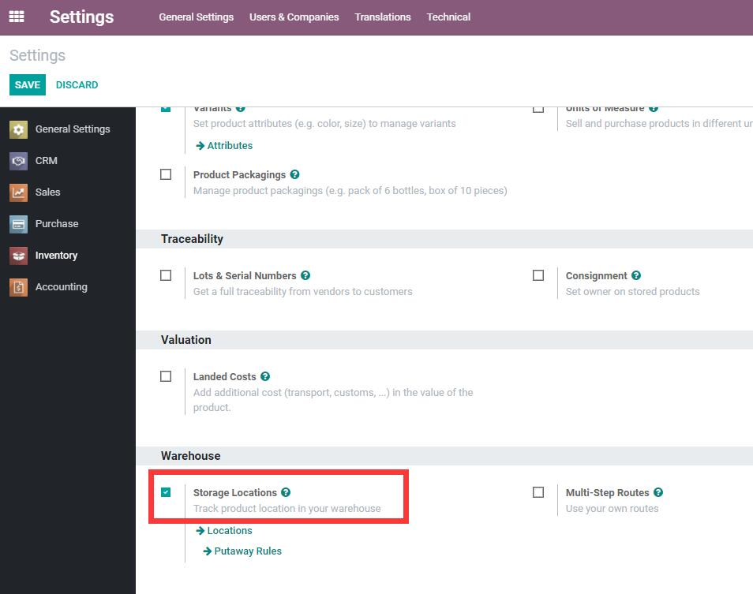
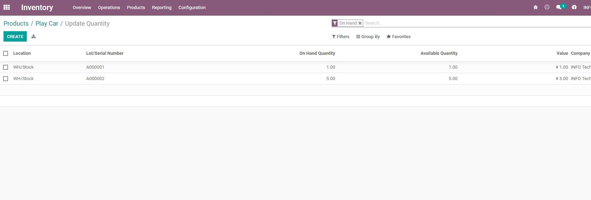
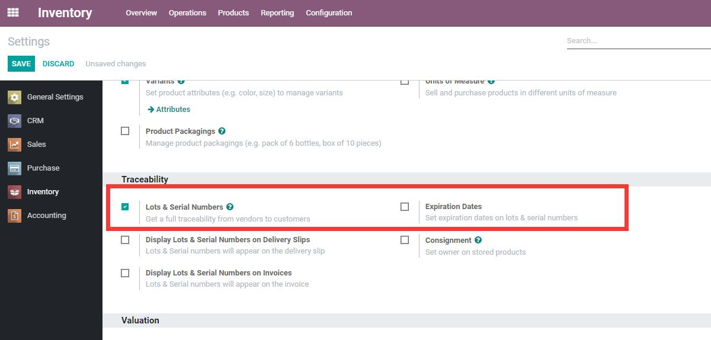
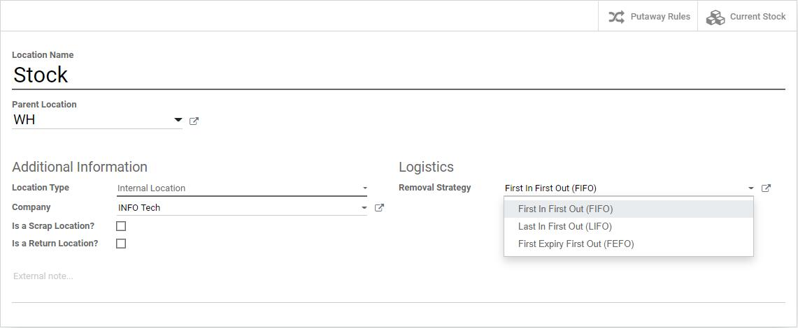

# 第二章 库位管理

* [库位类型](#库位类型)
* [下架策略](#下架策略)
* [上架策略](#上架策略)
  * [上架策略与调拨单的优先级](#上架策略与调拨单的优先级)

默认情况下，系统并没有开启多库位管理，开启的方法在菜单设置-库存-仓库-存储位置，开启多库位管理：

开启之后，我们就可以在仓库-设置-库位中看到库位管理功能了。

## 库位类型

odoo中的库位类型有以下几种：

* 供应商：供应商库位，一个虚拟库位，代表供应商库位。
* 客户：客户库位，一个虚拟库位，代表客户的存储库位。
* 盘点库位：盘点库位，虚拟库位，代表盘点业务的源或者目的库位。
* 生产：生产库位，虚拟库位，消耗原材料，产生成品的库位。
* 视图：逻辑库位，本身不能存储库存，主要用于逻辑上的库位层级关系。
* 中转库位：多公司下多库位调拨的中转库位。

另外两个选项，可以标记此库位为一个报废库位还是一个退库库位。只有被标记为退库之后，才可以在退回向导中选择。

## 下架策略

odoo中可以在库位上设置下架策略，但是此功能默认是没有开启的。需要给当前用户管理**推拉物流路线权限**后，可以看到：

给用户开启了此权限后，用户在仓库的管理页面就可以看到下面的配置信息：

我们之前说过，在产品分类中也有一个下架策略，产品分类中的下架策略的优先级是要高于此处的下架策略的。我们可以看个例子，我们先采购一批Play Car玩具，批次号为A00001，然后我们在此产品分类上设置LIFO，在stock库位上设置FIFO。然后，我们再采购一批同样的玩具，批次号为A00002，此时我们的库存：

此时，我们做一个销售单，按照我们的逻辑，由于产品分类设置了LIFO，那么优先出库的应该是A00002批次的产品。

由上图可以看出，优先查找的库位确实是A00002批次的库存。

关于下架策略，官方还提供了另外一种下架方式，根据产品的保质期进行选择。开启的方式为先启用库存-追溯性-序列号，然后选择设置过期日期：

启用之后，我们可以看到下架策略处多出了一个FEFO，即先到期先出库。

