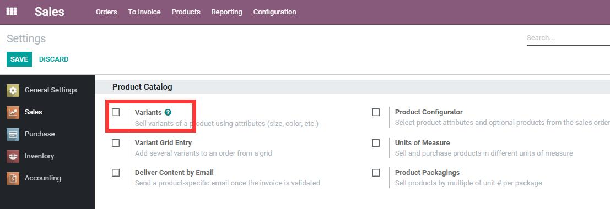
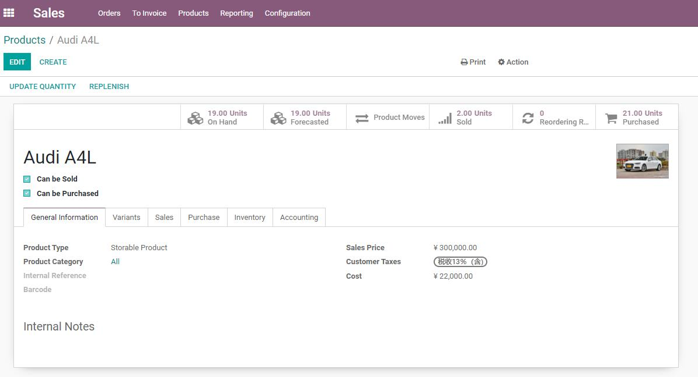

# 第三章 产品管理

Odoo中的产品概念分为两种，产品模板和产品变体。所谓产品模板，就是一种产品的抽象，而产品变体就是产品模板的具象化，举例来说，在Odoo中我们把iphone称为产品模板，而具体的白色的256G的iphone成为产品变体。所有的销售、采购、仓库使用的都是产品变体，产品模板只作为统一的管理入口。

## 产品变体的概念

Odoo默认是没有启用变体的，只有在设置-销售-产品中勾选了使用变体，才会显示变体的相关菜单和设置。

启用变体之后，可以在菜单中看到两个菜单，一个叫产品，一个叫产品变体。从技术角度讲，对应于两个不同的技术模型。产品模板对应的是product.template，产品变体对应的是product.product。 我们先来看产品模板：

首先产品模板里可以设置此产品是可供销售还是可供采购的， 然后在通用信息里，我们可以设置产品的类型、售价等信息。这种重点要说的是产品类型。

Odoo中的产品类型分为三种：

* 可消耗产品：可以无限使用，不必统计其消耗量的产品，例如，沙子和水等。
* 服务产品： 没有实体的产品，例如，咨询服务。
* 可库存产品： 具有实体的产品，可以控制其出入库。

产品分类，此产品归属的分类，产品分类上可以设置父级分类，下架逻辑，库存方法和财务科目等高级属性。

内部参考，就是我们通常说的SKU，Odoo默认没有添加唯一性标识，我们可以通过技术性手段添加唯一性标识*。在内部参考的下面是条码，即产品的统一商品码，这个同样也没有设置唯一性标识。

销售价格，产品的销售价格。默认只有一个销售价格，如果需要更多的价格，可以使用价格表的功能。

销售税种，销售此产品时默认的销售税。