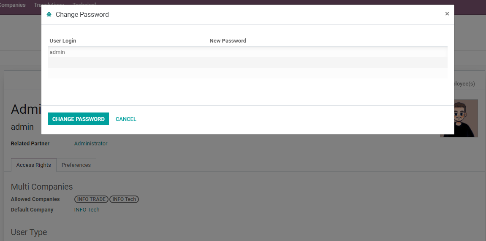

# 第五章 用户和用户组

odoo的用户和用户组不像其他系统那样由系统管理者搭配好了，odoo的角色和权限管理相对比较松散，需要用户根据自己的需求进行灵活的配置。

## 用户

### 用户的分类

在odoo中，用户可以分为三类：

* 内部用户： 公司内部用户。
* 门户用户： 给合作伙伴分配的账号，通常只有一小部分权限，仅可以访问门户的部分内容。
* 公共用户： 公共账号，只有小部分权限，只能访问有限的资源。

通常来讲，有管理员在后台创建的默认都是内部用户，由网站注册而来的默认都是门户用户。用户的分类默认是在开发者模式下可见。

### 用户账号和密码

一般来说，用户的账号应该是一个可用的邮箱，以便在用户忘记密码的时候由系统发出重置邮件。但odoo允许你不使用邮箱，而使用简单的字母或数字组合作为用户名，如admin。

用户名称则没有限制，可以任意输入。

用户密码在系统中是密文存储的，且不可反向解密，因此，密码一旦忘记则需要通过重置邮件或者由管理员重置密码来重新设置密码。

重置密码的操作为，点击用户-动作-重置密码，在弹出的对话框中输入新的密码，完成重设。

### 用户组

如果我们安装了几个应用，那么我们一般会在用户下面看到以该应用命名的角色分组。odoo中的用户所拥有的角色是多个，不想传统软件中的单一角色。因此，每个用户的拥有什么样的权限，完全取决于他所在的用户组。

举例来说，admin在销售模块的角色是经理，那么admin就拥有销售的所有权限。admin在采购拥有用户的权限，那么他在采购就只有用户而没有经理的权限。

对于同一个角色组来说，用户组A和用户租B通常是有继承关系存在的，因此才展示为下拉结构，也就是说，用户一旦有了更高权限组，那么他自动拥有了低层级用户组的全部权限。从感官上讲，这似乎是理所应该的，但是从技术上说，这样省去了我们重复设置一遍对象的访问权限和记录规则等操作。

### 非继承组

前面提到的同一角色组之间的用户组通常存在继承关系，如果不存在继承关系会怎样呢？答案是整个角色组会迁移到技术设置下面得角色分组中，每个用户组将变为单选框的形式。 这样就不存在了继承关系，用户组之间是"平等"的，如果需要，用户可能需要把每个权限都勾上。例如，原生的其他权限：

### 技术设置

技术设置是每个模块技术性的调整设置选项，一般只有对系统特别了解的人才会使用。

## 用户组

从前面我们知道了用户的权限是由用户组决定的，那么用户组的权限又是如何被组织的呢？

首先，我们需要了解odoo的权限机制。一般来说odoo的权限可以由上而下的分为四个层级：

* 模型层: 即odoo编程意义上的对象，实际上对应数据库中的表一级的控制，这一层级可以设置创建读写删除权限。
* 逻辑层：即odoo中的记录规则，实际对应数据库中行级别的读写控制。
* 视图层：即odoo中每个视图的权限控制。
* 字段层：即精确到视图中字段级别的读写控制。

模型层和逻辑层的控制可以由管理员在后台设置进行完成，视图层需要借助开发者工具在或者在视图页面上进行用户组的指定控制，只有字段层的权限是需要通过编程手段进行精确控制的，由于涉及开发内容，本书就不展开进行描述了，有兴趣的同学请参考笔者写的开发指南。

### 用户组的组成

这是一张用户组的截图，从截图上我们可以看到用户组大概由用户列表、继承关系、菜单、视图、访问权限、记录规则等方面组成。

#### 用户列表

本用户组所包含的用户列表

#### 继承关系

本用户组所继承的用户组列表

#### 菜单

本用户组所可以访问的菜单，需要注意的是，即便菜单可能不在此用户组内，用户也可能能够访问菜单下的内容，其原因是如果菜单没有指定任何一个用户组，那么这个菜单就是所有人都可以访问的。

