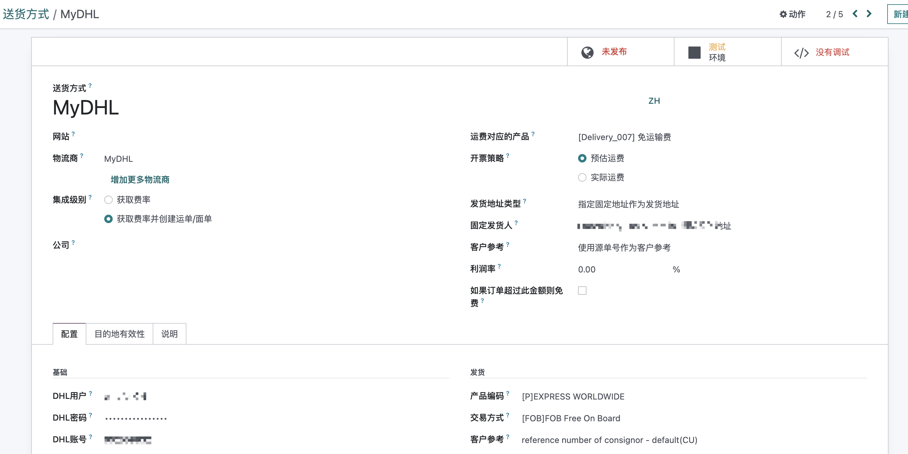
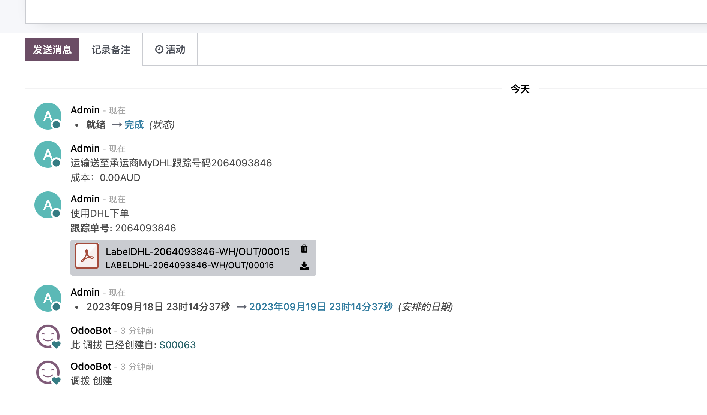
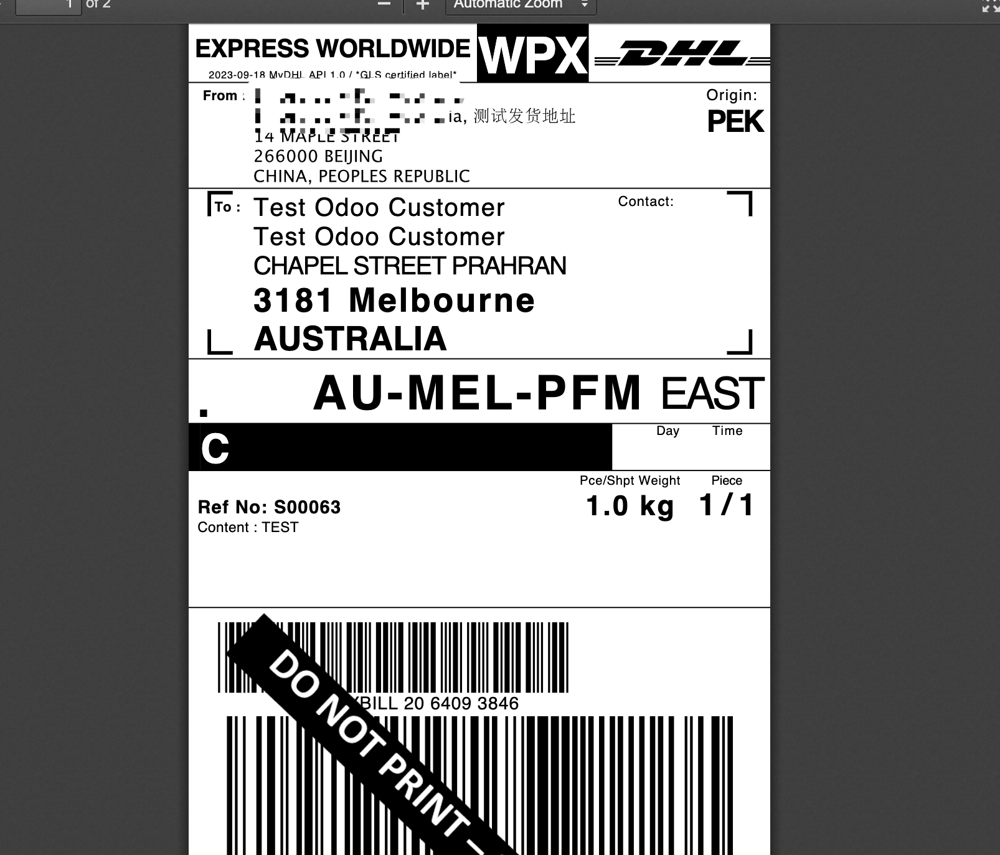
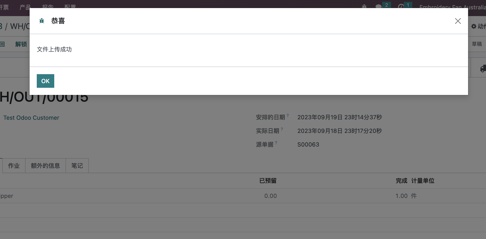
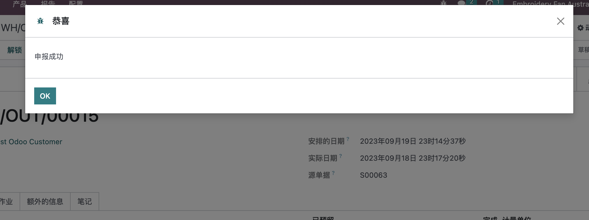

# 中国特色DHL

起因是客户希望使用DHL发货给国外的客户，因为Odoo原生就支持DHL发货，就感觉很简单，配置一下就能使用了。谁知道才是坑的开始。因为Odoo的DHL模块使用的还是旧的XML接口，DHL官方已经声明，会逐步弃用旧的接口转而使用新的RESTFUL接口。再尝试了几次官方模块未遂后，决定自行解决，花了三天时间撸出了今天要介绍给大家的，富含中国特色的DHL应用。

## 安装与配置

首先我们要安装我们的DHL模块:

安装完成后，我们在发货方式里，可以看到一个新的DHL发货方式（为了与官方区别，我们这里命名MyDHL）：

我们要使用DHL，就需要去申请一个DHL的**用户名、密码和账户**(这里吐槽一下，作为国际大公司的DHL居然不能自己去开放平台申请账号，必须通过人工审核)。

另外，进出口企业还需要去申请一个**DSP账户和密码**，用来跟海关申报。

配置完成后，我们就可以开始使用DHL来进行发货了。

## 销售订单费用预估

跟其他物流方式一致，我们在销售订单中添加物流方式，选择MyDHL:

## 快递跟踪

销售订单确认后，我们到发货单中，根据我们实际情况，配置好我们的发货参数，完成发货。

跟其他的物流方式一样，我们会得到DHL返回的电子面单:

正常情况下，到此就结束了。但是由于通关要求，于是又有了下面的中国特色部分。

## 在线申报

海关要求的参数配置繁杂且众多,为了简化客户操作，我们做了大量的适配工作，这里就不详细展开了。总之，我们不仅要配置发货方式，还要配置产品参数。下面是一个例子:

配置完成后，我们在发货单点击上传文件按钮，如果没有问题，则会显示上传成功。

如果有问题，则根据提示进行修改。

最后，我们再点击在线申报，即可完成在线申报。

