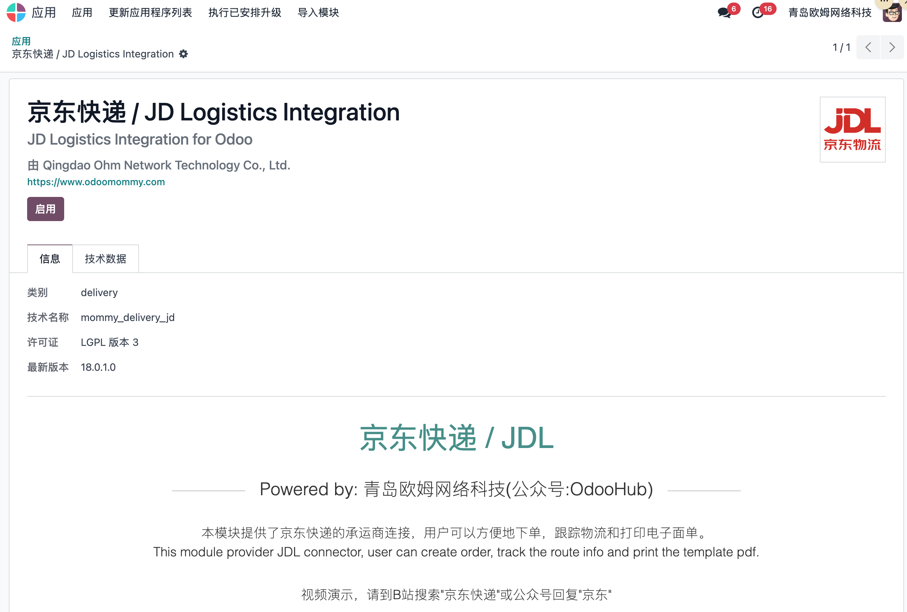
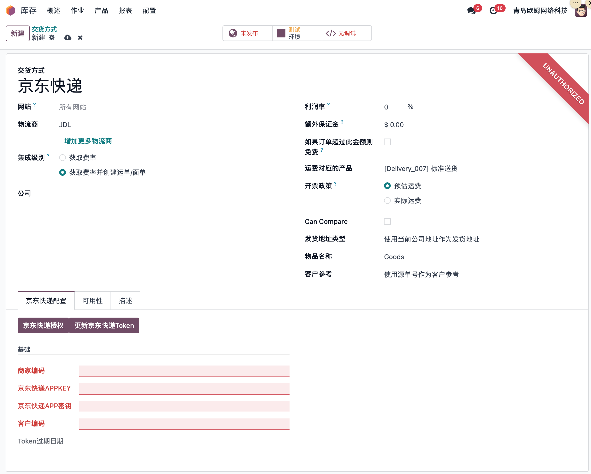
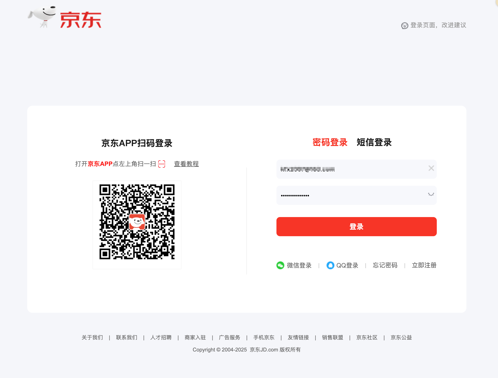
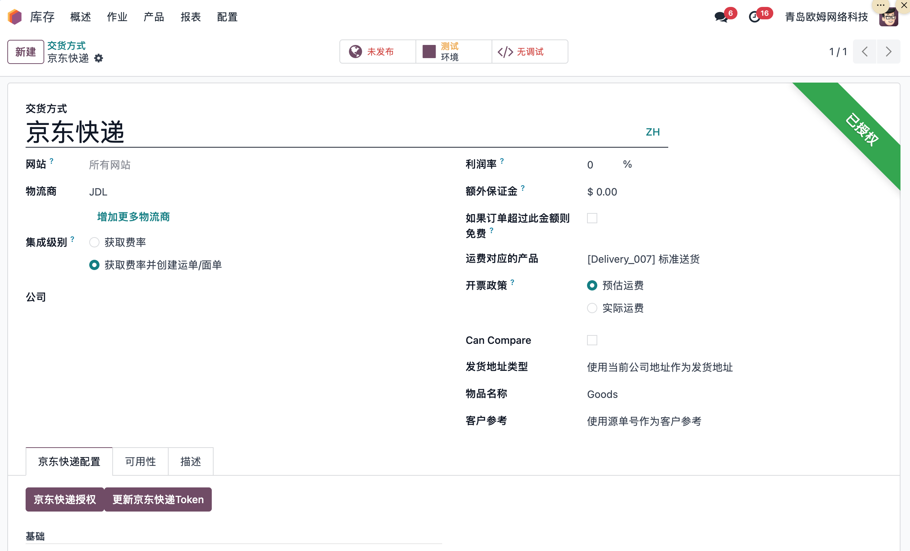
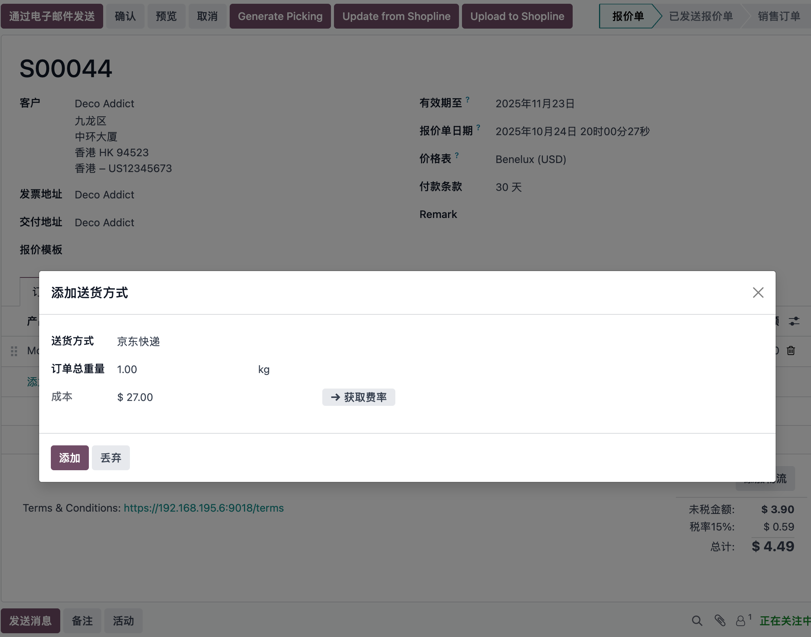
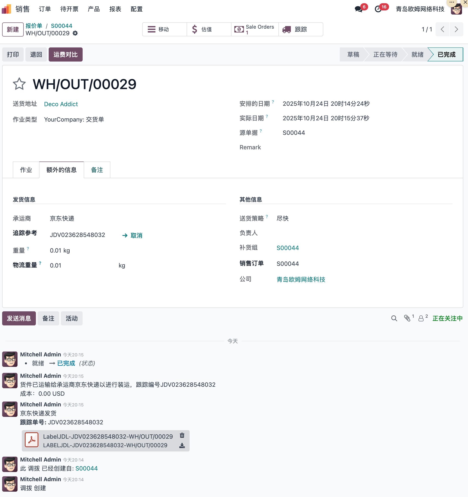
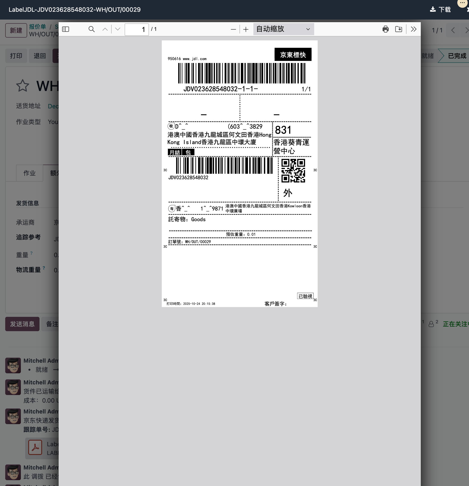
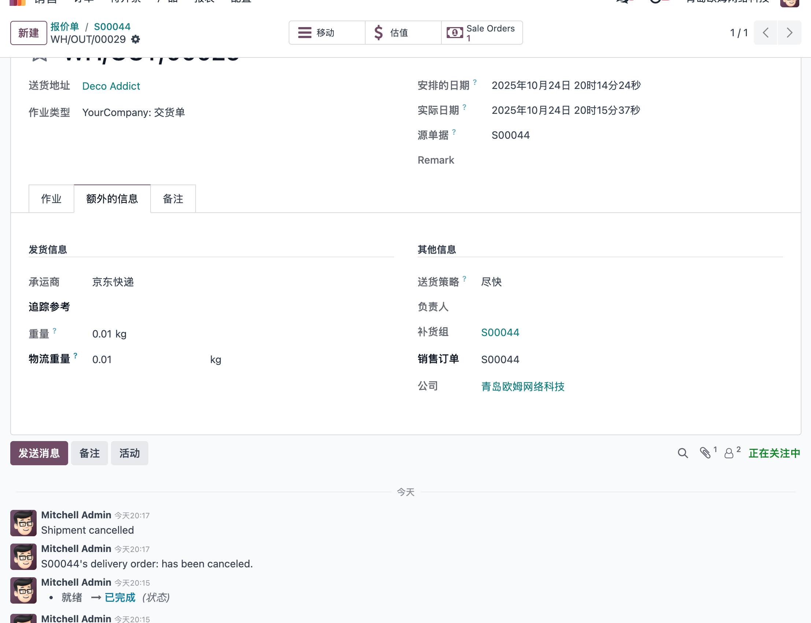

# 京东快递

本章我们来看一下如何使用我们[欧姆网络科技](https://www.odoohub.com.cn)的京东快递插件来完成Odoo与京东快递的对接。

## 前期准备

首先我们要先在[京东快递](https://open.jdl.com/)的开放平台注册一个商家[自研商家]，并完成认证签约。

入驻之后我们需要拿到如下参数：

* Seller ID：商家ID
* APPKEY: APPKEY
* APPSECRET： APP密钥
* 客户编码： 京东平台的编码（青龙编码）

拿到上述全部参数后，我们就可以安装京东快递模块进行Odoo对接了

## 对接Odoo

第一步就是安装我们的京东快递模块:

点击激活，完成安装。

### 京东快递配置

激活之后，我们到仓库-设置-送货方法中创建一个京东快递，物流商选择JDL:

下面简单介绍一下京东快递在Odoo中的配置：

* 商家编码： 前面获取到的商家编码
* 京东快递APPKEY： APPKEY
* 京东快递密钥： APPSCERET
* 客户编码：签约的客户编码（青龙编码）

### 完成授权

配置完之后我们还需要到京东快递官方完成授权才可以使用，具体方法是点击京东快递授权按钮，系统会引导我们跳转到京东快递官方网站进行登录：

使用我们的商家账号登录后，系统会自动跳回Odoo，这样就完成了认证。

> 京东快递的默认有效期是1年，刷新Token的有效期是1年1个月，在过期之前需要进行刷新

接下来我们就可以使用odoo进行操作了。

## 在Odoo中使用京东快递查询预估费率

我们在销售订单中选择京东快递作为承运商，点击预估费率：

## 使用京东快递发货并生成电子面单

然后我们点击确认按钮确认订单，之后我们验证发货单：

我们可以将附件中的电子面单打印出来贴到货物上然后发走

## 取消订单

如果我们不想发货了，及时点击发货单上的取消按钮即可取消京东快递发货:

## 物流跟踪

点击发货单上面的物流跟踪智能按钮我们即可快速在京东物流官网上进行物流查询：

