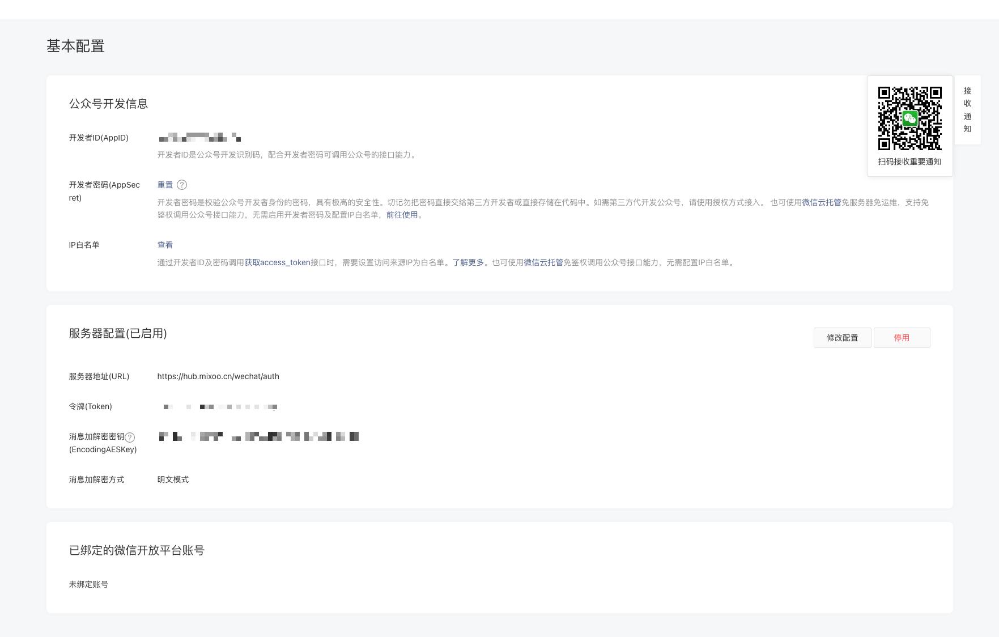
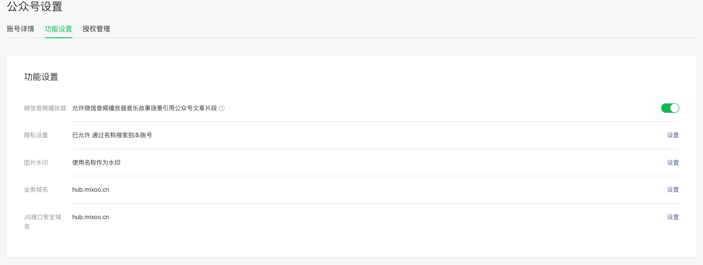
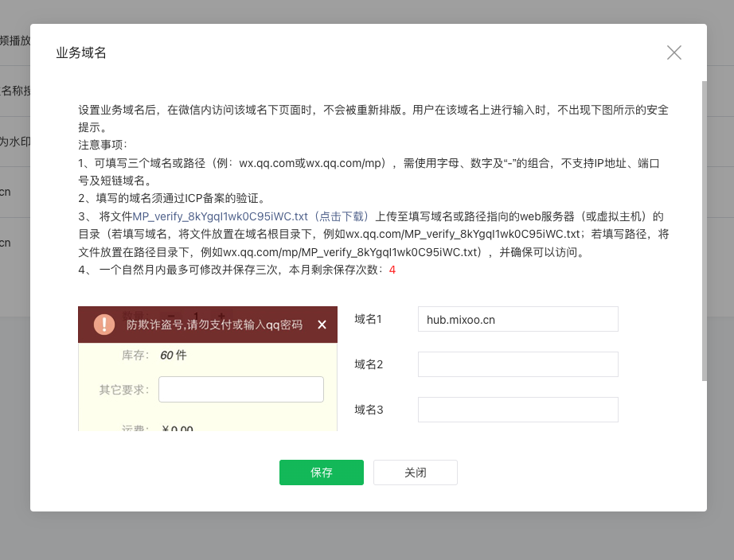
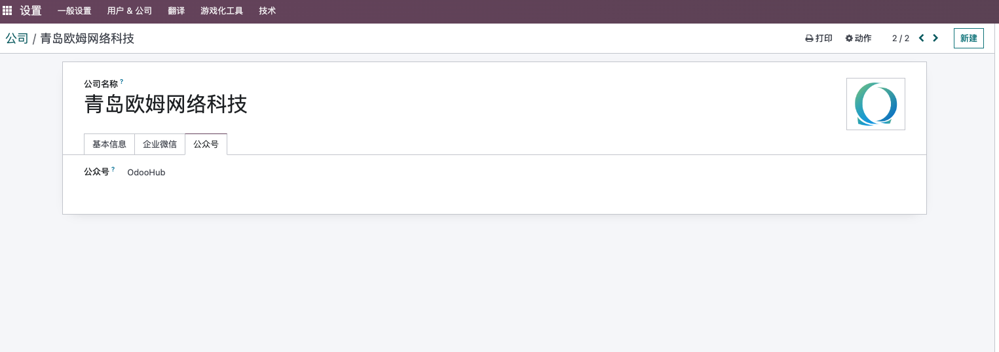
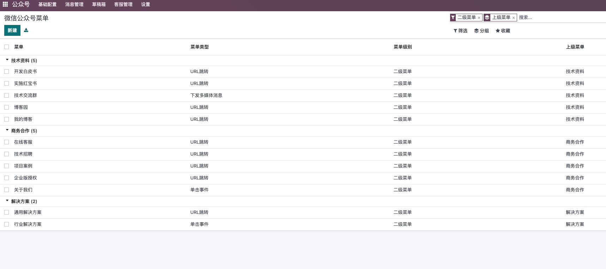
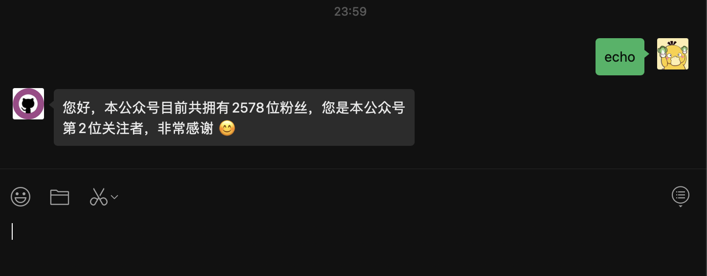
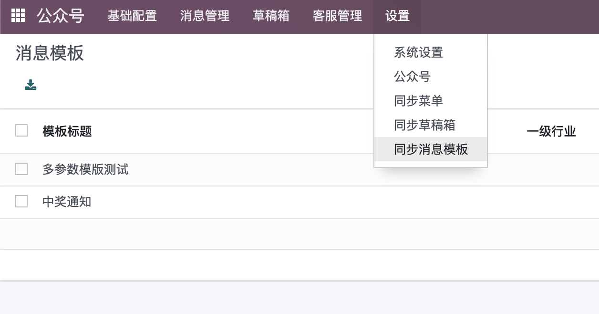
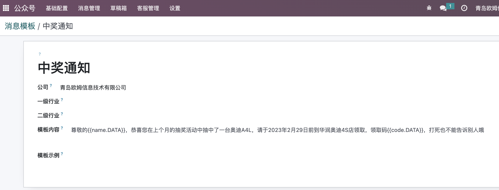
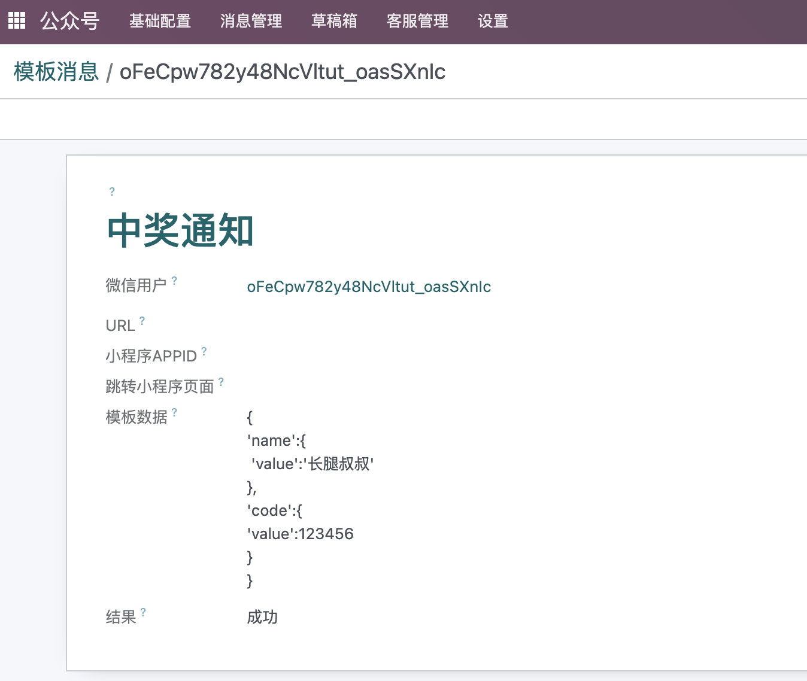
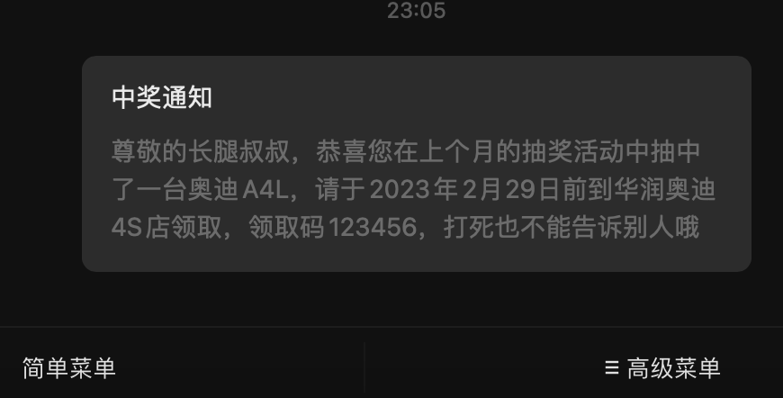

# 微信公众号解决方案

> 本模块适用于 16.0

## 需求背景

很多时候，我们在面对客户的询价的时候要耗费挺多的人力，除了使用企业微信等IM外，我们可以使用公众号来完成部分自动查询的工作。另外，公众号除了作为企业日常的宣传、服务媒介外，还可以接入客服等操作，让企业的服务能够更加贴近客户。

本文就将介绍由[欧姆网络科技](www.odoomommy.com)出品的微信公众号解决方案。

### 公众号基础配置

我们在申请完公众号之后，需要先配置公众号的基础设置之后才可以接入Odoo。下面来看一下公众号端的配置步骤。

首先，我们需要获取公众号的以下参数：

* 开发者ID(AppID)：通常以wx开头，例如wx123456678
* 开发者密码(AppSecret)： 一次性密码，公众号不会保存，遗失需要重置。
* 服务器地址(URL)： 我们后台需要接入的系统URL
* 令牌(Token)： 服务器与微信公众号通信的认证Token(可选)
* 消息加解密密钥(EncodingAESKey)：通信过程中加密需要的密钥。（可以不填）

以上参数可以在**设置与开发-基本配置**中找到。



其中，服务器地址需要填你的odoo地址的域名和固定路径/wechat/auth。

#### 业务域名和JS接口安全域名

如果公众号还需要接入自己开发的网页，或者不想被微信出现网页安全提示，那么我们还需要配置JS接口安全域名。配置路径在**公众号设置-JS接口安全域名**：



配置业务域名时，需要在odoo服务器上做校验，为了方便操作，我们在模块中内置了设置字段，用户只需要把校验文件名和文件内容填入到指定位置即可，这里我们先留空。



## Odoo微信公众号模块设置

设置完公众号以后，我们需要在我们的odoo系统中安装我们的微信公众号模块(mommy_wechat)， 安装完成后，我们先到**公众号-设置-公众号**对模块进行设置。

我们首先创建一个公众号应用，然后把我们前面拿到的那些参数填入到下面的页面中。


网页域名授权文件名即我们前面提到的txt文件的文件名，内容就是文件内的那串文本，填入到对应的字段中即可。

### 绑定公司

我们公众号支持多公司模式，因此，我们需要在公司设置中，选择我们创建的这个公众号应用：



现在，我们就完成了公众号模块的所有前置要求，下面我们来看一下公众号支持的功能吧。

## 解决方案

我们先从最基础的，菜单功能开始。菜单是整个公众号的入口，设置也十分灵活。配置好的话，可以给提供一个非常丝滑的用户体验。

### 菜单设置

菜单管理入口在**公众号-基础配置-菜单管理**，用户点开后，可以创建自己自定义的菜单。公众号支持3个一级菜单，每个一级菜单又支持5个二级菜单。

每个菜单都可以选择相应的动作和相应方式。具体地说，可以选择以下几种相应方式：

* 单击事件
* URL跳转
* 扫码推送结果
* 扫码接收消息
* 拍照
* 拍照或者从相册中选择
* 从微信相册中选择
* 选取微信地理位置
* 下发多媒体消息
* 跳转图文消息URL
* 小程序

每种响应方式都有其应用场景，用户可以根据自己的需要选择合适的方式进行配置。这里我们不过多进行介绍，需要更加详细使用方法的同学可以在公众号联系客服获取帮助。

我们来看一下菜单的创建界面：


需要注意的是，我们在创建的二级菜单的时候，必须要先创建一级菜单。菜单可以绑定一个KEY值，这个KEY值会被传递给后台应用程序，我们可以根据这个KEY值而自定义我们想要的响应方式。

下面来看一下本公众号(OdooHub)的菜单创建界面:



菜单同样支持排序，只要在序号那里填入数字即可。数字越大，就越靠近公众号底部。

### 消息回复

公众号的一个很常见的场景就是消息的自动回复，例如，当用户关注了公众号，我们可以提示一下欢迎语或是使用方法。再比如，用户给公众号发送的消息，我们可以根据内容个性化回复内容，乃至引入现在潮流的各种机器人(ChatGPT)等。如果客户想要查询序列号或是质保期等参数，也可以通过消息回复自助查询，从而节省企业的的运营成本。

我们的模块可以实现诸如上面的各种场景，我们在**公众号-消息管理-自动回复**菜单中，即可创建一个自动回复的规则。


本模块支持的触发条件有:

* 被关注回复
* 关键字回复
* 收到消息回复
* 单击事件

我们在收到客户发送的消息后，可以根据客户发送的内容，触发不同的规则，响应不同的内容。本模块支持的响应消息格式也有很多种：

* 不回复
* 文本回复
* 图片/语音/视频/音乐/图文回复
* 代码回复
* 模版消息

其中比较灵活的是代码回复，我们可以通过代码自定义实现业务逻辑的计算结果，然后封装后发送给用户。这里举一个实际的例子，我们在公众号OdooHub中发送“echo”，将会得到一个实时计算的结果，统计此公众号的当前粉丝数量和本用户所关注的序列。



此功能即使用代码回复功能完成的:


使用代码回复的好处是，不用每次都更新服务器上的代码，需要调整业务逻辑的时候，直接在界面修改代码即可。

另外一个比较实用的方式，即模版消息。模版消息只能用在服务号上，使用场景即通知关注了公众号的客户。

## 模版消息

模版消息的使用场景常见于用户关注了公众号（服务号），企业用来给用户推送服务通知。像我们日常使用的各类银行消费通知，顺丰快递通知等等。都是由模版消息推送完成的。下面我们来看一下如何借助odoo的微信公众号模块，来完成此类操作。

### 消息模版

我们在推送模版消息之前，要先在公众号后台预设**消息模版**，类似于我们使用的短信模版，我们预设完消息模版之后，同步到odoo系统中，方便我们使用。

> 消息模版的创建需要从微信官方已有的模版中进行挑选，不存在的新建还需要审核，因此本模块没有创建消息模版的功能。用户需要自行到公众号后台进行申请。

我们可以在**设置-同步消息模版**菜单中进行消息模版同步。



同步完成之后，我们可以在消息管理-消息模版中看到同步的模版数据。我们来看一个消息模版的例子:



消息模版的主体数据格式是文本+变量，变量由`{{}}`包裹，采用变量名.DATA的形式。

### 发送模版消息

有了消息模版，下面我们就可以来发送一条模版消息了。我们到菜单**消息管理-模版消息**中新建一个模版消息。



我们首先选择一个模版消息，然后选择要发送的目标用户。模版消息也可以设置链接，或者打开小程序的某个页面等。最重要的是模版数据，其数据格式如下：

```js
{
    'name':{
        'value':'长腿叔叔'
    },
    'code':{
        'value':123456
    }
}
```

其中的name和code都是消息模版中变量的KEY值，变量的值则放入了value中。

我们点击发送按钮，如无异常，我们在微信端将收到下面的消息提示。



### 编程接口

很显然，我们在使用过程中，不可能由我们人工手动一条一条去创建模版消息。本模块也预留了针对开发人员的编程接口，方便开发人员将业务嵌入到实际系统的各个方面中。鉴于这部分内容专业性较强，本文不展开。购买的同学可以在公众号回复**模版消息编程**获取开发指引。
