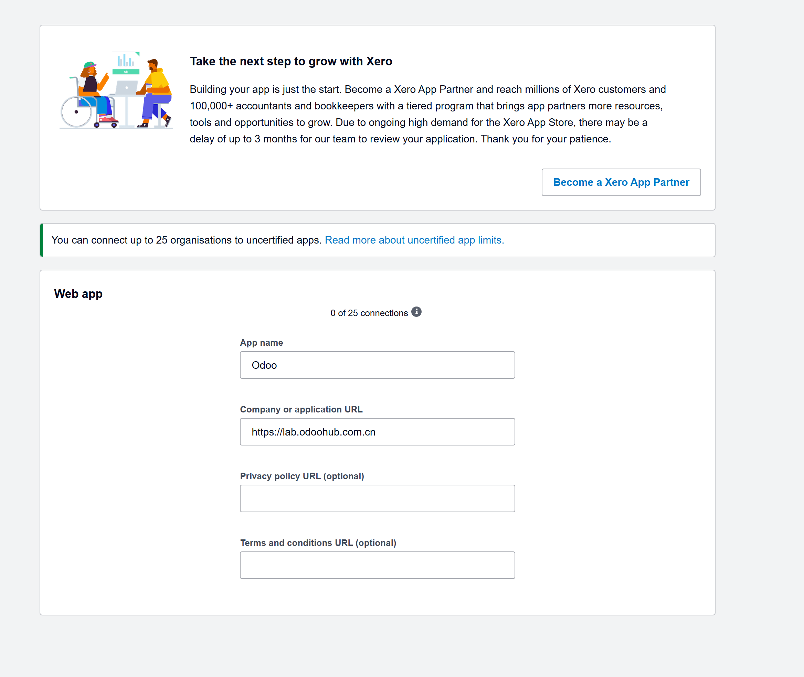
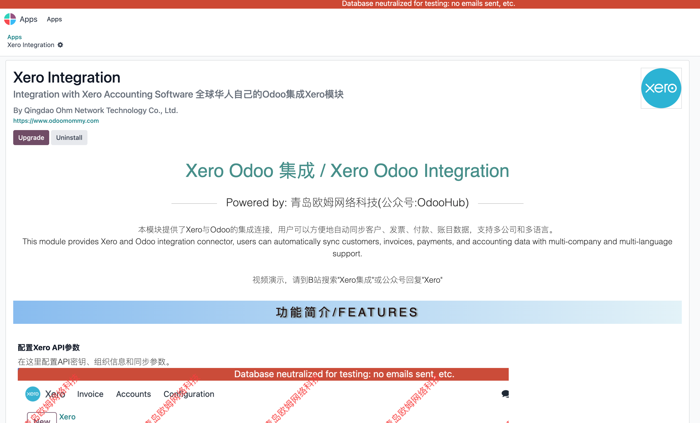
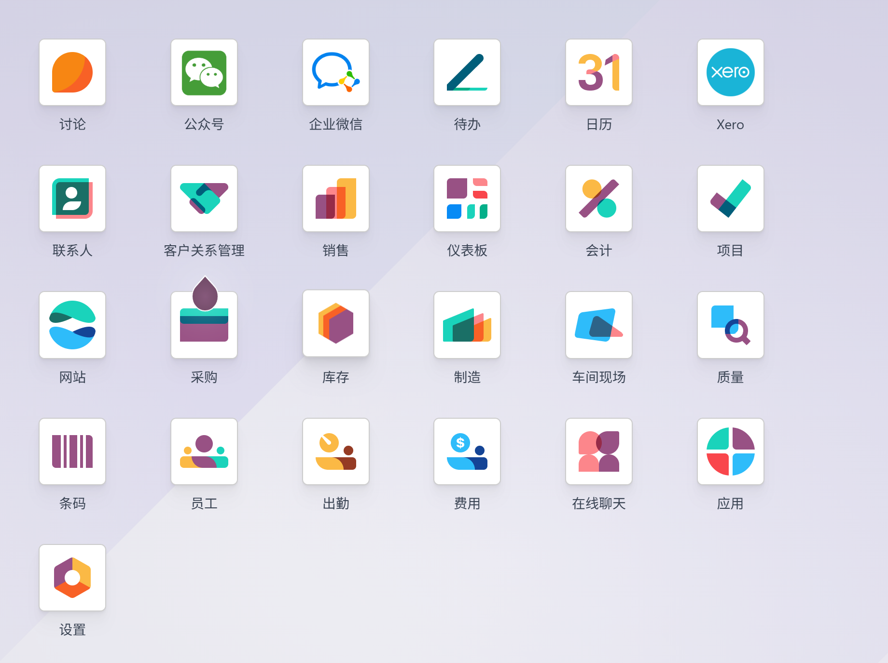
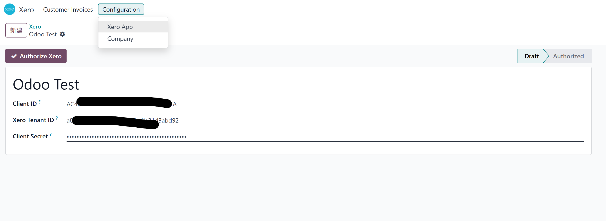
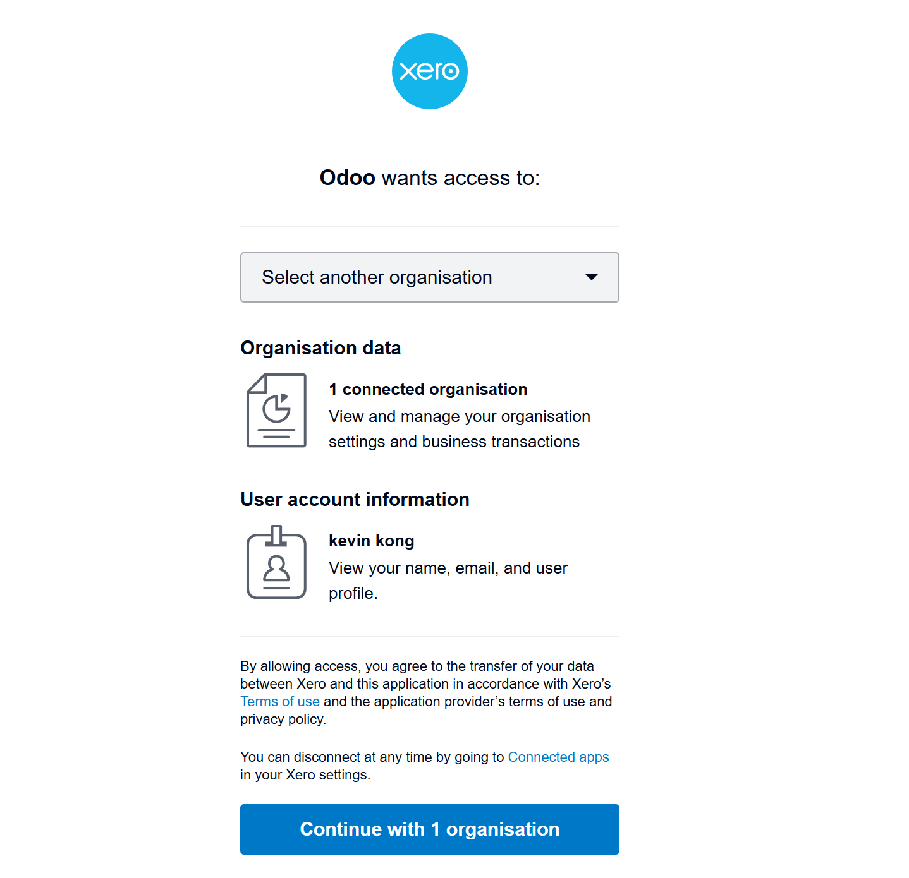
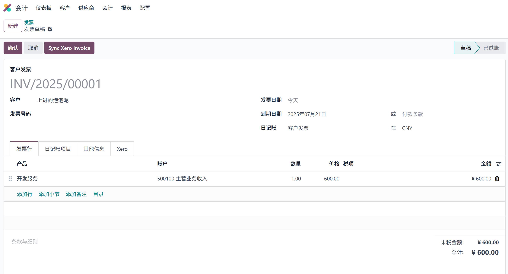
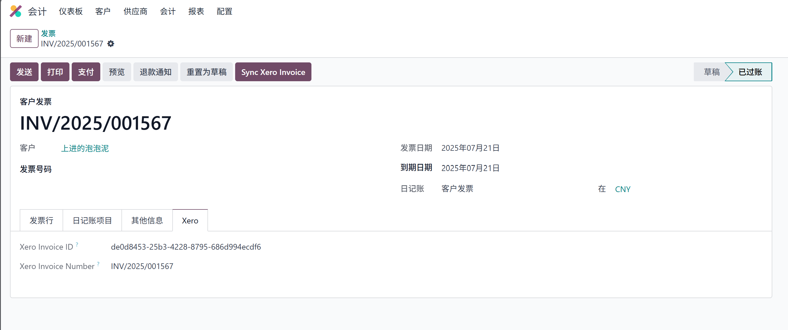
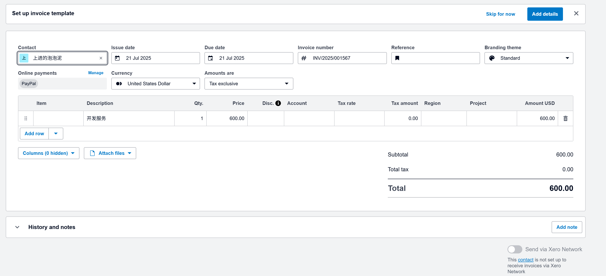

# XERO 对接

Xero是一款基于云的会计软件，专为中小型企业设计，用于管理财务和简化账务流程，在新西兰和澳大利亚有着广泛的应用。本章将演示如何使用Odoo跟Xero进行无缝链接。

## XERO端设置

首先，我们来一下XERO端的设置，我们打开[XERO开发者中心](https://developer.xero.com/app/manage/)，创建一个应用：

这里需要填写应用名称和应用的网站。

然后我们点击左边的配置，配置我们应用的回调地址：

这里我们要获取两个重要的参数：

* Client Id：应用的APPID
* Client Secret： 应用的密钥

### 获取Tenants ID

接下来就是获取商家ID这个参数，点击API Expoloer

在底部的Headers信息中获取 Tenant ID。

做完以上两步就可以在Odoo中进行对接了。

## Odoo端设置

首先，我们在应用中心中安装mommy_xero模块：

### 创建Xero App

我们在设置中新建一个Xero App，然后将我们在第一步获取到的应用APPID和密钥填到相应的位置中：

然后我们在主应用点击Xero应用进入设置页面：

### 绑定公司

创建完应用后，我们需要将应用绑定到当前公司才可以使用，在设置-公司中点击公司，然后选择当前公司，在Xero选项卡中选择我们刚才创建的应用：

### OAuth授权

由于Xero认证采取的是OAuth2的认证方式，因此我们只有再经过授权之后才可以正常使用。我们回到Xero应用，点击授权按钮，跳转到Xero官网进行认证：

认证完成后，页面会自动跳回到我们的App页面，如果没错，那我们可以看到我们的App处于已认证的状态。

这就意味这我们可以使用Odoo正常跟Xero进行对接了。

## Odoo中的应用

首先，我们来看一下如何将Odoo中的发票同步给Xero

### 发票同步

我们在会计模块中打开客户发票：

然后当我们点击确认或同步Xero按钮后，此发票就会被同步到Xero:

同步成功后，我们可以在xero选项卡中看到xero的invoice id和invocie number

我们到Xero官网上也可以看到我们的发票信息：

### 修改同步

当我们修改了发票信息想要同步到Xero时，直接点击同步发票按钮即可。

