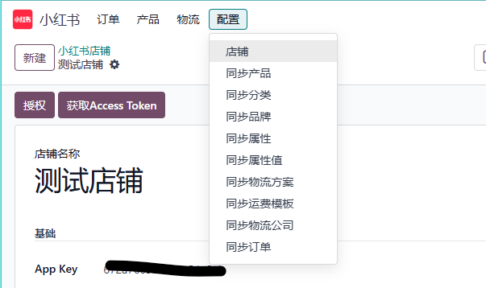
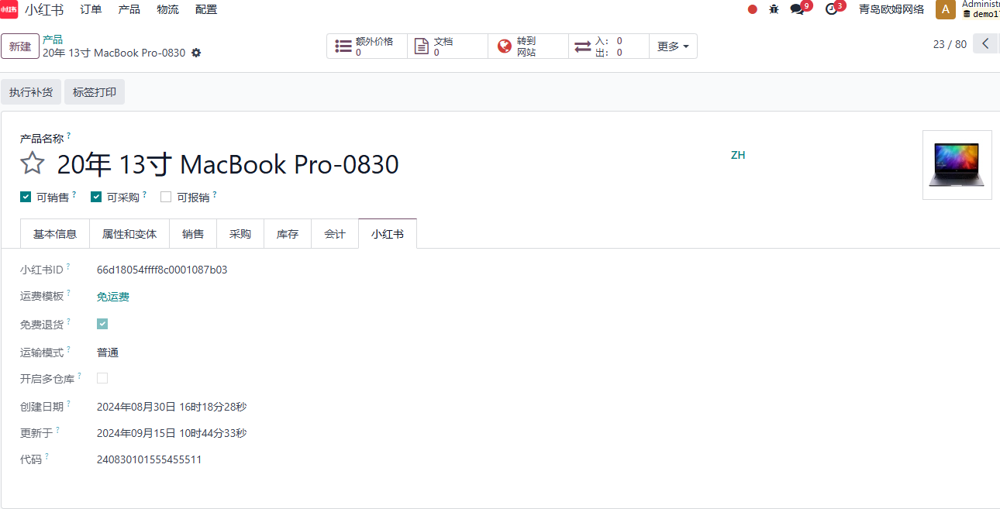
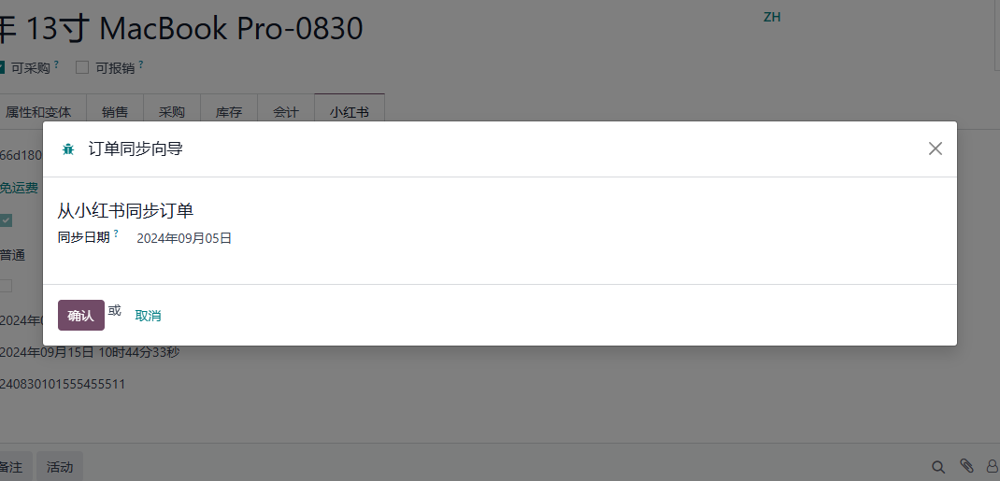
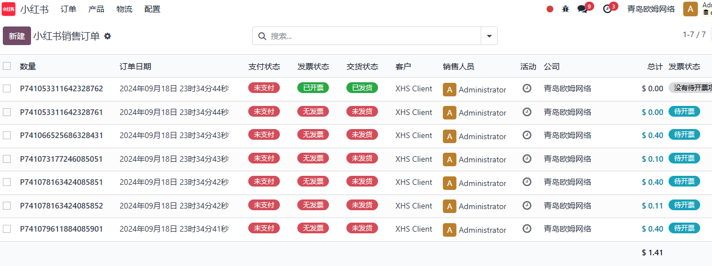

# 第八章 小红书

小红书是近年来年轻人中非常流行的社交分享购物平台，本章我们将介绍如何使用我们的**小红书模块**来完成平台和odoo的对接。

> 当前版本：17.0.1.0

## 基础配置

首先，我们要在系统中安装我们的小红书模块：

安装完模块之后，我们到主菜单-小红书-配置-店铺中新建一个店铺：

将我们在小红书商家后台创建的应用的APPKEY APPSCERT等信息填入到配置中，然后点击授权按钮跳转到平台进行授权，授权完成后点击获取Access Token按钮，获取Access Token

## 基础数据同步

拿到Access Token之后，我们就可以进行基础数据的同步了。 点击配置菜单下的多个同步菜单：

依次将基础数据(分类、属性、品牌、物流方案和物流公司)同步完成。

## 同步商品

接下来，我们同步商品。再同步商品之前一定要把前面讲到的基础数据同步完成。点击配置-同步产品：

同步完成后，我们可以在菜单小红书-产品-产品模板和产品变体中查看已经同步完成的产品。在产品详情页面，我们可以看到小红书的产品详情：

## 订单同步

产品同步完成后，我们就要进行订单的同步了。由于小红书官方的限制，我们每次只能同步一天的订单，因此我们在同步时给用户提供了一个订单同步的日期选择。点击配置-同步订单：

点击确认按钮，进行订单同步。

订单同步完成后，用户可以在菜单小红书-订单-报价单/订单中对订单进行查看和处理。

需要注意的是，由于小红书官方的限制，客户的敏感信息只有在待发货状态的订单才可以获取，其他状态我们都以小红书客户的名字替代了。

## 结语

目前，我们针对小红书的对接还在基础阶段，后面会陆续接入更多的功能，敬请期待。