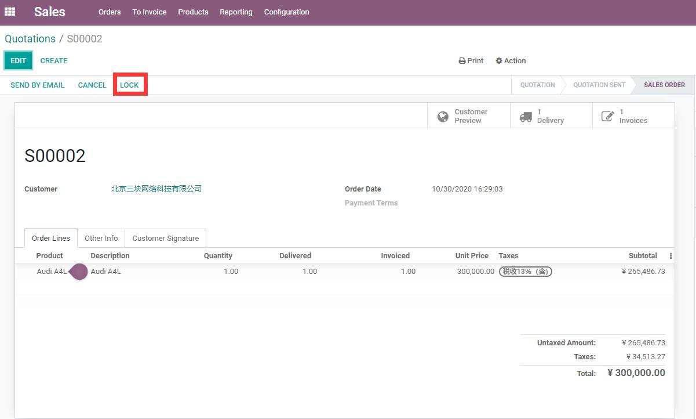
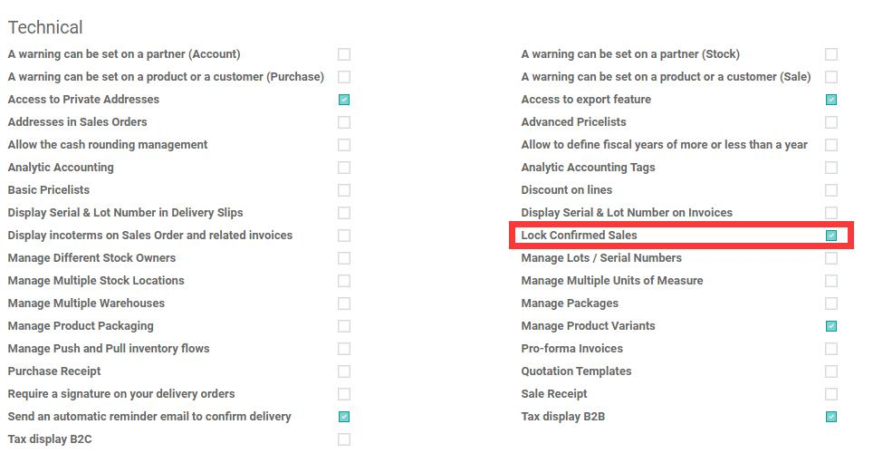
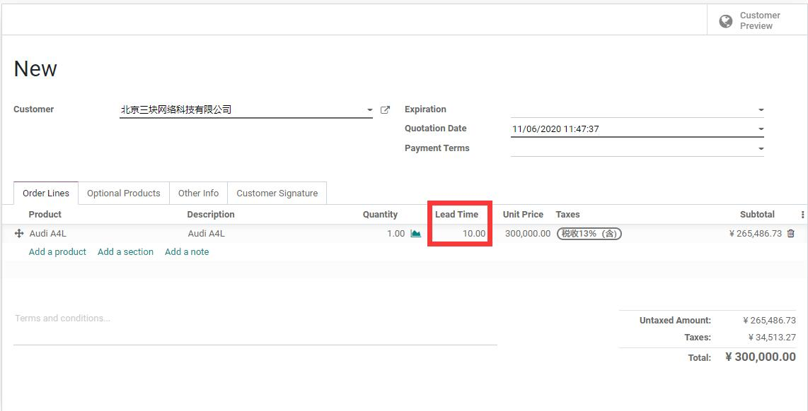
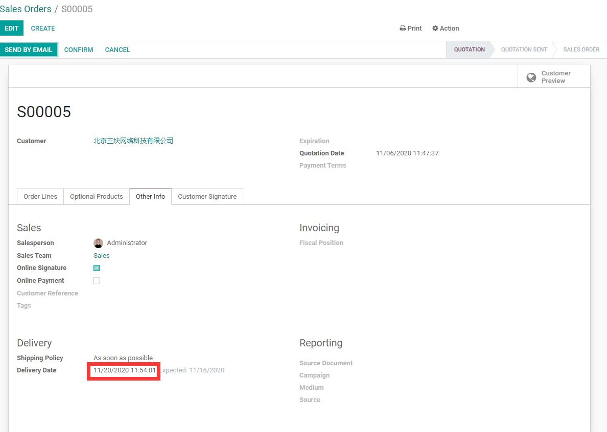

# 第一章 销售订单

### 询价单和销售订单

询价单，又称为报价单，其含义是指尚未确定的销售订单。从技术角度上讲，询价单和销售订单是同一个对象(sale.order)，询价单只是草稿状态的销售订单。一个sale.order对象拥有的完整的状态分别有，草稿(draft)、已发送的草稿(sent)、销售(sale)、完成(done)和取消(cancel)。从这些状态上我们可以大概看出来一个订单的生命周期，首先是从草稿开始，然后确认成为订单，发货收款以后被锁定完成。其中如果有问题，则可以随时取消订单。

一个典型的销售订单如下图：

可以看到，销售订单中包含了我们的客户信息，订单时间，订单内容，还包括一些附加信息如销售员、销售团队，开票信息和发货信息等。

### 客户地址

一个订单只有一个客户信息，默认情况下，客户信息即发货单的送货地址和开票地址。这对大多数客户地址和收货地址一致的情况是好用的。但是，也有客户的收货地址、发票地址均为不同的地址，这种情况下，我们就要启用"指定开票和送货地址"特性，以选择不同的开票地址和送货地址。

开启方法：设置-销售-报价单和销售订单，勾选"客户地址"：

然后点击保存。刷新我们之前的订单，就可以看到客户信息区域多了两个字段，开票地址和送货地址：

### 锁定销售订单

odoo12以后，新增了一个锁定销售订单的功能，会在销售订单中显示一个锁定和解锁的按钮：

点击锁定按钮，可以将订单设置为锁定状态(技术角度上的完成状态)，需要时也可以通过点击解锁按钮，将其反向设置回销售订单状态，以方便修改某些数据。

要启用此功能，需要到用户-设置-技术特性种，勾选"锁定确认的订单"选项:

### 订单策略

每个销售订单可以在"其他信息-发货"选项中指定发货的策略，Odoo支持的发货策略有两种：

* **尽快**：使用订单明细中最早的交付时间。
* **当全部产品就绪**：等所有产品就绪，即使用订单明细中最迟的交付时间。

> 订单策略会影响到出库的策略，具体参考出库单一节
### 承诺交货日期和预计日期

首先，我们先来明确两个时间的定义：

* **承诺交货日期**：对客户承诺的交货日期，如果此值不为空，发货单的安排日期将会根据此值进行计算，而不是根据订单明细信息中的交货提前期进行计算。
* **预计日期**：可以对客户承诺的交货日期，如果产品是服务类型，那么将根据订单明细中的最早交货提前期进行计算，而如果是库存商品，具体根据最早还是最迟交货期提前期就需要依据产品的交货策略而定。

承诺交货日期只能在草稿状态下进行填写，如果留空，那么系统将依据产品的交货提前期进行计算预计日期。如果承诺交货日期不为空，那么预计日期将根据订单的发货策略决定使用最早还是最迟的日期。

预计日期的计算逻辑是，如果当前订单的状态是草稿，那么取当前时间和订单明细的提前期之和，作为预计日期，如果当前订单已经确认或者锁定，那么取订单的确认时间和订单明细的提前期之和，作为预计日期。

例如，我们创建了一个汽车销售订单的时间是2020-11-06，本订单中只有一辆奥迪A4L，它的销售提前期是10天，当我们没有指定承诺给客户的交货时间时：

那么它的预计日期: 当前日期（2020-11-06） + 提前期(10) = 预计日期(2020-11-16)。如果我们指定了承诺给客户的交货日期早于2020-11-16，那么系统会提示你，有可能会延误交货：

假设我们这里指定一个可以完成的承诺给客户的交货日期为 2020-11-20：

当我们确定订单后，发货单的安排日期和DeadLine日期都会设置为2020-11-20:

因为我们这里只有一辆汽车在销售，因此不存在最早和最迟提前期的问题。

从上面的例子可以看出，**交货提前期**的概念有点类似于交付这个产品最少要等待的时间。

### 开票策略

销售订单确认之后，我们就可以根据不同的产品开票策略来制定相应的开票策略了。开票策略可以在产品信息中进行设置：

可以看到odoo中产品可以设置的开票策略有两种：

* 订单数量：根据订单中的订单数量进行开票
* 交货数量：根据订单中的交货数量进行开票

产品默认的策略是根据交货数量，也就是说，假如你做了一张销售单并确认了，但是在没有发货之前，你是不能对这张销售单进行开票处理的。
