# 第二章 产品管理

Odoo中的产品概念分为两种，产品模板和产品变体。所谓产品模板，就是一种产品的抽象，而产品变体就是产品模板的具象化，举例来说，在Odoo中我们把iphone称为产品模板，而具体的白色的256G的iphone成为产品变体。所有的销售、采购、仓库使用的都是产品变体，产品模板只作为统一的管理入口。

## 产品变体的概念

Odoo默认是没有启用变体的，只有在设置-销售-产品中勾选了使用变体，才会显示变体的相关菜单和设置。

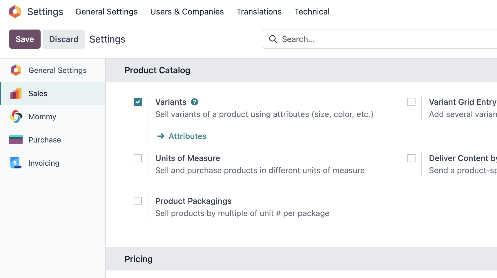

启用变体之后，可以在菜单中看到两个菜单，一个叫**产品模版**，一个叫**产品变体**。从技术角度讲，对应于两个不同的技术模型。产品模板对应的是product.template，产品变体对应的是product.product。 两者在界面上基本相同，修改产品模板和变体的共同拥有的属性，修改一方，另一方也会同时修改。只有一些特殊的属性，仅变体拥有的属性，不会在产品模板上反应出来。

### 变体属性

**变体属性**用来描述一个产品可配置的变体属性信息，例如iphone所拥有的变体属性名可能有颜色，内存大小，版本，而对应的属性值可能是白色、128G和iphone15等等。

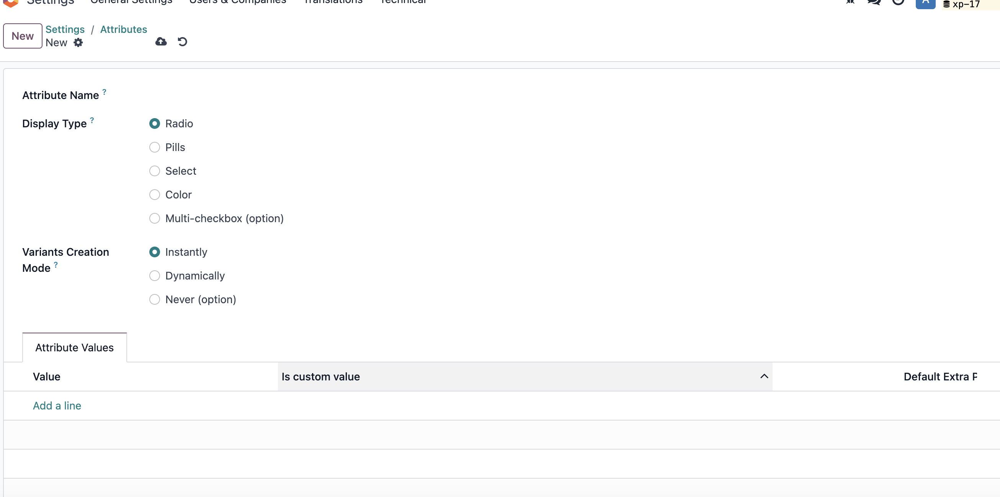

#### 变体属性的类型

原生支持的变体属性类型有一下几个：

* Radio: 单选框

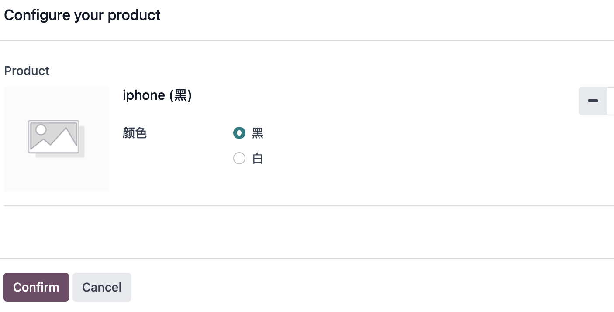

* Pills：药丸式

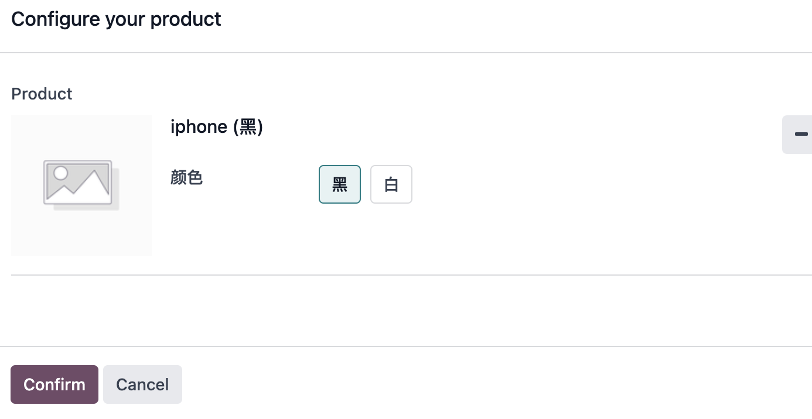

* Select: 下拉框

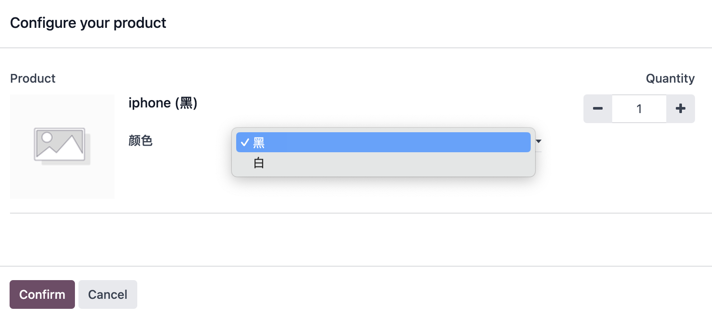

* Color: 颜色

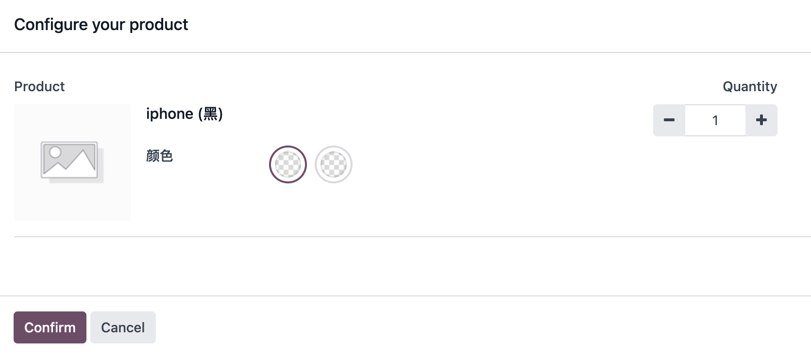

#### 自定义变体属性值

还有另外一种变体的创建方式，即让用户自定义变体的属性值，我们在前面的属性值中可以看到有一个字段叫做"是否自定义",当我们勾选了此选项后，即可让用户在下单的时候可以输入自定义的变体属性值。

举例来说，假如目前我们系统中可以下单的iphone的颜色有黑色和白色，我们同时增加了第三种值，叫做自定义，选中是否自定义字段。

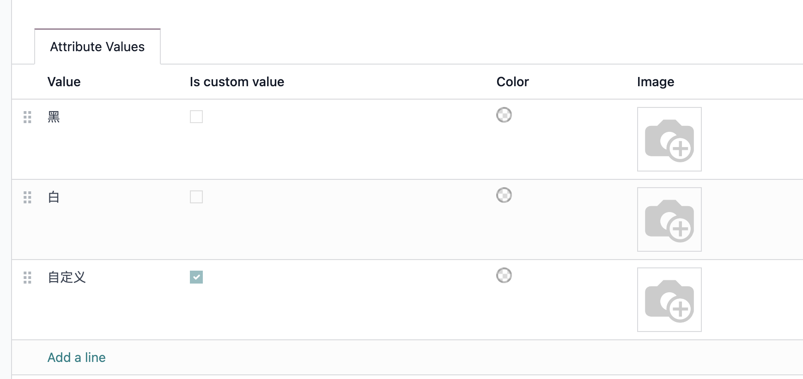

然后我们在下单的时候就可以看到多出一个自定义的选项值:

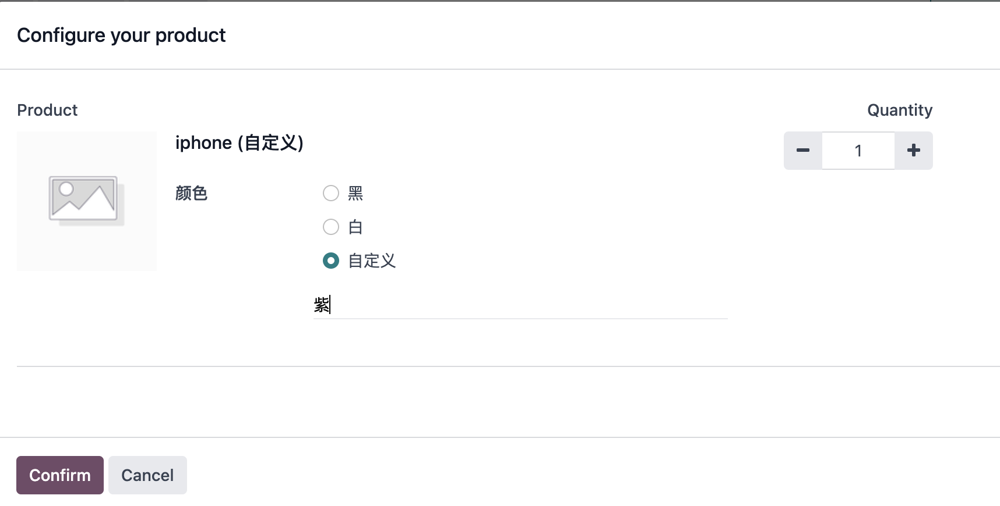

用户可以根据自己的需求填写自己的属性值，然后创建订单。

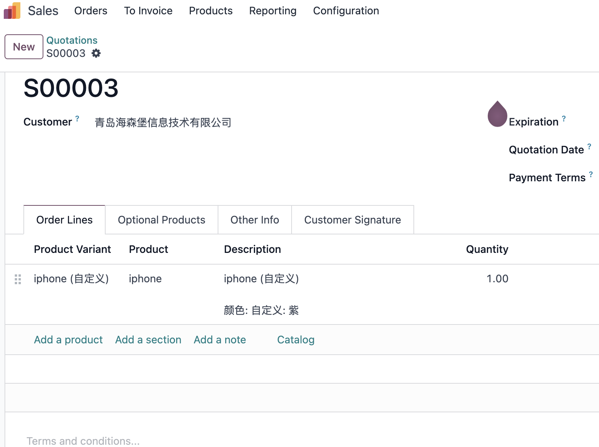

需要注意的是，虽然我们自定义了变体的值，但是系统中并没有真正创建这个属性值的变体，而仅仅是将自定义属性作为订单的备注写到了订单明细中，变体依旧使用的是“自定义”的这个产品变体。

如果想要真正在系统中创建这个变体，一种方式是手动创建，另外一种是使用我们在销售解决方案提供的自动创建功能，在设置-欧姆-销售特性中选中销售拓展:

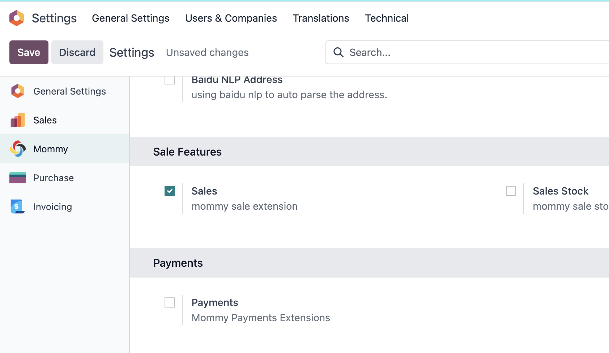

然后我们到用户的设置中，选中“根据自定义属性创建变体”权限:

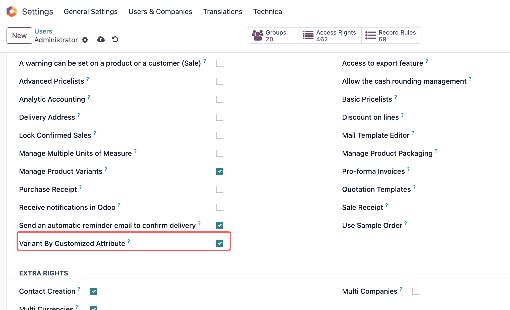

然后我们在变体的属性值列表中会看到新增的一列：

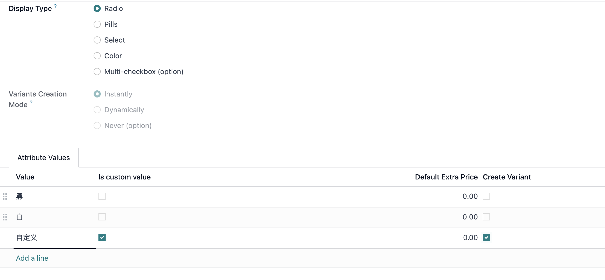

选中"创建变体"选项即可在确认订单时自动创建自定义属性的变体。

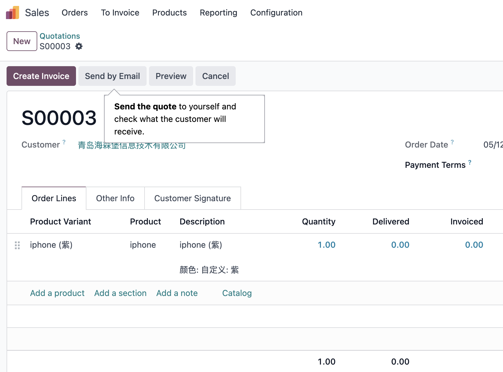

可以看到当我们确认了订单，系统自动帮我们创建了紫色的iphone。

#### 变体的创建模式

* Instantly: 立即创建，产品保存的时候立刻创建变体
* Dynamically: 动态创建变体，产品创建时不立即创建变体而是在订单中实际用到时才会创建变体
* Never: 此选项不创建变体

变体的创建模式在产品中使用之后就将不可再编辑。

### 产品变体的配置模式

变体在订单的中的配置模式可以支持两种：

* Product Configurator: 产品配置器，即我们前面看到那种形式的配置向导。
* Order Grid Entry: 网格形式的配置器，即可以在一个向导中同时配置多个属性的变体和数量。

## 通用属性

产品管理界面种包含了若干关于产品设置的信息，我们首先来看一下通用设置。

### 产品类型

首先产品模板里可以设置此产品是可供销售还是可供采购的， 然后在通用信息里，我们可以设置产品的类型、售价等信息。这种重点要说的是产品类型。

Odoo中的产品类型可以分为两种**商品**和**服务**:

* 商品：包括可库存的产品和不计库存的产品
* 服务：不存在库存中的产品 

在17.0及之前的版本中，产品类型分为三种：

* 可消耗产品：可以无限使用，不必统计其消耗量的产品，例如，沙子和水等。
* 服务产品： 没有实体的产品，例如，咨询服务。
* 可库存产品： 具有实体的产品，可以控制其出入库。

### 产品分类

产品分类，此产品归属的分类，产品分类上可以设置父级分类，下架逻辑，库存方法和财务科目等高级属性。

强制下架策略：如果在分类上设置了下架策略，那么改分类下的产品的下架策略将忽略掉库位上的下架策略。默认情况下，可选的下架策略有两种，FIFO和LIFO。详细策略介绍，请参考库存管理-库位-上架策略一节。

### 

内部参考，就是我们通常说的SKU，Odoo默认没有添加唯一性标识，我们可以通过技术性手段添加唯一性标识*。在内部参考的下面是条码，即产品的统一商品码，这个同样也没有设置唯一性标识。

销售价格，产品的销售价格。默认只有一个销售价格，如果需要更多的价格，可以使用价格表的功能(参考价格表一章)。

销售税种，销售此产品时默认的销售税，更多关于税种的设置，请参阅财务-税种一章。

