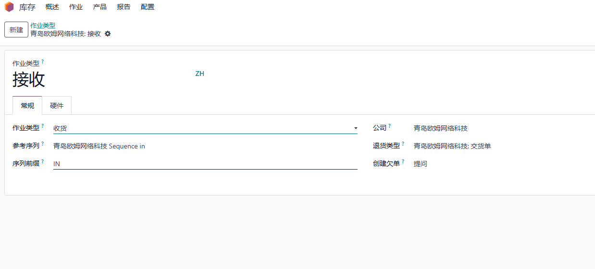
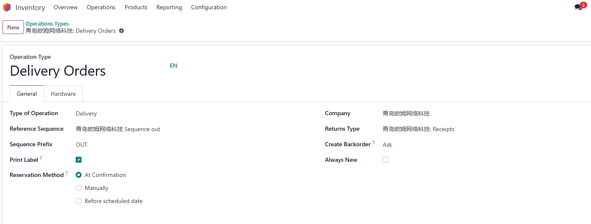
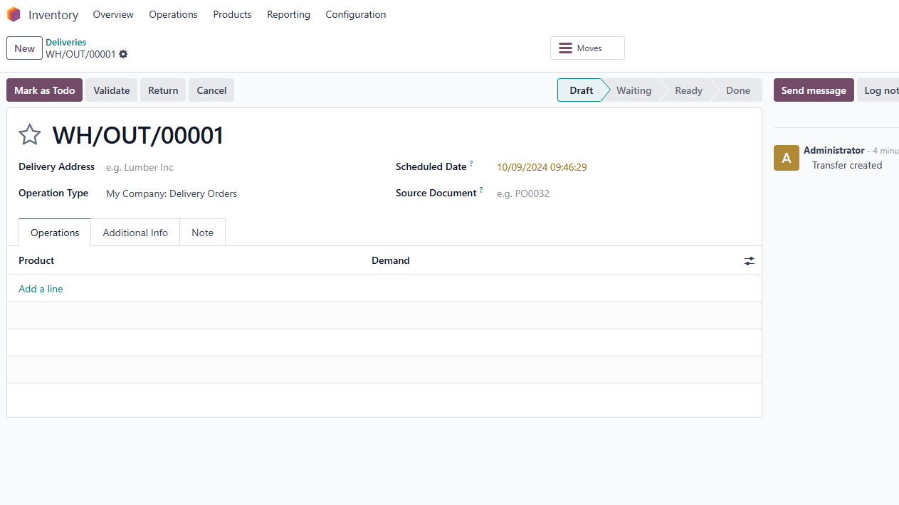

# 第三章 调拨类型

**调拨类型**是odoo中对调拨单的分类依据，我们可以根据用途的不同把调拨单分成不同类型的调拨，对某一类的调拨进行集中管理。

* [基本属性](#基本属性)
  * [操作类型](#操作类型)
  * [首选序列](#首选序列)
  * [序列前缀](#序列前缀)
  * [退货类型](#退货类型)
  * [欠单操作](#欠单操作)
* [自动合并](#自动合并)
  * [停止自动合并](#停止自动合并)
* [入库单批次号逻辑](#入库单批次号逻辑)
* [库存移动](#库存移动)
* [库存移动明细](#库存移动明细)
* [负库存](#负库存)

下面是一个调拨类型的例子：

## 基本属性

我们先来看几个调拨类型的基本属性

### 操作类型

默认情况下, Odoo可以把操作类型分为以下三种：

* 收货：从客户或供应商等三方库位入库的操作
* 交货: 从内部库位出库给客户或供应商
* 内部调拨：内部库位之间的相互调拨

如果安装了更多功能，也有可能会有其他类型的出现，比如生产、维修等等。

### 首选序列

每个调拨类型可以指定一个[序列]()，用来指定该调拨类型下的调拨单的单号的生成规则。

### 序列前缀

序列前缀用来指定生成调拨单的单号前缀

### 退货类型

退货类型用来指定该调拨类型的逆向操作类型，比如，入库类型的反向操作是出库，同样的，出库的反向操作是入库。

### 欠单操作

指定发生欠单时的默认动作， 支持三种类型：

* 询问: 弹窗询问是否生成欠单
* 总是：不询问直接生成欠单
* 从不：不询问直接忽略欠货数量

## 自动合并

Odoo在新生成调拨的时候，会检查当前是否存在还没完成的相似的调拨。所谓相似，是指满足以下条件的调拨单:

* 具有相同的源库位和目的库位
* 属于同一种调拨类型
* 隶属于同一个需求组
* 没有被打印过
* 状态是草稿/确认/等待/部分可用/就绪状态中的一种

如果调拨单还指定了联系人且源库位或目的库位是中转库， 那么还需要满足具有相同的联系人这个条件。

相似的调拨单将不会新增，而是将调拨明细添加到既有的调拨单中。

### 停止自动合并

但是在实际应用中，某些情况下，我们希望不自动合并而是每次都强制创建一个新的调拨单出来。这个时候可以安装我们的[仓库解决方案模块](https://odoohub.com.cn)，安装之后，在调拨类型中会多出一个控制是否合并到现在调拨单中的字段: 

当我们勾选了这个总是新建的选项之后，系统将不会再将相似的调拨进行合并，而是每次都新建一个调拨单出来。

## 入库单批次号逻辑

入库类型上面有两个选项

* 创建新的批次
* 使用已有批次

这两个选择会在调拨单上显示不同的字段，创建新的批次会显示一个字符串的文本，以供用户输入新的批次号，使用已有批次则会显示一个多对一的字段，让用户即可以创建新的批次，也可以选择既有的批次。

批次显示文本批次号的逻辑是：

* 启用了批次跟踪且调拨单类型启用了创建新批次，且调拨单状态尚未完成

其他时候均使用多对一的批次号

## 库存移动

### 销售策略对出库单的影响

我们在销售单一节中曾经提到过出库策略设置，之前仅仅说明了会对订单交付时间的影响。实际上，订单策略的选择还会对出库单的状态造成影响。下面我们就详细分析其内部的逻辑。

销售单中的两个选择**尽快**和**当全部产品就绪时**对应技术上的两个值：direct和one，这两个值不是随便设置的，这两个值与库存移动(stock.move)中的移动类型(move_type)的选项相对应。

出库单的状态与明细中的库存移动（stock.move)有着十分紧密的联系，具体地来说，当出库单需要确定状态时，会先将明细中的库存移动按照**状态**和**数量**进行排序，具体的状态优先级如下：

* confirmed: 确认
* partially_available：部分就绪
* waiting：等待其他操作
* assigned：就绪

排序以后，根据第一行的库存移动进行判断：

1. 如果第一行移动的移动类型是**当全部产品就绪**，系统会把第一行作为**最重要的移动**，并进行如下的逻辑判断：

    1. 如果最重要的移动状态是确认且数量有效，则整个出库单的状态为确认，如果数量无效，则出库单状态为就绪。
    2. 如果最重要的移动状态是部分就绪，则整个出库单为确认状态，并不会显示部分就绪状态。
    3. 如果最重要的移动状态是等待其他操作或者就绪，整个出库单状态为等待其他操作或者就绪。

2. 如果第一行的库存移动状态非就绪且其他库存移动中有处于就绪或部分就绪的状态时，整个出库单的状态是部分就绪。

3. 如果不属于上述两种情况，则取**最后一行**作为**最不重要的库存移动**，并进行如下判断：
    1. 如果最不重要库存移动状态是确认且库存移动数量为0，则整单状态为就绪。
    2. 否则以最不重要的库存移动状态作为整单状态。

## 库存移动明细

每个库存移动实际上都有一个库存移动明细表与之对应，某些调拨类型默认情况下不显示移动明细，想要手动开启，可以到设置-调拨类型-显示明细操作，开启明细显示：

> 注意： 此字段在后续版本中即将被删除

开启之后，我们在调拨单中就可以看到调拨的明细选项卡:

## 负库存

odoo是支持负库存的，如果强制把一个SKU从一个库位移到另外一个库位，即使源库位库存不足或不存在指定批次/序列号的库存，依旧可以成功，其结果是源库位会多出一个数量为负的库存，已匹配凭空产生的库存。这种操作就是负库存。

如果不想系统产生负库存，可以安装OCA开发的[禁止负库存模块](https://apps.odoo.com/apps/modules/13.0/stock_no_negative/)。