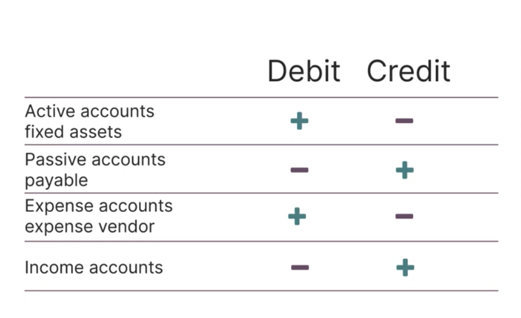

# 第一章 基础概念

本章我们将介绍Odoo财务体系的基础概念。在Odoo的财务体系中有三大基石，它们是
**科目表(Chart of Accounts)**、**日记账(Journals)**和**税率(Taxes)**。如果想要在Odoo中进行开票，那么这三样东西是必须要事先配置好的。

## 会计仪表盘

我们在进入Odoo的财务模块时，首先看到的就是**会计仪表盘(Accounting Dashboard)**，下面我们来看一下可以从会计仪表盘中看到哪些有用的信息。
下面是一个典型的会计仪表盘。

在会计仪表盘中会列出我们当前系统中拥有的日记帐。关于日记帐，我们会在后面详细介绍，这里我们可以看到与日记帐相关的一些数据。

## 财务本地化

我们在刚开始创建系统时，Odoo会让我们选择一个国家，会计模块在安装时会根据我们选择的国家安装与其对应的会计模块包。我们可以在会计-设置-财务本地化菜单中看到我们当前安装的是哪一个会计包。

> 此设置将在你创建了第一个(包含草稿状态在内的)凭证之后消失。

## 财务角色

公司内部的通常的财务角色有如下几种：

* **财务助理**(Account Assistant)： 负责客户/供应商发票整理，银行流水处理和支付校验跟踪。
* **财务经理**(Account Manager)：职责是验证客户/供应商账单，处理支付和生成总账报表。
* **财务总监**(CFO): 负责公司内部的科目余额表、利润表、分析会计和预算的制定。

对于外部的财务角色来说，通常有以下几种:

* **注册会计师**(Chatered Account): 负责审计公司的财务报表、作出调整和装订已经关闭的会计凭证。
* **审计**(Auditor): 负责审计流水的真假或是否合理。
* **官方**(Authority): 政府的监管部门，审计公司财务是否存在偷税漏税或财务造假的可能。

公司财务角色与监管的关系可以用下图展示:

## 科目表

如果想要查看当前公司内的所有科目表，可以在会计仪表盘中点击会计科目-审查进行查看，也可以在设置-会计-日记帐中进行查看。

我们将看到科目的列表。

我们可以根据需要对现有的科目进行调整配置。

### 科目类型

* **权益**(Equity): 公司的资产权益，包括股东的出资等。
* **固定资产**(Fixed Assets)： 公司拥有的长期资产，例如房子、车等等。
* **负债**(Liability): 公司要在将来支付的债权，例如供应商账单等。
* **流动资产**(Current Assests): 代表公司短期权益，例如短期内客户将要支付的账单。
* **银行和现金**(Bank and Cash)：代表公司银行和现金资产。
* **收入**(Income)：公司经营活动产生的利润。
* **费用**(Expense)：公司经营活动产生的费用成本。

### 科目核销

在科目设置上有一个是否允许核销的开关

**核销**的操作意思是允许使用银行流水或支付流水对凭证进行核销。

> 允许核销的科目应该只是**应收**或者**应付**的科目。

### 借方与贷方

在财务专业用语中有这么一句常说的，“有借必有贷，借贷必相等”，说的就是我们在录入会计凭证的时候，通常会有一个**借方(Debit)**和**贷方(Credit)**，且它他们在会计凭证中永远是相等的。举例，我们在记录员工工资这个会计凭证的时候，需要两个会计科目来同时记录。借方为费用科目，贷方为流动资产。

对于不同的科目，在**余额表(Balance)**的借贷方的行为会有所不同。例如，对于**资产科目(Active Accounts)**来说，在余额表中贷方会减少，而借方会增加。而对于**被动科目(Passive Accounts)**来说，在余额表中贷方在增加，而借方在减少。

对于**费用科目(Expense)**来说，在余额表中，借方在增加，贷方在减少。而对于**收入科目(Income Accounts)**, 在余额表中，借方在减少，贷方在增加。

具体可以看下图:

