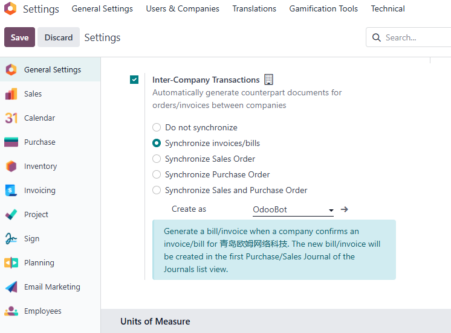
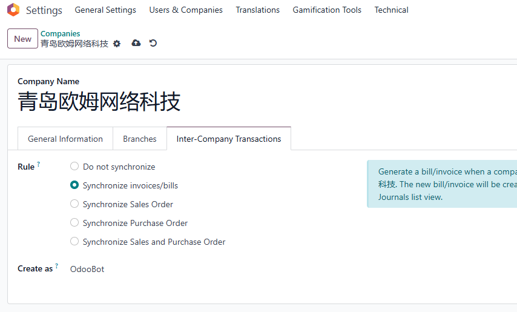
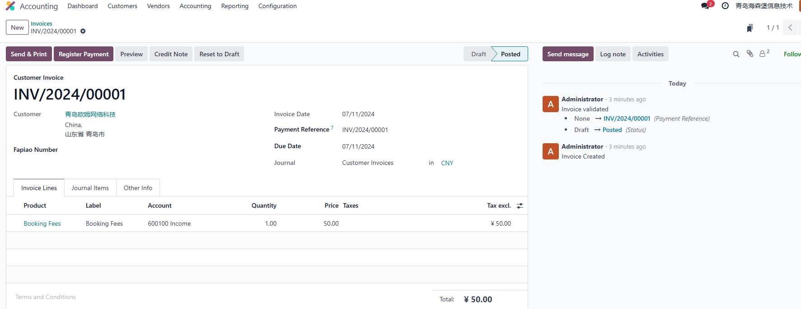
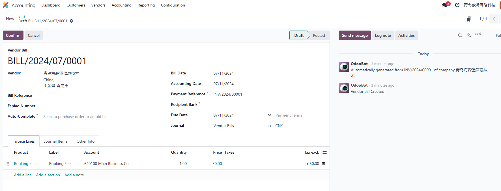
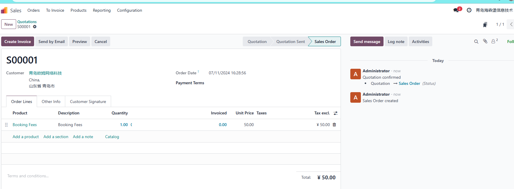
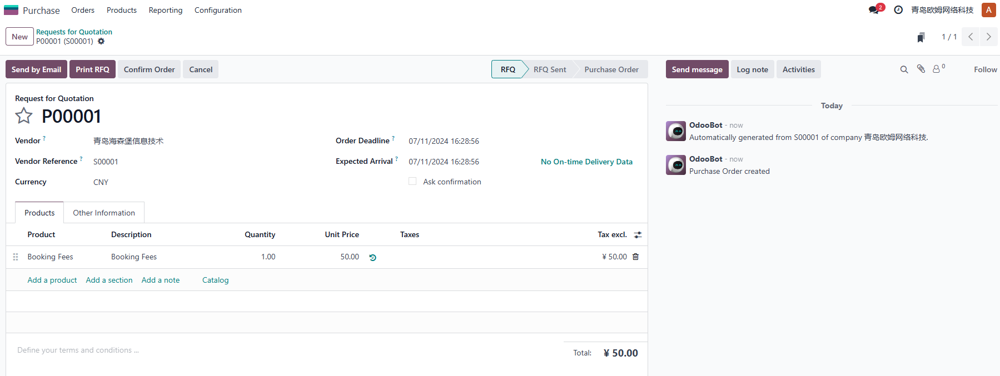
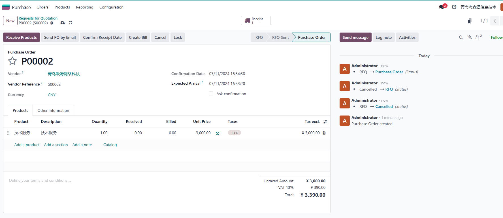

# 第一章 多公司间的采购

Odoo支持多公司间的业务，本章就将开启多公司间的业务介绍。

## 公司间业务

要使用多公司，我们需要先开启多公司设置。具体的设置方法如下：在**设置-通用设置-公司**菜单下，选中公司间业务选项：

然后点击保存。

我们也可以在公司设置页面中进行设置

> 需要开始debug模式

我们可以在列出的选项中选择我们需要的公司间规则，然后保存即可。odoo支持的公司间规则有以下几种：

* 同步发票和账单
* 同步销售订单
* 同步采购订单
* 同步销售订单和采购订单

### 同步发票和账单

同步发票和账单的意思是如果在给A公司做了一个销售发票/采购账单，那么在对应的公司会自动生成与之匹配的采购账单/销售发票。

举例来说，我们在青岛欧姆网络科技公司下设置了一个同步发票和账单的规则，那么当青岛海森堡信息技术这家公司给青岛欧姆网络做了一张销售发票的时候，系统会在青岛欧姆网络公司下自动创建一个供应商为青岛海森堡信息技术的采购账单。

### 同步销售订单

同步销售订单的意思是，当某公司给A公司下了一个销售订单，那么会在A公司下自动生成一个采购订单草稿。

> 如果需要自动确认生成的采购订单，则勾选下面的自动验证选项框即可。

同样的，我们以海森堡公司为例给欧姆网络下一个销售订单，则可以在海森堡公司的采购菜单下看到自动生成的采购询价单。

### 同步采购订单

同步采购订单的意思是，当某公司给A公司下了一个采购订单，那么系统会自动在A公司下生成一个销售订单。

假设我们以海森堡公司的名义给欧姆网络下了一个采购订单，那么系统会自动在欧姆网络公司下创建一个客户为海森堡公司的销售订单。

### 同步销售订单和采购订单

即上面两个规则的结合，即可以给A公司使用销售订单的规则也可以给A公司使用采购订单的规则。

### 销售和采购批次号同步

odoo在默认情况下并没有对多公司下的批次号进行同步，也就是说，A公司作为B公司的供应商，供应产品P在出库单中的序列号S并没有同步到B公司的采购入库单中。

B公司仍然需要像从第三方公司采购一样，一条一条地把序列号/批次号录入到自己的公司下。这在某些情况下对用户来说是繁琐的。

因此，我们在自己的[解决方案](../sections/SECTION10.md)中，添加了对此问题的解决方案。在菜单中设置-欧姆-销售特性中勾选**公司间规则拓展**， 这将安装我们写的公司间规则拓展模块，完成之后，前面提到的销售发货单中的序列号和批次号将自动同步到采购入库单中，采购操作人员直接根据入库单中的批次号核对实际收货的批次号，完成入库即可。