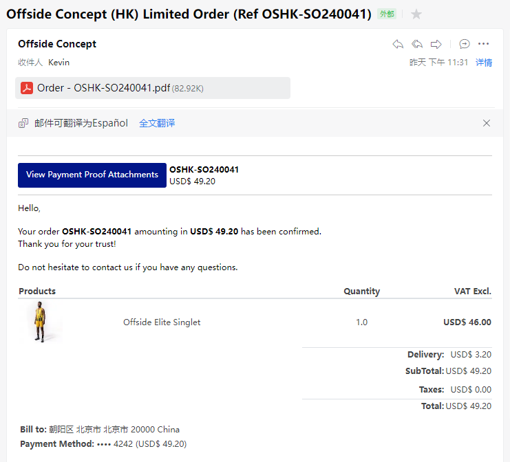
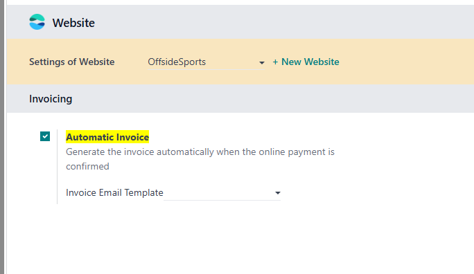

# 第二章 商城

## 邮件确认模板

客户在商城下单以后，系统会根据默认配置的邮件确认模板(sale.default_confirmation_template)给客户发出一封订单确认邮件。

目前(17.0)版本存在的问题是，邮件确认模板并没有像下面提到的发票模板一样有一个在系统中可以指定设置的地方。这对于多公司条件下的使用，非常的不方便，因为很多客户希望在多公司条件下针对不同的公司(网站)使用不同的确认模板。

我们在[欧姆网络网站解决方案(mommy_website_sale)]中增加了此选项，用户可以在不同公司下指定不同的邮件确认模板。

保存后，不同的公司下将使用不同的邮件模板发出邮件。

## 发票模板

当客户在商城中完成下单并且支付成功后，系统可以自动发送发票(Invoice)到客户注册的邮箱中。具体的设置位置在: **设置-发票-自动开票**

### 基于多公司的发票邮件模板

但是当我们的系统中拥有多个网站的时候，会碰到一个问题就是邮件模板默认并非跟公司关联的，因此当我们创建的第二个网站拥有第二个域名和标题的时候，用户收到的邮件还是第一个网站的模板，就变得有点尬尴。

我们在[欧姆网络网站解决方案(mommy_website_sale)](https://odoohub.com.cn)中添加了对此项的支持，用户安装了这个模块以后即可使用多公司下多发票模块的功能，详询客服。

