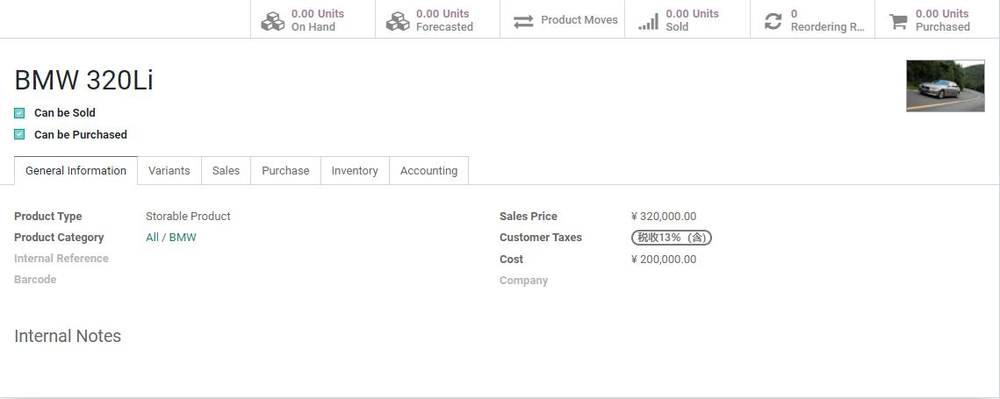
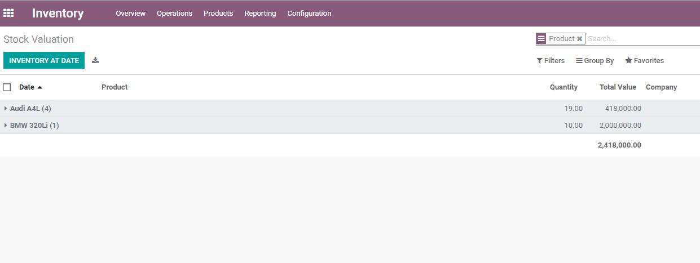
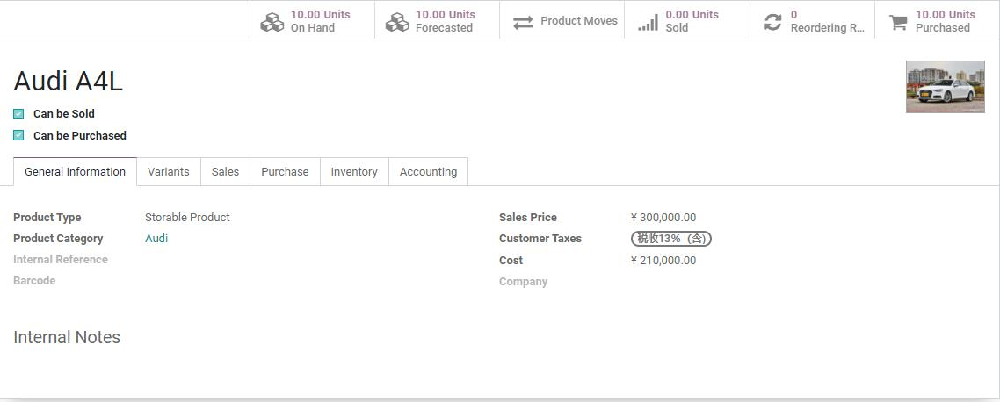
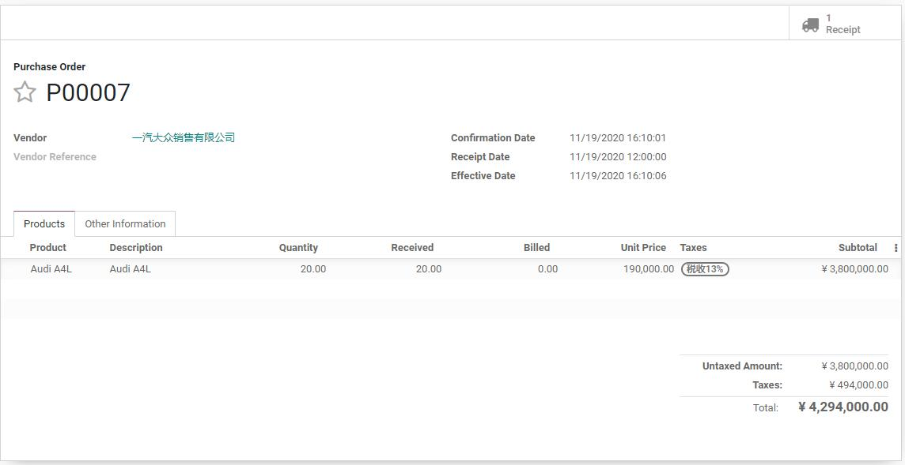
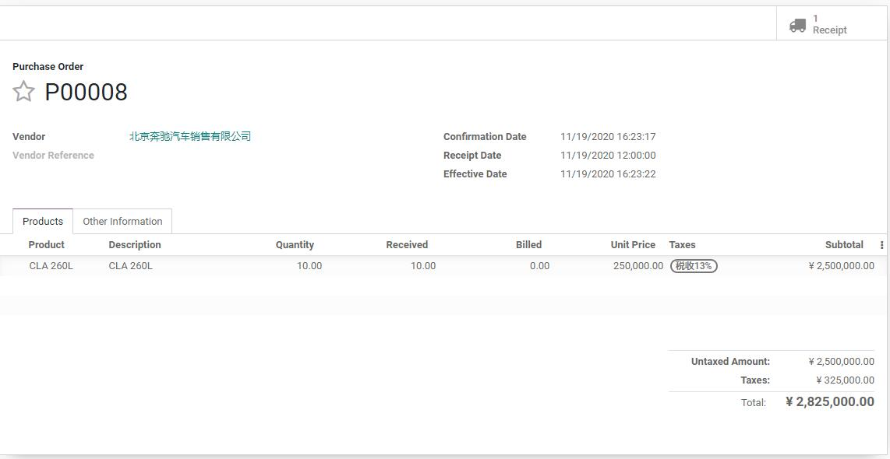
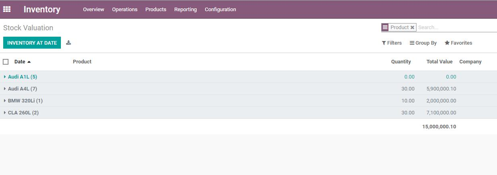
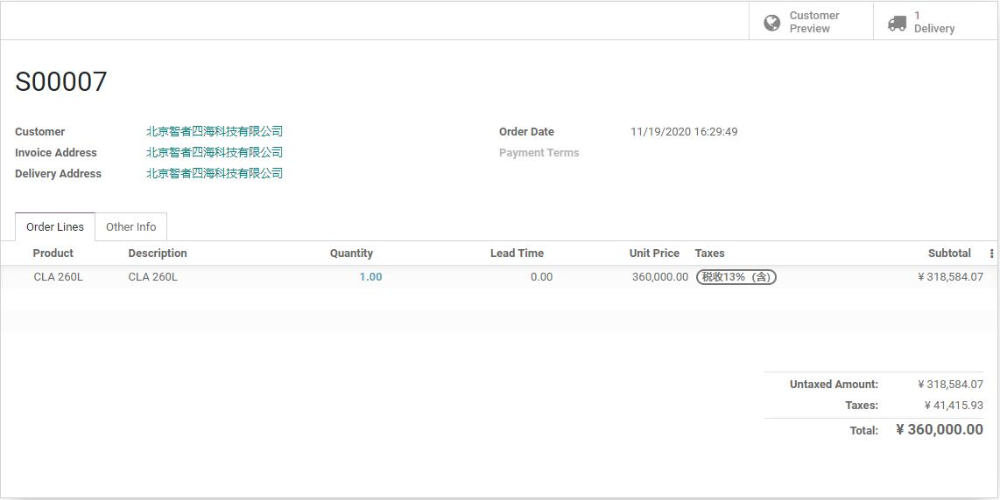

# 第八章 成本核算

odoo支持多种成本核算方式和估值方法，最常见的有标准价格、先进先出和平均价格三种。本章将详细介绍如何设置产品的成本核算方法，以及这些核算方式之间的不同。

## 设置成本核算方式

> 在12.0版本或更早的版本中，成本的核算方式是可以在产品设置中直接进行设置的，如果产品中没有设置再去产品分类中进行查找设置。但是从13.0版本开始，官方取消了产品设置中的选项，统一调整到了产品分类中进行设置，产品设置中仅仅是做了产品分类的映射。

成本核算方式的设置，在产品分类中：

成本核算的方式支持三种：

* 标准价格：使用产品设置中定义的成本价核算
* 平均价格：使用加权平均价来核算
* 先进先出：使用先进先出方法进行核算

库存价值核算支持两种：

* 人工核算：由人工进行手动核算
* 自动核算：在库存发生变化时由系统自动核算

下面我们来详细看一下这三种方式的具体含义。

## 标准价格

我们新建一个BMW的320Li的车型，将其成本设置为20万人民币，并将整个BMW车系设置为标准价格核算：

然后我们做一张采购单，以25万/台的价格购入10辆，放入我们的库存，因为我们这里使用的是标准价格法，因此采购完成后320Li的成本价格并没有发生变化，依旧是20万/台。此时，当我们查看库存估值时，可以看到320Li库存10辆，价值为200万。

从这里可以看出来，使用标准价格法，在库存估值时并不会考虑到采购价格的变化，而是采用标准的价格估算库存价值。

## 平均价格

接下来，我们看一下平均价格是怎样核算的。我们以Audi A4L为例，我们将其成本设置为0，然后第一次以21万/台的价格采购10台。采购入库以后，我们可以看到此时的成本价格为21万：

然后我们进行第二次采购，假设此时一汽大众公司使用了促销手段，每辆汽车降价2万，我们以19万/台的价格购入20辆。那么我们的平均成本应该为

(库存总价值210万 + 购入总价值380万) / (库存数量10 + 购入数量20) = 19.66万。

此刻的库存价值：

由此我们可以看出来，平均价格法在每次采购入库后，平均价格都会发生改变。计算公式为

新平均价 = (当前库存总值 + 入库总值) / (当前库存总数 + 入库总数量)

由于使用平均价格，销售一辆汽车同时就会使库存减少与平均价格相同的库存价值，因此，销售不会影响平均价格法下的成本价格。

### 平均价格的内部逻辑

在12.0中，Stock Move对象中有两个字段用来存储库存的数量和金额，他们是remaining_qty和remaining_value。但是到13.0这两个字段被移除了。13.0开始引入了一个新的对象stock.valuation.layer。

## FIFO

最后，我们看一下先进先出法下的库存核算。我们以奔驰CLA 260L为例，同样的我们不预先设置其成本。然后以25万/台的价格购入10辆，此时其库存价值为250万：

然后，我们第二次以23万/台的价格购入20辆，根据FIFO的原则，我们入库以后的库存估值应该为 250+460 = 710万：

然后我们以360000的价格销售一辆CLA 260：

根据FIFO的原则，我们出库的是最早入库的一批，也就是出库的是成本为25万的CLA，因此销售完成后，我们的库存价值应该为 710 - 25 = 685万：

采用FIFO的成本核算方法，出入库并不会修改产品的成本价格。库存的核算也是根据出入库的先后顺序进行累计核算的。